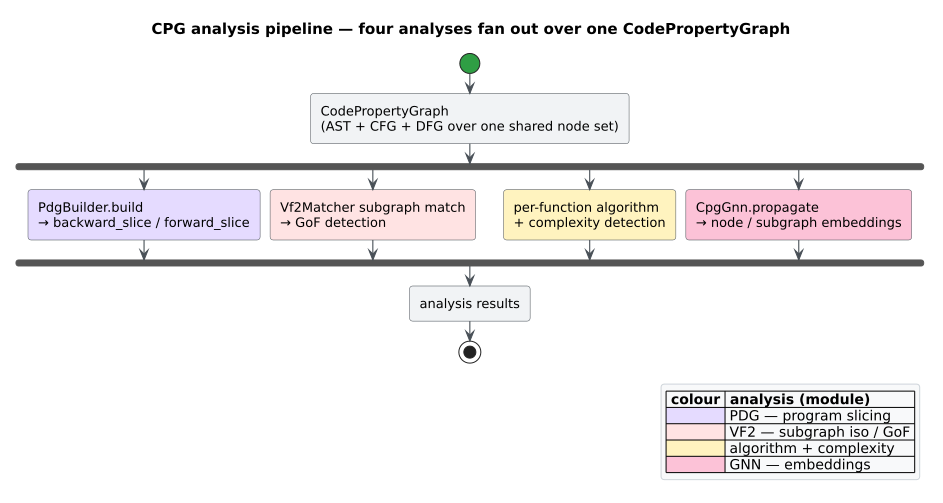

# Data Flow Architecture

This page traces how information moves through libcpg in two phases:

1. the **construction pipeline** — source text becomes a [Code Property Graph](../GLOSSARY.md#code-property-graph-cpg) (Yamaguchi et al. [[1]](#references)) with AST, [CFG](../GLOSSARY.md#control-flow-graph-cfg), and [DFG](../GLOSSARY.md#data-flow-graph-dfg) overlays; and
2. the **analysis pipeline** — a constructed CPG is queried by the [PDG](../GLOSSARY.md#program-dependence-graph-pdg)/slicer, the [VF2](../GLOSSARY.md#vf2) and [GoF](../GLOSSARY.md#gang-of-four-gof) detectors, the algorithm/complexity heuristics, and the [GNN](../GLOSSARY.md#graph-neural-network-gnn).

"Data flow" here means both the program's own data-flow overlay *and* the flow of data through libcpg's stages. This is a rewrite of an earlier draft that invented `BranchTrue`/`UseUse`/`Phi` edge kinds, an SSA-based DFG, a parse/embedding cache, and a bincode format — none of which exist. The real edge model is [`CpgEdgeKind::ControlFlow(CfgEdgeKind)`](../GLOSSARY.md#control-flow-graph-cfg) / [`DataFlow(DfgEdgeKind)`](../GLOSSARY.md#data-flow-graph-dfg), the DFG is [AST-ordered reaching definitions](../GLOSSARY.md#ast-ordered-reaching-definitions), and persistence is plain derive-based serde.

## The construction pipeline


*Figure — the construction pipeline: parse (Mode A) or accept a caller-supplied tree (Mode B), build the AST, then run the config-gated CFG and DFG passes. Source: [`diagrams/construction-pipeline.puml`](../diagrams/construction-pipeline.puml).*

Both entry points share one post-parse pipeline. `TreeSitterCpgBuilder::build` parses internally then delegates to `build_from_tree`, so the two paths are byte-for-byte equivalent (a regression test asserts identical `node_count`, `edge_count`, and `language`).

```rust
// requires: features = ["lang-rust"]   (build() needs a grammar; default = [] has none)
use libcpg::{TreeSitterCpgBuilder, CpgBuilder, Language};

fn demo() -> libcpg::Result<()> {
    let builder = TreeSitterCpgBuilder::new();
    let cpg = builder.build("fn main() { let x = 1; let y = x; }", Language::Rust)?;
    println!("{} nodes, {} edges", cpg.node_count(), cpg.edge_count());
    Ok(())
}
```

### Stage 0 — parse

`build(source, language)` looks the language up in the [`ParserRegistry`](../GLOSSARY.md#tree-sitter), enforces `config.max_file_size` (default 10 MiB), parses with tree-sitter, and forwards the tree to `build_from_tree`. `build_from_tree(&tree, source, language)` skips the size check (the caller already owns the tree) and is the only path for [Rholang](../GLOSSARY.md#rholang)/[MeTTa](../GLOSSARY.md#metta). If no grammar is registered for `language` — the situation for *every* language under `default = []` — `build` returns `Error::UnsupportedLanguage`. The two modes are detailed in [`language-frontends.md`](language-frontends.md).

### Stage 1 — AST construction

`build_from_tree` recursively walks the tree-sitter tree (`convert_node`). For each retained node it:

1. asks the `NodeMapper` whether to keep the node (`should_include_node`, which drops punctuation, comments unless configured, and language-specific wrappers/tokens);
2. maps the grammar's node-kind string to a `CpgNodeKind` (`map_kind`);
3. records a `SourceRange` from the tree-sitter byte offsets;
4. adds the node and, if it has a parent, wires an `AstChild` edge **and** sets the child's `parent` pointer; and
5. marks `Function` nodes as CFG entry points.

The dual bookkeeping in step 4 matters: `ast_children` reads the `AstChild` edges (sorted by monotonic edge id to recover source order), while `ast_parent`/`ast_ancestors` read the parent pointer. Both must be set or ancestor-based analyses (def/use classification, enclosing-statement lookup, slicing) silently break. [`graph-data-model.md`](graph-data-model.md#recovering-source-order) explains the source-order recovery.

### Stage 2 — CFG extraction

`CfgExtractor` adds [`ControlFlow`](../GLOSSARY.md#control-flow-graph-cfg) edges. It is a plain struct, constructed with `new()` or `with_config(..)`, and `extract` takes `&mut cpg` and returns `()`:

```rust
// Feature-free: the extractors live in `builder`, always compiled.
use libcpg::{CfgExtractor, CfgExtractorConfig};

// Default config; or customise the three switches:
let cfg = CfgExtractorConfig { include_fallthrough: true, include_exceptions: true, include_call_edges: true };
CfgExtractor::with_config(cfg).extract(&mut cpg);
```

For each function it takes the **last AST child as the body**, connects the function to that body with a `Sequential` edge, then structurally walks the body, dispatching per `CpgNodeKind` to a handler (`process_block`, `process_if`, `process_while`, `process_for`, `process_loop`, `process_match`, `process_return`, `process_break`, `process_continue`, `process_try`, `process_throw`, and — when `include_call_edges` — `process_call`). A `CfgContext` carries the enclosing loop/try stacks so `break`/`continue`/`throw` target the right place.

The 14 `CfgEdgeKind` variants — the real vocabulary, replacing the invented `BranchTrue`/`BranchFalse`:

| `CfgEdgeKind` | Meaning |
|---------------|---------|
| `Sequential` | Fallthrough to the next statement |
| `ConditionalTrue` | Branch taken when the condition holds |
| `ConditionalFalse` | Branch taken when the condition fails |
| `LoopBack` | Back edge to the loop head |
| `LoopExit` | Edge leaving the loop |
| `Break` | `break` out of a loop |
| `Continue` | `continue` to the loop head |
| `Return` | Edge to the function exit |
| `Throw` | Exception raised |
| `Catch` | Exception caught by a handler |
| `Call` | Edge into a callee |
| `CallReturn` | Edge back from a callee |
| `Case` | `match`/`switch` case edge |
| `DefaultCase` | Default/`else` case edge |

From the resulting CFG, libcpg derives [cyclomatic complexity](../GLOSSARY.md#cyclomatic-complexity) (McCabe [[6]](#references)) as

```math
M = E - N + 2
```

where $`E`$ and $`N`$ are the CFG edge and node counts of a single-entry/single-exit component. `cpg.cyclomatic_complexity()` computes it directly.

### Stage 3 — DFG extraction

`DfgExtractor` adds [`DataFlow`](../GLOSSARY.md#data-flow-graph-dfg) edges. Its strategy is **[AST-ordered reaching definitions](../GLOSSARY.md#ast-ordered-reaching-definitions)** — a single flow-sensitive sweep over AST nodes in source order — **not** [SSA](../GLOSSARY.md#static-single-assignment-ssa) and **not** a classical CFG fixed point. (Two earlier CFG-based approaches remain in the source under `#[cfg(any())]`, never compiled, as an executable record of why they failed: nested-expression identifier uses are not CFG nodes, so a CFG-keyed reaching set never reached them.)

```rust
use libcpg::{DfgExtractor, DfgExtractorConfig};

let cfg = DfgExtractorConfig {
    include_field_access: true,
    include_parameters: true,
    include_return_values: true,
    track_aliases: false,   // more expensive; off by default
    max_iterations: 100,    // bound for the reaching-defs sweep
};
DfgExtractor::with_config(cfg).extract(&mut cpg);
```

The sweep abstract-interprets the function body in execution order, threading a `ReachingEnv` (a map from each bound name to the set of definitions currently reaching it). In literate form:

```text
visit_reaching(node, env, conditional):
  match node.kind:
    Variable{name} | Parameter{name}:
        visit each child EXCEPT the binder identifier   # the initializer's uses see the pre-binding env
        bind_definition(env, name, node, conditional)   # gen; strong-update in straight-line, weak in a branch
    Assignment{op}:
        if op is "=" and target is a plain identifier:  # simple write: target is not a read
            visit RHS children only
        else:                                            # compound (+=) or complex l-value: target is a read too
            visit all children
        if target is an identifier: bind_definition(env, target_name, node, conditional)
    Identifier{name}:                                    # a USE
        for def in env[name]: record edge  def --DefUse--> node
    _ (blocks, calls, control flow, ...):
        child_conditional = conditional or is_conditional_region(node)   # branch/loop body ⇒ weak updates
        passes = 2 if node is a loop else 1              # sweep loop bodies twice for loop-carried deps
        for _ in 0..passes: for child in ast_children(node): visit_reaching(child, env, child_conditional)
```

A [strong update](../GLOSSARY.md#strong-update--weak-update) (kill + gen; the latest write wins) applies in straight-line context; inside a [conditional region](../GLOSSARY.md#strong-update--weak-update) a weak update *adds* a definition without killing, so a write on one path cannot erase a write on another — a sound over-approximation (extra edges, never a missing one). This is what threads a definition into a deeply nested use such as `buf` in `decode(buf)` — precisely the case the retired CFG-based passes missed. The pass is intraprocedural, bounded, language-agnostic (it dispatches on `CpgNodeKind`, never grammar specifics), and **idempotent**: an edge is added only if an identical one does not already exist, so re-running `extract` is a no-op.

Beyond the core def-use sweep, three auxiliary builders run under their config switches: `build_parameter_edges` (argument → `Parameter`), `build_return_edges` (returned expression → caller, `ReturnValue`), and `build_field_access_edges` (`FieldRead`/`IndexRead`). The 13 `DfgEdgeKind` variants — replacing the invented `UseUse`/`Phi`:

| `DfgEdgeKind` | Meaning |
|---------------|---------|
| `DefUse` | A definition reaches this use (the primary edge) |
| `UseDef` | Use back to its definition |
| `ReachingDef` | A reaching definition |
| `DataDependency` | Generic value dependency |
| `Parameter` | Argument passed to a parameter |
| `ReturnValue` | Value returned to a caller |
| `FieldRead` / `FieldWrite` | Object field read / write |
| `IndexRead` / `IndexWrite` | Indexed/array read / write |
| `Alias` | Aliasing between names (opt-in) |
| `Dereference` | Pointer dereference |
| `AddressOf` | Address-of |

Public helpers expose the same information as [def-use chains](../GLOSSARY.md#def-use-chain--definition--use): `Definition`/`DefinitionKind`, `Use`/`UseKind`, `DefUseChain`, and `build_def_use_chains(&cpg, function)`. Graph queries read the overlay directly — `reaching_definitions(use_site)`, `uses_of_definition(def)`, `dfg_successors`/`dfg_predecessors`. The DFG builder is dissected in [`../components/builder/dfg.md`](../components/builder/dfg.md); the theory of reaching definitions (Kildall's lattice framing [[5]](#references); the gen/kill formulation of the dragon book [[13]](#references)) is in [`../theory/03-data-flow-and-reaching-definitions.md`](../theory/03-data-flow-and-reaching-definitions.md).

### Config gating and idempotency

`CpgBuilderConfig.build_cfg` and `build_dfg` (both default `true`) decide whether stages 2 and 3 run during `build`/`build_from_tree`; disable one to get a cheaper partial graph, or run the extractors yourself later. Because all three of `CfgExtractor::extract`, `DfgExtractor::extract`, and `PdgBuilder::build` are [idempotent](../GLOSSARY.md#idempotent), re-applying them never duplicates edges.

## The analysis pipeline

A constructed CPG is the substrate for several independent analyses. Each consumes the overlays built above; none of them run during construction.



*Figure — a constructed CPG fans out to the on-demand PDG/slicer, the VF2 and GoF pattern detectors, the algorithm/complexity heuristics, and the GNN. Source: [`diagrams/analysis-pipeline.puml`](../diagrams/analysis-pipeline.puml).*

### Program dependence and slicing (feature-free)

`PdgBuilder::build(&mut cpg, function)` adds the [PDG](../GLOSSARY.md#program-dependence-graph-pdg) overlay for one function: [`ControlDependence`](../GLOSSARY.md#control-dependence) edges (computed as the [reverse dominance frontier](../GLOSSARY.md#dominance-frontier--reverse-dominance-frontier) of the CFG — a virtual `EXIT`, `petgraph`'s `dominators::simple_fast` on the reversed CFG, then the Cytron et al. frontier walk [[3]](#references)) and [`DataDependence`](../GLOSSARY.md#data-dependence) edges (re-projected from the DFG's `DefUse`/`ReachingDef` edges), following Ferrante–Ottenstein–Warren [[2]](#references). With the PDG in place, [program slicing](../GLOSSARY.md#program-slicing) (Weiser [[7]](#references)) is a bounded breadth-first traversal:

```rust
use libcpg::{PdgBuilder, backward_slice, forward_slice};

PdgBuilder::new().build(&mut cpg, function);              // adds PDG edges (idempotent)
let bwd = backward_slice(&cpg, criterion, 256);           // nodes that can affect `criterion`
let fwd = forward_slice(&cpg, criterion, 256);            // nodes `criterion` can affect
// Both return FxHashSet<NodeId>; the last argument caps the slice size.
```

The full construction and worked slices are in [`../components/builder/pdg-and-slicing.md`](../components/builder/pdg-and-slicing.md) and [`../usage/04-program-slicing.md`](../usage/04-program-slicing.md).

### Pattern detection

Two layers, at two feature levels:

- **Generic subgraph matching (feature-free, module `pattern`).** `Vf2Matcher` runs [VF2](../GLOSSARY.md#vf2) (Cordella et al. [[4]](#references)) to find every embedding of a pattern graph in the CPG. It exposes `with_strict_kinds`, `with_strict_edges`, and `with_max_matches(usize)` (`0` = unbounded), and `find_matches(&pattern, &target) -> Vec<PatternMatch>`.

  ```rust
  use libcpg::pattern::Vf2Matcher;
  use libcpg::SubgraphMatcher;

  let matches = Vf2Matcher::new()
      .with_max_matches(0)                 // 0 = find all embeddings
      .find_matches(&pattern, &cpg);
  for m in &matches { println!("{} @ {:?}", m.pattern_name, m.root); }
  ```

- **Design-pattern detection (feature `design-patterns`, module `patterns`).** `GofPatternDetector::detect(&cpg) -> Vec<PatternMatch>` runs a *relaxed* VF2 (`strict_kinds = false`, `strict_edges = false`) against each [GoF](../GLOSSARY.md#gang-of-four-gof) template and keeps matches at or above `min_confidence` (default `0.7`).

  ```rust
  // requires: features = ["design-patterns"]
  use libcpg::patterns::{GofPatternDetector, PatternDetector};

  let hits = GofPatternDetector::new().with_min_confidence(0.7).detect(&cpg);
  ```

The distinction between the always-on `pattern` module and the gated `patterns` module is deliberate — see [`overview.md`](overview.md#pattern-versus-patterns--do-not-conflate) and [`../components/patterns/overview.md`](../components/patterns/overview.md).

### Algorithm and complexity detection (feature `algorithm-detection`)

`DefaultAlgorithmDetector::detect(&cpg, function)` is **per-function**: it runs a `ControlFlowAnalyzer` (loop and recursion shape) then a `ComplexityAnalyzer` (a Big-O estimate), then five family routines, returning `Vec<DetectedAlgorithm>` sorted by confidence descending and filtered at `min_confidence` (default `0.5`).

```rust
// requires: features = ["algorithm-detection"]
use libcpg::algorithms::detection::DefaultAlgorithmDetector;
use libcpg::algorithms::AlgorithmDetector;

for function in cpg.functions().map(|n| n.id).collect::<Vec<_>>() {
    for algo in DefaultAlgorithmDetector::new().detect(&cpg, function) {
        // algo.family, algo.confidence, algo.signature.time_complexity ...
    }
}
```

These are heuristics, not proofs of identity; see [`../components/algorithms/overview.md`](../components/algorithms/overview.md).

### GNN embeddings (feature `gnn`)

`CpgGnn::new(cpg)` **owns** the CPG (it takes it by value, not by `Arc`, and has no separate config object). `propagate(&mut self, iterations)` runs [message passing](../GLOSSARY.md#message-passing) — mean [aggregation](../GLOSSARY.md#aggregation-gnn) over the AST, CFG, and DFG neighbourhoods with a [ReLU](../GLOSSARY.md#relu) nonlinearity — after which node/subgraph [embeddings](../GLOSSARY.md#embedding) can be read and compared by [cosine similarity](../GLOSSARY.md#cosine-similarity).

```rust
// requires: features = ["gnn"]
use libcpg::gnn::CpgGnn;
use libcpg::GraphNeuralNetwork;

let mut gnn = CpgGnn::new(cpg).with_embedding_dim(128).with_num_layers(3).with_dropout(0.1);
gnn.propagate(3);
let emb = gnn.node_embedding(node_id);   // Option<ndarray::Array1<f32>>
```

The `Mean` aggregation is the only wired one; `Attention` and `Hierarchical` are reserved placeholders, and there is no GPU path. See [`../components/gnn/overview.md`](../components/gnn/overview.md).

## What this pipeline does *not* do

To close the door on the earlier draft's fictions:

- **No caching.** There is no parse cache, no embedding cache, no `enable_cache`. Each `build` reparses; each `propagate` recomputes.
- **No SSA and no `Phi`.** The DFG is AST-ordered reaching definitions; there are no `Phi`/`UseUse` edges.
- **No bespoke on-disk format.** With `--features serde`, all graph types derive `Serialize`/`Deserialize`; round-trip a CPG through the caller's own `serde_json`. There is no `bincode` format and no export/import function. `NodeEmbedding`'s vector is `#[serde(skip)]`. See [`../usage/05-serialization.md`](../usage/05-serialization.md).
- **No hidden parallelism.** The extractors iterate functions sequentially; callers may parallelize using the `Send + Sync` traits.

## Where to go next

- [`overview.md`](overview.md) — design principles and the module map.
- [`graph-data-model.md`](graph-data-model.md) — the node/edge model the overlays are built on.
- [`language-frontends.md`](language-frontends.md) — Stage 0/1 in depth (parsing and mapping).
- [`../components/builder/cfg.md`](../components/builder/cfg.md) / [`../components/builder/dfg.md`](../components/builder/dfg.md) — the extractors in detail.
- [`../api/builder-reference.md`](../api/builder-reference.md) — the precise builder/extractor API.

## References

1. Yamaguchi, F., Golde, N., Arp, D., Rieck, K. (2014). *Modeling and Discovering Vulnerabilities with Code Property Graphs.* 2014 IEEE Symposium on Security and Privacy. DOI: [10.1109/SP.2014.44](https://doi.org/10.1109/SP.2014.44)
2. Ferrante, J., Ottenstein, K. J., Warren, J. D. (1987). *The Program Dependence Graph and Its Use in Optimization.* ACM TOPLAS 9(3). DOI: [10.1145/24039.24041](https://doi.org/10.1145/24039.24041)
3. Cytron, R., Ferrante, J., Rosen, B. K., Wegman, M. N., Zadeck, F. K. (1991). *Efficiently Computing Static Single Assignment Form and the Control Dependence Graph.* ACM TOPLAS 13(4). DOI: [10.1145/115372.115320](https://doi.org/10.1145/115372.115320)
4. Cordella, L. P., Foggia, P., Sansone, C., Vento, M. (2004). *A (Sub)graph Isomorphism Algorithm for Matching Large Graphs.* IEEE TPAMI 26(10). DOI: [10.1109/TPAMI.2004.75](https://doi.org/10.1109/TPAMI.2004.75)
5. Kildall, G. A. (1973). *A Unified Approach to Global Program Optimization.* POPL '73. DOI: [10.1145/512927.512945](https://doi.org/10.1145/512927.512945)
6. McCabe, T. J. (1976). *A Complexity Measure.* IEEE Transactions on Software Engineering SE-2(4). DOI: [10.1109/TSE.1976.233837](https://doi.org/10.1109/TSE.1976.233837)
7. Weiser, M. (1984). *Program Slicing.* IEEE Transactions on Software Engineering SE-10(4). DOI: [10.1109/TSE.1984.5010248](https://doi.org/10.1109/TSE.1984.5010248) (originally ICSE '81).
13. Aho, A. V., Lam, M. S., Sethi, R., Ullman, J. D. (2006). *Compilers: Principles, Techniques, and Tools* (2nd ed.). Addison-Wesley. ISBN 978-0321486813 (no DOI). *(Reaching definitions, data-flow analysis.)*
