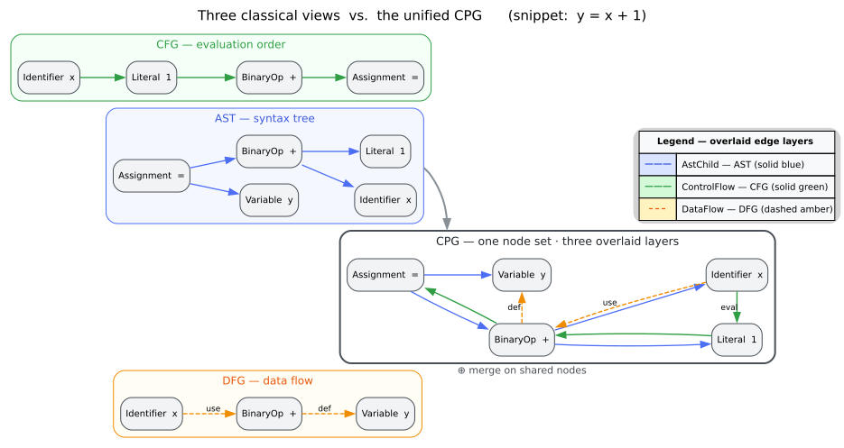
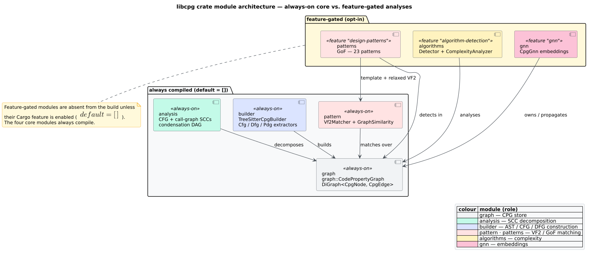

# Architecture Overview

**libcpg** (crate `libcpg`, v0.1.1) builds and analyzes [Code Property Graphs](../GLOSSARY.md#code-property-graph-cpg) (CPGs): a single directed graph that overlays a program's [Abstract Syntax Tree](../GLOSSARY.md#abstract-syntax-tree-ast), [Control Flow Graph](../GLOSSARY.md#control-flow-graph-cfg), [Data Flow Graph](../GLOSSARY.md#data-flow-graph-dfg), and — on demand — its [Program Dependence Graph](../GLOSSARY.md#program-dependence-graph-pdg) onto **one shared node set**. The design follows Yamaguchi et al. [[1]](#references), who introduced the CPG so that a single query can reason about syntax, control, and data flow at once (the classic use case being [taint analysis](../GLOSSARY.md#taint-analysis): does an untrusted value reach a sensitive sink?).

This page is the map of the system: the design principles, the module layout, the error model, and the real memory and threading story. It corrects the earlier draft's inventions — there is no `CpgError`, no `CfgEdge`/`DfgEdge` wrapper, no SSA, no parse/embedding cache, no "40+ languages", no atomic progress counters, and the graph is **not** immutable after construction.

## Design principles

### 1. One node set, typed edge overlays

Traditional pipelines keep the AST, CFG, and DFG as three separate structures and run three separate analyses over them. libcpg instead materializes every view as a set of **typed edges over the same `CpgNode` set**, so an analysis can hop from a syntax edge to a control-flow edge to a data-flow edge without re-keying between graphs.



*Figure — the traditional approach maintains AST, CFG, and DFG as disjoint graphs; libcpg unifies them as edge overlays on a single node set. Source: [`diagrams/cpg-vs-traditional.dot`](../diagrams/cpg-vs-traditional.dot).*

Concretely, the [edge kind](../GLOSSARY.md#node-kind--edge-kind) `CpgEdgeKind` distinguishes the overlays and wraps the control- and data-flow sub-kinds:

```rust
// Real edge model (src/graph/edge.rs). Feature-free surface.
use libcpg::{CpgEdgeKind, CfgEdgeKind, DfgEdgeKind};

let ast   = CpgEdgeKind::AstChild;                            // AST overlay
let cfg    = CpgEdgeKind::ControlFlow(CfgEdgeKind::ConditionalTrue); // CFG overlay
let dfg    = CpgEdgeKind::DataFlow(DfgEdgeKind::DefUse);       // DFG overlay
let pdg    = CpgEdgeKind::ControlDependence;                   // PDG overlay

assert!(ast.is_ast() && cfg.is_cfg() && dfg.is_dfg() && pdg.is_pdg());
```

There is **no** `CfgEdge(..)` or `DfgEdge(..)` variant: control flow is `CpgEdgeKind::ControlFlow(CfgEdgeKind)` and data flow is `CpgEdgeKind::DataFlow(DfgEdgeKind)`. The full model — 4 AST kinds, 14 [`CfgEdgeKind`](../GLOSSARY.md#control-flow-graph-cfg), 13 [`DfgEdgeKind`](../GLOSSARY.md#data-flow-graph-dfg), plus PDG/call/type/reference/scope/import kinds — is detailed in [`graph-data-model.md`](graph-data-model.md).

### 2. Language-agnostic through tree-sitter

Frontends normalize language-specific syntax to shared vocabulary:

- **[Tree-sitter](../GLOSSARY.md#tree-sitter)** parses source into a concrete syntax tree. libcpg ships **16 feature-gated grammars** (`lang-rust`, `lang-python`, `lang-javascript`, `lang-typescript`, `lang-go`, `lang-java`, `lang-c`, `lang-cpp`, `lang-json`, `lang-html`, `lang-css`, `lang-bash`, `lang-toml`, `lang-yaml`, `lang-markdown`, `lang-ruby`) — **not** "40+". The `Language` enum enumerates more variants than there are grammars; a variant is only *parseable* when its `lang-*` feature is enabled (see `ParserRegistry::supports`).
- A per-language **`NodeMapper`** maps each grammar's node-kind strings onto the shared `CpgNodeKind`. The mapping is deliberately *sound but possibly incomplete* — it never asserts an edge the semantics forbid, though it may omit one they allow (Yamaguchi et al. [[1]](#references)).
- **Mode B** (`build_from_tree`) lets a caller that already links a grammar hand libcpg an already-parsed tree, which is how [Rholang](../GLOSSARY.md#rholang) and [MeTTa](../GLOSSARY.md#metta) are supported. See [`language-frontends.md`](language-frontends.md).

### 3. Staged, on-demand construction

Construction proceeds in stages, and the later stages are optional so a caller can pay only for what it queries. The AST is always built; CFG and DFG extraction are gated by `CpgBuilderConfig`; the PDG is **never** built during construction — it is added on demand per function.

```text
source ──parse──▶ AST  ──(build_cfg)──▶ +CFG  ──(build_dfg)──▶ +DFG        [construction]
                                                                  │
                                                    PdgBuilder::build(&mut cpg, fn)   [on demand]
                                                                  ▼
                                                              +PDG (control + data dependence)
```

`CpgBuilderConfig` is the real knob set — `retain_source`, `build_cfg` (default `true`), `build_dfg` (default `true`), `include_comments`, `max_file_size` (default 10 MiB), `resolve_imports`. There is no `enable_cfg`/`enable_dfg`/`enable_cache` field; there is no cache. The [`data-flow.md`](data-flow.md) page walks the full pipeline.

### 4. Empty default feature set

`default = []`: with no Cargo features, `build(source, language)` fails for **every** language (the [parser registry](../GLOSSARY.md#tree-sitter) is empty), and only the feature-free surface works — hand-built CPGs, `build_from_tree`, the CFG/DFG/PDG extractors, exact CFG/call-graph SCC decomposition, VF2 matching, and slicing. Optional analyses live behind features: `gnn`, `design-patterns`, `algorithm-detection`, `serde`, `ml-linfa`/`ml-rules`, and the Mode-B toggles `rholang`/`metta`. The umbrella `full = [gnn, design-patterns, algorithm-detection, serde, ml-rules, lang-all]` (it excludes `rholang`, `metta`, `gpu`, and `ml-linfa`). The rationale — compile time, dependency surface, and duplicate-symbol avoidance — is captured in [`../design/0005-feature-flag-taxonomy.md`](../design/0005-feature-flag-taxonomy.md).

### 5. Thread-safety, honestly

The public types are built for concurrency but do **not** silently parallelize:

- `CodePropertyGraph` is a plain owned value: it is **mutable** during construction (`add_node`, `connect`, and the extractors all mutate it) and implements `Clone`. It is *not* "immutable after construction".
- The matcher and detector traits are `Send + Sync` (`SubgraphMatcher`, `PatternDetector`, `AlgorithmDetector`, `CpgBuilder`), so a caller can run them across files or functions with its own thread pool.
- `rayon` is a declared dependency and the crate is written to be parallelizable, but the current extractors and detectors iterate functions **sequentially** — no `par_iter` is wired in `src/` yet. There are **no** atomic progress counters and **no** SIMD paths; the `gpu` feature is reserved with no code behind it. Benchmarking is a documented gap (criterion is a dev-dependency, `[[bench]]` targets are commented out). See [`../engineering/03-performance.md`](../engineering/03-performance.md).

## Module map

libcpg is a small set of modules; four are always compiled, the rest are feature-gated.



*Figure — the crate's modules and the Cargo features that gate them; `graph`, `analysis`, `builder`, and `pattern` are always compiled. Source: [`diagrams/module-architecture.puml`](../diagrams/module-architecture.puml).*

| Module | Gate | Responsibility |
|--------|------|----------------|
| `graph` | always | `CodePropertyGraph` and the graph vocabulary: `CpgNode`/`CpgNodeKind`, `CpgEdge`/`CpgEdgeKind`/`CfgEdgeKind`/`DfgEdgeKind`, `NodeId`/`EdgeId`, `SourceRange`, `Language`/`Paradigm`, `CpgStats`. |
| `analysis` | always | Exact graph analyses: per-function CFG and whole-CPG call-graph SCC decomposition, cycle classification, membership lookup, and condensation DAGs. |
| `builder` | always | Construction: the `CpgBuilder` trait, `TreeSitterCpgBuilder`, `CfgExtractor`, `DfgExtractor`, `PdgBuilder`, `backward_slice`/`forward_slice`, def-use chains, plus `NodeMapper` and `ParserRegistry`. |
| `pattern` | always | Generic subgraph matching and similarity: `Vf2Matcher`/`Vf2State` ([VF2](../GLOSSARY.md#vf2)), `GraphSimilarity`/`SimilarityMetric`, `PatternMatch`, the `SubgraphMatcher` trait, and pattern templates. |
| `patterns` | `design-patterns` | [Gang-of-Four](../GLOSSARY.md#gang-of-four-gof) detection: `GofPatternDetector`, the 23 `GofPattern` templates, [DPML](../GLOSSARY.md#dpml-design-pattern-markup-language), classification, and `PatternMetrics`. |
| `algorithms` | `algorithm-detection` | Algorithm-family and complexity heuristics: `DefaultAlgorithmDetector`, `ControlFlowAnalyzer`, `ComplexityAnalyzer`. |
| `gnn` | `gnn` | [Graph neural network](../GLOSSARY.md#graph-neural-network-gnn) message passing: `CpgGnn`, `GraphNeuralNetwork`, node/subgraph [embeddings](../GLOSSARY.md#embedding). |

### `pattern` versus `patterns` — do not conflate

These are two different modules with confusingly close names:

- **`pattern`** (singular, **always compiled**) is *generic subgraph isomorphism and graph similarity*. It knows nothing about design patterns — it matches an arbitrary pattern graph against a target graph with VF2, and scores graph likeness with Jaccard/cosine/Weisfeiler-Lehman/graph-edit metrics.
- **`patterns`** (plural, gated by `design-patterns`) is *Gang-of-Four design-pattern detection*. It builds on `pattern`: `GofPatternDetector` runs a **relaxed** `Vf2Matcher` (category-level kind/edge matching) against each GoF template and scores [confidence](../GLOSSARY.md#confidence-pattern-match) by template completeness.

So VF2 matching is available with `default = []`; GoF detection requires `--features design-patterns`. The full detection surface is documented in [`../components/patterns/overview.md`](../components/patterns/overview.md) and [`../api/pattern-reference.md`](../api/pattern-reference.md).

### The `builder` submodules

`builder` is the construction engine and hosts several cooperating pieces (all re-exported at the crate root except `NodeMapper` and `ParserRegistry`, which live at `libcpg::builder::`):

- `TreeSitterCpgBuilder` — the `CpgBuilder` implementation; `build` (Mode A) and `build_from_tree` (Mode B).
- `ParserRegistry` — the `OnceLock` global mapping a `Language` to its feature-gated tree-sitter grammar.
- `NodeMapper` — the per-language `map_kind` dispatch (including `map_rholang`/`map_metta`).
- `CfgExtractor` / `DfgExtractor` — the CFG and DFG passes; both `extract(&mut cpg)` idempotently.
- `PdgBuilder` — adds `ControlDependence` + `DataDependence` edges on demand; `backward_slice` / `forward_slice` traverse them.

## Error model

Every fallible operation returns `libcpg::Result<T>` = `std::result::Result<T, libcpg::Error>`. The error type is `Error` — there is no `CpgError`:

```rust
// Real error enum (src/lib.rs). Two variants are feature-gated.
pub enum Error {
    Construction(String),          // parse / build failure
    PatternMatch(String),          // matcher failure
    #[cfg(feature = "gnn")]
    Gnn(String),                   // GNN failure (gnn feature)
    InvalidNodeId(NodeId),         // dangling node reference
    InvalidEdgeId(EdgeId),         // dangling edge reference
    UnsupportedLanguage(String),   // no grammar registered for this Language
    Io(std::io::Error),            // from build_file (#[from])
    #[cfg(feature = "serde")]
    Serialization(String),         // serde feature
}
```

Note what is *fallible* and what is not: `build`, `build_from_tree`, and `build_file` return `Result`; the extractors do not — `CfgExtractor::extract`, `DfgExtractor::extract`, and `PdgBuilder::build` return `()` and degrade gracefully on malformed input rather than erroring. Graph lookups return `Option`, not `Result`: `cpg.node(id) -> Option<&CpgNode>`, `cpg.edge(id) -> Option<&CpgEdge>`.

## Memory model

The storage is [petgraph](../GLOSSARY.md#petgraph)-backed, with compact, sharing-friendly node payloads:

- `CodePropertyGraph` wraps a `petgraph::graph::DiGraph<CpgNode, CpgEdge>` plus two `FxHashMap`s (`rustc-hash`) that map the stable `NodeId`/`EdgeId` onto petgraph's internal `NodeIndex`/`EdgeIndex`. Stable ids survive graph mutation and (de)serialization; petgraph's indices are an implementation detail.
- Node text and interned names are `Arc<str>` — atomically reference-counted shared string slices — so repeated identifiers and literals share one allocation rather than copying bytes.
- A node's AST child list is a `smallvec::SmallVec<[NodeId; 4]>`, keeping the common small-arity case allocation-free; source positions are six `u32`s in `SourceRange` (interoperable with `text-size`).

This is the *actual* mechanism. The crate also declares `string_cache` and `ahash` as dependencies, but the hot paths use `Arc<str>` and `FxHashMap`; those two crates are not wired into the current code. The full storage model — the four overlays over one node set, and how AST child order is recovered — is the subject of [`graph-data-model.md`](graph-data-model.md).

## Where to go next

- [`graph-data-model.md`](graph-data-model.md) — the petgraph-backed node/edge model and the four overlays.
- [`data-flow.md`](data-flow.md) — the construction and analysis pipelines end to end.
- [`language-frontends.md`](language-frontends.md) — tree-sitter, the parser registry, `NodeMapper`, and Mode B.
- [`../theory/00-overview.md`](../theory/00-overview.md) — the theory pillar (why unify AST+CFG+DFG+PDG).
- [`../api/graph-reference.md`](../api/graph-reference.md) — the precise `CodePropertyGraph` API.
- [`../components/graph/overview.md`](../components/graph/overview.md) — a deeper tour of the graph component.

## References

1. Yamaguchi, F., Golde, N., Arp, D., Rieck, K. (2014). *Modeling and Discovering Vulnerabilities with Code Property Graphs.* 2014 IEEE Symposium on Security and Privacy. DOI: [10.1109/SP.2014.44](https://doi.org/10.1109/SP.2014.44)
