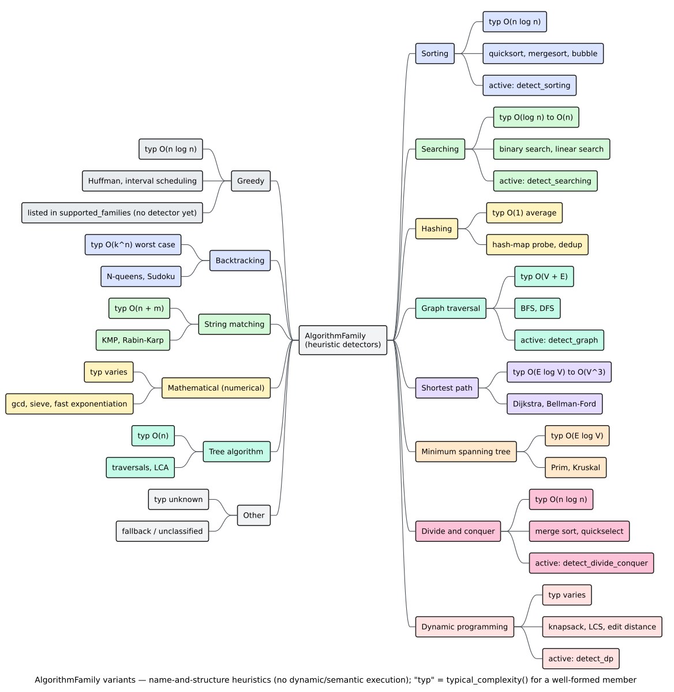

# Algorithm Families

An **[algorithm family](../../GLOSSARY.md#algorithm-family)** is a structural category — sorting, searching, graph traversal, and so on — that the `algorithm-detection` feature recognises from a function's loop and recursion shape plus a handful of identifier-name cues. Families are named by the `AlgorithmFamily` enum. This page lists every variant, gives each one's *intended* structural signature, and states plainly which families the shipped detector actually produces.

> **Feature gate.** `AlgorithmFamily` and everything below live in the `algorithm-detection`-gated `algorithms` module (`default = []`). See [Overview](overview.md) for enabling it and [Feature flags](../../GLOSSARY.md#feature-flag-cargo).



*Figure — the `AlgorithmFamily` taxonomy and its heuristic detectors. Source: [`diagrams/algorithm-family-taxonomy.puml`](../../diagrams/algorithm-family-taxonomy.puml).*

## The `AlgorithmFamily` enum

There are **14** variants. Each provides a `name()` and a `typical_complexity()` label (both `&'static str`), and the enum implements `Display` via `name()`.

```rust
// requires: features = ["algorithm-detection"]
pub enum AlgorithmFamily {
    Sorting,              // ordering elements
    Searching,            // finding an element
    GraphTraversal,       // BFS, DFS
    ShortestPath,         // Dijkstra, Bellman-Ford
    MinimumSpanningTree,  // Prim, Kruskal
    DynamicProgramming,   // overlapping subproblems + memoisation
    DivideAndConquer,     // recursive decomposition
    Greedy,               // locally optimal choices
    Backtracking,         // exhaustive search with pruning
    StringMatching,       // pattern search in text
    TreeAlgorithm,        // tree-shaped recursion / traversal
    Hashing,              // hash-based lookup
    Mathematical,         // numeric / closed-form computation
    Other,                // catch-all
}
```

There is **no** `Unknown`, `Compression`, `Numerical`, or `MachineLearning` variant — earlier drafts of this page listed those in error. `Other` is the catch-all.

### Family metadata

`typical_complexity()` returns a *documentation label* describing a well-implemented member of the family, not a measured result. The exact strings are:

| Variant | `name()` | `typical_complexity()` | As Big-O |
|---|---|---|---|
| `Sorting` | `"Sorting"` | `"O(n log n)"` | $`O(n \log n)`$ |
| `Searching` | `"Searching"` | `"O(log n) to O(n)"` | $`O(\log n)`$ – $`O(n)`$ |
| `GraphTraversal` | `"Graph Traversal"` | `"O(V + E)"` | $`O(V + E)`$ |
| `ShortestPath` | `"Shortest Path"` | `"O(E log V) to O(V³)"` | $`O(E \log V)`$ – $`O(V^3)`$ |
| `MinimumSpanningTree` | `"Minimum Spanning Tree"` | `"O(E log V)"` | $`O(E \log V)`$ |
| `DynamicProgramming` | `"Dynamic Programming"` | `"Varies"` | problem-specific |
| `DivideAndConquer` | `"Divide and Conquer"` | `"O(n log n)"` | $`O(n \log n)`$ |
| `Greedy` | `"Greedy"` | `"O(n log n)"` | $`O(n \log n)`$ |
| `Backtracking` | `"Backtracking"` | `"O(k^n) worst case"` | $`O(k^n)`$ |
| `StringMatching` | `"String Matching"` | `"O(n + m)"` | $`O(n + m)`$ |
| `TreeAlgorithm` | `"Tree Algorithm"` | `"O(n)"` | $`O(n)`$ |
| `Hashing` | `"Hashing"` | `"O(1) average"` | $`O(1)`$ amortised |
| `Mathematical` | `"Mathematical"` | `"Varies"` | problem-specific |
| `Other` | `"Other"` | `"Unknown"` | — |

## Which families are actually detected?

This is the single most important table on the page. `DefaultAlgorithmDetector` contains exactly **five** family routines; everything else is metadata only.

| Family | Detector present? | Notes |
|---|---|---|
| `Sorting` | ✅ `detect_sorting` | The only family that fills an `AlgorithmSignature`. |
| `Searching` | ✅ `detect_searching` | Distinguishes binary vs linear search. |
| `GraphTraversal` | ✅ `detect_graph` | Distinguishes BFS vs DFS. |
| `DynamicProgramming` | ✅ `detect_dp` | Memoisation-table cue. |
| `DivideAndConquer` | ✅ `detect_divide_conquer` | Recursion + $`O(\log n)`$/$`O(n \log n)`$ estimate. |
| `Greedy` | ⚠️ advertised, **absent** | Listed by `supported_families()` but has no routine, so it is never returned. |
| `ShortestPath` | ❌ | Named in the enum; not produced. |
| `MinimumSpanningTree` | ❌ | Named; not produced. |
| `Backtracking` | ❌ | Named; not produced. |
| `StringMatching` | ❌ | Named; not produced. |
| `TreeAlgorithm` | ❌ | Named; not produced. |
| `Hashing` | ❌ | Named; not produced. |
| `Mathematical` | ❌ | Named; not produced. |
| `Other` | ❌ | Catch-all; not produced. |

`supported_families()` returns `[Sorting, Searching, GraphTraversal, DynamicProgramming, DivideAndConquer, Greedy]` — six entries, one of which (`Greedy`) is aspirational. Rely on the five real detectors, not on this list.

## Structural signatures of the detected families

Each detector combines the `ComplexityAnalyzer`'s [complexity estimate](complexity.md), the [`ControlFlowAnalyzer`](../../GLOSSARY.md#control-flow-graph-cfg)'s loop/recursion findings, and AST-scan predicates over the function's descendants. The predicates are frank about being shallow: several are pure identifier-name matches.

### Sorting

- **Gate**: at least one loop **and** a comparison operator (`<`, `>`, `<=`, `>=`, `==`, `!=`) somewhere in the body.
- **$`O(n^2)`$ branch** (`Quadratic` estimate): if a swap is present (three or more assignments, or an identifier/member whose name contains `swap`) and the body indexes an adjacent element (`i + 1`, i.e. a `+` with an integer-`1` operand) → **`"Bubble Sort"`**, confidence `0.7`; swap without the adjacency cue → **`"Selection Sort"`**, `0.6`; no swap but array indexing present → **`"Insertion Sort"`**, `0.6`; otherwise unnamed at `0.5`.
- **$`O(n \log n)`$ branch** (`Linearithmic`): unnamed at `0.6` (merge/quick/heap territory).
- **$`O(n)`$ branch** (`Linear`): unnamed at `0.4` — below the default threshold, so normally dropped.
- **Signature**: this detector alone attaches a full `AlgorithmSignature` (loop structure + time complexity).

### Searching

- **Gate**: a comparison operator is present.
- **$`O(\log n)`$ branch** (`Logarithmic`): if the function recurses, or computes a midpoint (division/right-shift by an integer `1` or `2`, or an identifier named `mid`/`middle`) → **`"Binary Search"`**, confidence `0.8`; otherwise unnamed at `0.6`.
- **$`O(n)`$ branch** (`Linear`): exactly one loop containing an early `return` (a `Return` nested inside a `For`/`While`/`Loop`) → **`"Linear Search"`**, `0.7`; otherwise unnamed at `0.5`.

### Graph traversal

- **Gate**: a *visited-set* cue — an identifier whose name contains `visited`, `seen`, or `marked`.
- **Queue cue** (name contains `queue`, `push_back`, `pop_front`, `deque`, `enqueue`, or `dequeue`) → **`"BFS"`**, confidence `0.7`.
- **Stack cue** (name contains `stack`, or is exactly `push`/`pop`) **or** a `While` loop → **`"DFS"`**, `0.6`.
- Otherwise nothing is reported.

### Dynamic programming

- **Gate**: a *memoisation-table* cue — an identifier whose name contains `memo`, `dp`, `cache`, or `table`, or is exactly `f` or `dp_table`.
- **Confidence**: `0.7` when the function has loops of nesting depth $`\ge 2`$ (bottom-up table filling), else `0.5`.

### Divide and conquer

- **Gate**: the function recurses **and** the complexity estimate is `Logarithmic` or `Linearithmic`.
- **Confidence**: driven by the number of recursive call sites — one call → `0.6` (binary-search-like), two → `0.7` (merge-sort-like), more → `0.5`.

## The remaining families

`ShortestPath`, `MinimumSpanningTree`, `Greedy`, `Backtracking`, `StringMatching`, `TreeAlgorithm`, `Hashing`, `Mathematical`, and `Other` are part of the vocabulary so that consumers (and future detectors) have stable names, but the current release does **not** emit them. If you filter for them you will always get an empty result:

```rust
// requires: features = ["algorithm-detection"]
use libcpg::algorithms::{AlgorithmDetector, AlgorithmFamily,
                         detection::DefaultAlgorithmDetector};

let detector = DefaultAlgorithmDetector::new();
let found = detector.detect(&cpg, function_id);

// Always empty in the current release — no greedy/shortest-path/… detector exists.
let greedy: Vec<_> = found.iter()
    .filter(|a| a.family == AlgorithmFamily::Greedy)
    .collect();
assert!(greedy.is_empty());
```

For reference, the *structural intent* of these families (drawn from the standard literature [[1]](#references)) is:

- **Shortest path / MST**: distance or key arrays maintained against a priority queue with an edge-relaxation or cut step.
- **Greedy**: a sort or heap followed by a single non-backtracking pass.
- **Backtracking**: recursion that mutates shared state, checks a constraint, recurses, then *undoes* the mutation.
- **String matching**: a scan driven by a precomputed skip/failure table or a rolling hash.
- **Tree / mathematical / hashing**: tree-shaped recursion, closed-form numeric work, and modulo-indexed lookup respectively.

Encoding these as detectors is future work; see [Contributing](../../engineering/04-contributing.md) for how a new family routine plugs into `detect`.

## Filtering results by family

Because `detect` already sorts by confidence descending, family filtering is a simple `Iterator` step:

```rust
// requires: features = ["algorithm-detection"]
use libcpg::algorithms::{AlgorithmDetector, AlgorithmFamily,
                         detection::DefaultAlgorithmDetector};

let detector = DefaultAlgorithmDetector::new();

for func in cpg.functions() {
    let sorts = detector
        .detect(&cpg, func.id)
        .into_iter()
        .filter(|a| a.family == AlgorithmFamily::Sorting);

    for s in sorts {
        println!(
            "{} looks like {} ({:.0}% confidence)",
            func.name().unwrap_or("<anon>"),
            s.name.as_deref().unwrap_or("an unnamed sort"),
            s.confidence * 100.0,
        );
    }
}
```

There is no `with_families(...)` selector on `DefaultAlgorithmDetector`; the only knob is `with_min_confidence`. Filter by family after the fact, as above.

## Related reading

- [Overview](overview.md) — the detection pipeline and result types.
- [Complexity analysis](complexity.md) — how the `ComplexityClass` used by these gates is derived.
- [Theory: algorithm & complexity analysis](../../theory/08-algorithm-and-complexity-analysis.md) — families as structural signatures.
- [API: pattern & analysis reference](../../api/pattern-reference.md) — the exact `AlgorithmFamily` surface.

## References

1. Cormen, T. H., Leiserson, C. E., Rivest, R. L., Stein, C. (2009). *Introduction to Algorithms* (3rd ed.). MIT Press. ISBN 978-0262033848 (no DOI). *(Canonical taxonomy of algorithm families and their idiomatic structures.)*
