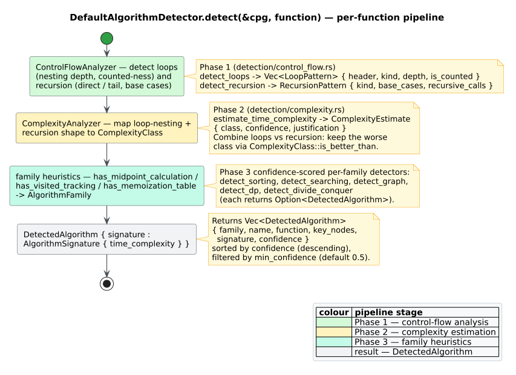

# Algorithm Detection — Overview

`libcpg` can look at a single function's [Code Property Graph](../../GLOSSARY.md#code-property-graph-cpg) and make a *heuristic* guess at which **[algorithm family](../../GLOSSARY.md#algorithm-family)** it implements (sorting, searching, graph traversal, …) together with a **[Big-O complexity](../../GLOSSARY.md#complexity-class--big-o)** estimate. This page introduces the feature, the detector API, and — honestly — what the detector can and cannot do.

> **Feature gate.** The entire `algorithms` module is compiled only when the `algorithm-detection` feature is enabled. `libcpg`'s default feature set is empty (`default = []`), so with a bare dependency the module does not exist. Add the feature explicitly:
>
> ```toml
> [dependencies]
> libcpg = { version = "0.1", features = ["algorithm-detection"] }
> ```
>
> To also build a CPG from source text you need a language grammar feature such as `lang-rust`; see [Feature flags](../../GLOSSARY.md#feature-flag-cargo).

## Why heuristic detection?

A CPG already exposes a function's loop nesting, recursion structure, and identifier names. Those structural signals correlate strongly with algorithm shape: two nested counted loops with a comparison and a swap *look like* an $`O(n^2)`$ sort; one recursive call after halving the input *looks like* binary search. The detector turns these observations into a ranked list of candidate algorithms, each with a confidence score in $`[0, 1]`$.

This is **pattern recognition, not proof**. The detector never executes code and never certifies identity — it reports *evidence*, and much of that evidence is name-based (it inspects identifiers such as `visited`, `memo`, `mid`). Treat every result as advisory.



*Figure — the per-function detection pipeline inside `DefaultAlgorithmDetector::detect`. Source: [`diagrams/algorithm-detection-pipeline.puml`](../../diagrams/algorithm-detection-pipeline.puml).*

## The detector API

Detection is exposed through one trait and one concrete implementation.

```rust
// requires: features = ["algorithm-detection"]
use libcpg::{CodePropertyGraph, NodeId};
use libcpg::algorithms::{DetectedAlgorithm, AlgorithmFamily};

pub trait AlgorithmDetector: Send + Sync {
    /// Detects algorithms in ONE function, identified by its NodeId.
    fn detect(&self, cpg: &CodePropertyGraph, function: NodeId) -> Vec<DetectedAlgorithm>;

    /// The families this detector is willing to report.
    fn supported_families(&self) -> &[AlgorithmFamily];
}
```

The key fact — and the one most existing prose gets wrong — is that **`detect` is per-function**: it takes the `NodeId` of a single `Function` node, not the whole graph. To scan a program you iterate the functions yourself.

`DefaultAlgorithmDetector` is the built-in implementation:

```rust
// requires: features = ["algorithm-detection"]
use libcpg::algorithms::detection::DefaultAlgorithmDetector;

let detector = DefaultAlgorithmDetector::new();            // min_confidence = 0.5
let strict   = DefaultAlgorithmDetector::new()
    .with_min_confidence(0.7);                             // keep only strong matches
```

The default confidence threshold is **`0.5`** (do not confuse this with the Gang-of-Four pattern detector's `0.7` default — that lives in the separate `patterns` module). Candidates scoring below the threshold are discarded.

## What `detect` does, step by step

`DefaultAlgorithmDetector::detect` runs three phases and returns the survivors sorted by confidence, highest first.

```text
detect(cpg, function):
  # Phase 1 — control-flow analysis (ControlFlowAnalyzer)
  loops     ← detect_loops(cpg, function)       # nesting depth, counted?, kind
  recursion ← detect_recursion(cpg, function)   # Direct | Tail; base cases; calls

  # Phase 2 — complexity estimation (ComplexityAnalyzer)
  time ← estimate_time_complexity(cpg, function)  # a ComplexityClass + confidence

  # Phase 3 — five family detectors, each may return Some(DetectedAlgorithm)
  results ← []
  push_if_some results  detect_sorting(cpg, function, loops, time)
  push_if_some results  detect_searching(cpg, function, loops, recursion, time)
  push_if_some results  detect_graph(cpg, function, loops)
  push_if_some results  detect_dp(cpg, function, loops)
  push_if_some results  detect_divide_conquer(cpg, function, recursion, time)

  sort results by confidence descending
  return results          # each element already passed min_confidence
```

Two subsystems do the structural work and are usable on their own:

- **[`ControlFlowAnalyzer`](../../GLOSSARY.md#control-flow-graph-cfg)** walks the function's AST descendants to find loops (`detect_loops`) and self-recursion (`detect_recursion`). It classifies each loop as `For` / `While` / `DoWhile` / `Infinite` / `Iterator`, computes nesting depth by counting loop ancestors, and marks a loop *counted* when it finds a range or a comparison-plus-increment idiom.
- **`ComplexityAnalyzer`** maps that loop/recursion shape onto a [`ComplexityClass`](../../GLOSSARY.md#complexity-class--big-o). It is covered in depth in [Complexity analysis](complexity.md).

## Result types

### `DetectedAlgorithm`

```rust
// requires: features = ["algorithm-detection"]
pub struct DetectedAlgorithm {
    pub family: AlgorithmFamily,       // e.g. AlgorithmFamily::Sorting
    pub name: Option<String>,          // e.g. Some("Bubble Sort") — a guessed label
    pub function: NodeId,              // the function this describes
    pub key_nodes: Vec<NodeId>,        // notable nodes (may be empty)
    pub signature: AlgorithmSignature, // structural summary (see below)
    pub confidence: f64,               // 0.0 ..= 1.0
}
```

`name` is a hard-coded English string chosen by the detector (`"Bubble Sort"`, `"Binary Search"`, `"BFS"`, …), not one of the per-family enums such as `SortingAlgorithm`. Those enums exist under `algorithms::families::{sorting, searching, graph, dp}` as reference catalogues but are **not** wired into the detector's output.

### `AlgorithmSignature`

```rust
// requires: features = ["algorithm-detection"]
pub struct AlgorithmSignature {
    pub loop_structure:   Option<LoopStructure>,
    pub recursion_pattern: Option<RecursionPattern>,
    pub time_complexity:  Option<ComplexityEstimate>,
    pub space_complexity: Option<ComplexityEstimate>,
    pub feature_vector:   Vec<f32>,     // reserved for ML classification; empty by default
}
```

**Honesty note.** Only `detect_sorting` fills in a signature (via an internal `build_signature` that records the loop structure and time complexity). The other four detectors return a `DetectedAlgorithm` with a *default* (all-`None`, empty) `AlgorithmSignature`. So for a detected `Searching`, `GraphTraversal`, `DynamicProgramming`, or `DivideAndConquer` result, `signature.time_complexity` is `None` — query the [`ComplexityAnalyzer`](complexity.md) directly if you need the estimate for those.

## A worked example

```rust
// requires: features = ["algorithm-detection", "lang-rust"]
use libcpg::{TreeSitterCpgBuilder, CpgBuilder, Language};
use libcpg::algorithms::{AlgorithmDetector, detection::DefaultAlgorithmDetector};

fn main() -> libcpg::Result<()> {
    let source = r#"
        fn bubble_sort(a: &mut [i32]) {
            for i in 0..a.len() {
                for j in 0..a.len() - 1 {
                    if a[j] > a[j + 1] {
                        a.swap(j, j + 1);
                    }
                }
            }
        }
    "#;

    let cpg = TreeSitterCpgBuilder::new().build(source, Language::Rust)?;
    let detector = DefaultAlgorithmDetector::new();

    for func in cpg.functions() {
        for found in detector.detect(&cpg, func.id) {
            let name = found.name.as_deref().unwrap_or("<unnamed>");
            println!(
                "{}: {} / {} (confidence {:.2})",
                func.name().unwrap_or("<anon>"),
                found.family,          // AlgorithmFamily implements Display
                name,
                found.confidence,
            );
            if let Some(est) = &found.signature.time_complexity {
                println!("    time: {} — {}", est.class, est.justification);
            }
        }
    }
    Ok(())
}
```

For this input the detector reports one result: family `Sorting`, name `"Bubble Sort"`, confidence `0.70`, with an attached `Quadratic` time estimate — the two counted nested loops give $`O(n^2)`$, the `>` comparison and the `a.swap(j, j + 1)` call supply the swap evidence, and the `j + 1` index reveals the *adjacent* swap that distinguishes bubble sort from selection sort.

Note the field access `func.id` (a public field on `CpgNode`) and the method `func.name()` (which returns `Option<&str>`) — `CpgNode` exposes `id`, `kind`, and `range` as fields, not accessor methods.

## Coverage and honest limits

The detector's reach is deliberately narrow. Be explicit about it in any tool you build on top.

| Concern | Reality |
|---|---|
| Families actually emitted | Only **5**: `Sorting`, `Searching`, `GraphTraversal`, `DynamicProgramming`, `DivideAndConquer`. |
| `supported_families()` | Advertises **6** — the five above **plus `Greedy`** — yet there is **no** greedy detector, so `Greedy` is never returned. |
| The other 8 `AlgorithmFamily` variants | `ShortestPath`, `MinimumSpanningTree`, `Backtracking`, `StringMatching`, `TreeAlgorithm`, `Hashing`, `Mathematical`, `Other` are defined and carry a `typical_complexity()` label but are **never produced**. |
| Evidence quality | Much of it is **identifier-name matching** (`visited`, `seen`, `memo`, `cache`, `queue`, `mid`). Renamed variables defeat it; unrelated names can trigger false positives. |
| Recursion classification | `detect_recursion` only ever yields `Direct` or `Tail`; mutual/`Indirect` recursion is not actually recognised. |
| Signature completeness | Populated only for `Sorting` results (see above). |

Because `supported_families()` over-promises, do not use it as a capability oracle; rely on the fact that `detect` returns only the five implemented families.

## When to use it

- **Good for**: first-pass triage ("which functions look like expensive sorts or exponential recursion?"), teaching aids, and enriching a review dashboard with soft labels.
- **Not for**: security or correctness decisions, exact algorithm identification, or any pipeline that must not act on a false positive.

## Related reading

- [Algorithm families](families.md) — the `AlgorithmFamily` taxonomy and each family's structural signature.
- [Complexity analysis](complexity.md) — how `ComplexityAnalyzer` maps structure to a `ComplexityClass`, with the Master Theorem.
- [Theory: algorithm & complexity analysis](../../theory/08-algorithm-and-complexity-analysis.md) — the formal grounding.
- [API: pattern & analysis reference](../../api/pattern-reference.md) — exact signatures for every type named here.
- [Design-pattern detection](../patterns/overview.md) — the sibling `patterns` module for Gang-of-Four structural detection.

## References

1. Cormen, T. H., Leiserson, C. E., Rivest, R. L., Stein, C. (2009). *Introduction to Algorithms* (3rd ed.). MIT Press. ISBN 978-0262033848 (no DOI). *(Reference taxonomy of algorithm families and their complexities.)*
