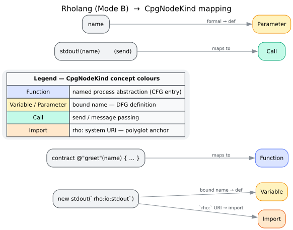
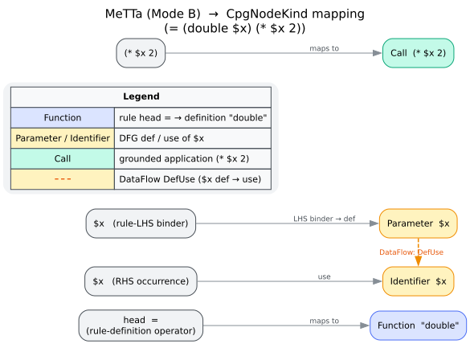

# Builder — Language Front-Ends (NodeMapper)

The `NodeMapper` is the one language-specific component of the builder. It translates a
grammar's tree-sitter node-kind **strings** (`"function_item"`, `"send"`, `"list"`, …) into
libcpg's language-agnostic [`CpgNodeKind`](../../GLOSSARY.md#node-kind--edge-kind)
vocabulary, so that the [CFG](cfg.md) and [DFG](dfg.md) extractors — and every analysis
above them — can be written **once** and work for every language. This is the mechanism
that makes libcpg polyglot (Yamaguchi et al. [[1]](#references)).

`NodeMapper` lives in the `builder` module and is reached as `libcpg::builder::NodeMapper`
(it is not re-exported at the crate root).


*Figure — from grammar to unified node kinds via the NodeMapper. Source: [`diagrams/language-frontend-pipeline.puml`](../../diagrams/language-frontend-pipeline.puml).*

---

## `map_kind` — per-language dispatch

A mapper is created for one language and dispatches every node through it:

```rust
// requires: features = ["lang-rust"]  (any lang-* enables its arm)
use libcpg::builder::NodeMapper;
use libcpg::Language;

let mapper = NodeMapper::new(Language::Rust);
// During construction the builder calls:
//   let kind = mapper.map_kind(ts_node.kind(), &ts_node, source);
```

`map_kind(ts_kind, node, source) -> CpgNodeKind` switches on the mapper's language to a
per-language routine:

| `Language` | Mapper routine |
|------------|----------------|
| `Rust` | `map_rust` |
| `Python` | `map_python` |
| `JavaScript`, `TypeScript` | `map_javascript` |
| `Go` | `map_go` |
| `Java` | `map_java` |
| `C`, `Cpp` | `map_c_cpp` |
| `Ruby` | `map_ruby` |
| `Json` | `map_json` |
| `Html` | `map_html` |
| `Css` | `map_css` |
| `Bash` | `map_bash` |
| `Yaml`, `Toml` | `map_config` |
| `Markdown` | `map_markdown` |
| `Rholang` *(cfg `rholang`)* | `map_rholang` |
| `MeTTa` *(cfg `metta`)* | `map_metta` |
| *anything else* | `map_generic` (→ `Unknown { kind }`) |

Each routine is a `match` on the grammar's kind strings. The Rust mapper is representative:

```text
map_rust(ts_kind, node, source):
    "source_file"           → Root
    "function_item"         → Function { signature: … }      # a CFG entry
    "let_declaration"       → Variable { name, var_type, … }  # a DFG definition
    "parameter"             → Parameter { name, … }
    "if_expression"         → If
    "while_expression"      → While
    "call_expression"       → Call { target: None, is_method: false }
    "binary_expression"     → BinaryOp { operator }
    "identifier"            → Identifier { name, definition: None }  # a DFG use
    "integer_literal"       → Literal { kind: Integer(..) }
    "use_declaration"       → Import { path }
    …                       → …
    _                       → Unknown { kind: ts_kind }
```

The invariants every mapper upholds are the ones the shared extractors rely on: a named
function abstraction becomes `Function` (so it seeds a CFG entry and its **last** AST child
is treated as the body — see [`cfg.md`](cfg.md#the-last-child-is-body-rule)); a *bound* name
becomes `Variable`/`Parameter` (a DFG definition) while a *referenced* name becomes
`Identifier` (a DFG use), so def-use edges form; and a call/send becomes `Call` (so the
argument→parameter machinery fires). Unrecognised kinds degrade to `Unknown { kind }` rather
than failing — construction never aborts on an unfamiliar node.

---

## Inclusion filtering: `should_include` vs `should_include_node`

Not every tree-sitter node becomes a CPG node. Two cooperating predicates decide inclusion;
the builder walk (`convert_node`) calls the node-aware one.

**`should_include(ts_kind, include_comments) -> bool`** is the string-keyed test. It drops:

- pure punctuation: `(` `)` `{` `}` `[` `]` `,` `;` `:` `::` `.` `->` `=>` `<` `>`;
- comments, unless `include_comments` is set and the kind contains `"comment"`;
- language-specific **transparent wrappers / grouping containers** whose names never collide
  with a semantic rule:
  - **MeTTa** *(cfg `metta`)*: `expression`, `atom_expression`, `prefixed_expression` — these
    wrap *every* node in the grammar;
  - **Rholang** *(cfg `rholang`)*: comma/semicolon/`&`-list and marker containers —
    `names`, `name_decls`, `receipts`, `receipt`, `linear_decls`, `conc_decls`,
    `agent_decls`, `agent_decl`, `inputs`, `messages`, `args`, `procs`, `cases`, `branches`,
    `send_single`, `send_multiple`, `var_ref_kind`.

Dropping a wrapper **reparents its children** to the enclosing construct (see
[`overview.md`](overview.md#inside-ast-construction-convert_node)), so the surviving CPG
tree has the real structure the CFG/DFG expect — e.g. an `ifElse`'s children collapse to
exactly `[condition, consequence, alternative]`, matching `process_if`.

**`should_include_node(node, include_comments) -> bool`** layers a node-aware check on top:
for **Rholang** it additionally drops anonymous keyword/operator/punctuation **tokens**
(`node.is_named() == false`). This is necessary because in tree-sitter an anonymous token
shares its `kind()` string with the same-named semantic rule — the `"contract"` keyword vs.
the `contract` rule, `"match"`, `"new"`, `"let"`, `"bundle"`, `"method"`, … — so the string
test alone cannot drop the token without also dropping the rule. Removing the tokens (but
never the rules) yields clean child ordering for the CFG builder and keeps operator glyphs
out of the DFG use-set. MeTTa needs no token filtering: its only anonymous tokens are `(` /
`)` (already dropped as punctuation), and its "keywords" (`if`, `let`, `import!`) are
*named* `identifier` atoms that `map_metta` dispatches on and must retain.

> **A key subtlety.** The mapper navigates the **raw tree-sitter tree**, in which the
> wrappers still exist; `should_include` only decides which nodes get a *CPG* node. That is
> why the Rholang and MeTTa classifiers below can walk `node.parent()` through a `names` list
> or unwrap an `expression` layer that never appears in the finished CPG.

---

## Parser registry

For the internal-parse path (`build`), the grammars themselves live in `ParserRegistry`, a
lazily-initialised `OnceLock` singleton:

```rust
use libcpg::builder::ParserRegistry;
use libcpg::Language;

let registry = ParserRegistry::global();
let _ = registry.supports(Language::Rust);   // true iff `lang-rust` is compiled in
```

The registry inserts a grammar **only when its `lang-*` feature is enabled**, so it holds up
to the 16 built-in languages (Rust, Python, JavaScript, TypeScript, Go, Java, C, C++, JSON,
HTML, CSS, Bash, TOML, YAML, Markdown, Ruby). `ParserRegistry::supports(lang)` is the
*ground truth* for grammar availability — unlike the builder's static
`supported_languages()` list (see [`overview.md`](overview.md#the-cpgbuilder-trait)).

**Rholang and MeTTa are deliberately absent from the registry.** They are reached only
through [Mode B](#mode-b-rholang-and-metta).

---

## Mode B: Rholang and MeTTa

Rholang and MeTTa are **implemented Mode-B mappers**, not planned features and not
registry-backed `build()` languages. Their `map_kind` arms and mapper routines are gated on
the dependency-free cfg toggles `rholang` and `metta`: the arms reference only kind strings
and `tree_sitter::Node` navigation — never a grammar-crate symbol — so enabling the feature
pulls in no dependency. The caller parses with its own grammar (e.g. `tree-sitter-rholang`,
`tree-sitter-metta`) and hands the tree to
[`build_from_tree`](overview.md#two-ways-to-build-build-vs-build_from_tree):

```rust
// requires: features = ["rholang"] + a tree parsed with tree-sitter-rholang (Mode B)
use libcpg::{TreeSitterCpgBuilder, Language};

// The caller owns the parse:
//   let mut parser = tree_sitter::Parser::new();
//   parser.set_language(&tree_sitter_rholang::language())?;
//   let tree = parser.parse(source, None).expect("parse");

// libcpg maps and builds — no registry, no lang-* feature:
//   let cpg = TreeSitterCpgBuilder::new()
//       .build_from_tree(&tree, source, Language::Rholang)?;
```

The design rationale (why empty cfg toggles, why the grammar pins are matched to pgmcp to
avoid duplicate C symbols) is recorded in
[`../../design/0002-mode-b-build-from-tree.md`](../../design/0002-mode-b-build-from-tree.md).

The mapping posture for both languages is **sound but incomplete** in the standard
multi-language-CPG sense (Yamaguchi et al. [[1]](#references)): each construct is normalised
onto the nearest CPG anchor that never asserts an edge the semantics forbid, even where it
omits an edge the semantics would allow.

---

## Rholang mapping (`map_rholang`)

Rholang is the concurrent [ρ-calculus](../../GLOSSARY.md#rholang) language of the
F1R3FLY.io / RChain ecosystem. Process-calculus constructs have no dedicated CPG node kind,
so each is normalised onto the nearest imperative anchor that keeps the CFG/DFG sound.



*Figure — how ρ-calculus constructs project onto CpgNodeKind. Source: [`diagrams/rholang-mapping.dot`](../../diagrams/rholang-mapping.dot).*

| Rholang construct (kind) | `CpgNodeKind` | Why |
|--------------------------|---------------|-----|
| `contract`, `constructor_decl`, `method_decl`, `default_decl` | `Function` | named process abstraction → CFG entry; body `block` is the last child |
| `agent_block` | `Class` | object-like grouping of a constructor + methods |
| `new`, `let`, `input`, `block`, `par`, `bundle`, `sync_send_cont`, `non_empty_cont`, `empty_cont` | `Block` | process regions / scopes (`par` keeps both operands as concurrent sub-blocks) |
| `ifElse` | `If` | conditional |
| `match`, `choice` | `Match` | scrutinee-dispatch / non-deterministic choice |
| `case`, `branch` | `MatchArm` | a match/choice arm |
| `send`, `send_sync` | `Call` | `x!(v)` / `x!?(v)` send at the send site |
| `send_method`, `method`, `send_method_source` | `Call { is_method: true }` | method-style send / method call |
| `linear_bind`, `repeated_bind`, `peek_bind`, `receive_send_source`, `send_receive_source` | `Call` | `<-` / `<=` / `<<-` receive consumes on a source channel |
| `simple_source` | `Identifier` | bare channel name in `for`-source position (a use) |
| `name_decl` **with** a `` `rho:…` `` URI child | `Import { path }` | system-process import (the polyglot anchor) |
| `name_decl` without a URI, `let_var_decl`, `decl` | `Block` | scope wrapper around the bound `Variable` |
| `var` | `Variable` / `Parameter` / `Identifier` | classified by position — see below |
| `wildcard` | `Identifier { name: "_" }` | |
| `var_ref` | `Identifier` | `=x` / `=*x` pattern-variable reference (a use) |
| `eval` | `UnaryOp { operator: "*" }` | `*x` unquote (the `name` child stays a use) |
| `quote` | `UnaryOp { operator: "@" }` | `@P` reify a process as a name |
| `add`,`sub`,`mult`,…,`disjunction`,`conjunction` | `BinaryOp { operator }` | arithmetic / comparison / logic |
| `not`, `neg`, `negation` | `UnaryOp { operator }` | |
| `simple_type` | `TypeAnnotation` | |
| `bool_literal`, integer/float literals, `string_literal`, `uri_literal` | `Literal` | |
| `nil`, `unit` | `Literal { kind: Null }` | inert process `Nil`, empty value `()` |
| `list`, `set`, `tuple`, `collection` | `Literal { kind: Array }` | |
| `map`, `pathmap` | `Literal { kind: Object }` | |
| `key_value_pair` | `Field` | |
| `bundle_read`/`bundle_write`/`bundle_equiv`/`bundle_read_write` | `Attribute` | capability markers |
| `line_comment`, `block_comment` | `Comment` | |
| `ERROR` | `Error` | parse error |

### `classify_rholang_var` — the DFG-soundness core

Rholang has a single lexical identifier token, `var`. Whether it is a **definition** or a
**use** is decided by its syntactic position, walking `node.parent()` on the raw tree:

- parent is `name_decl` → `Variable` (a `new`-restricted channel name is a definition);
- parent is `let_var_decl` and the node is its first named child → `Variable`
  (the `x` in `let x = P`);
- the `var` sits under a `names` list (possibly through a `@`-`quote` pattern) whose
  grandparent is a binding construct (`contract`, `constructor_decl`, `method_decl`,
  `default_decl`, `linear_bind`, `repeated_bind`, `peek_bind`, `decl`) → `Parameter`
  (a formal / receive-bound name);
- otherwise → `Identifier` (a use: a send channel, an argument, an operand, a `*x` target).

This positional def/use split is what lets the shared DFG sweep form correct def-use edges
for Rholang without any Rholang-specific logic in the extractor.

### Worked mapping

```text
new stdout(`rho:io:stdout`) in {
  contract @"double"(x, ret) = { ret!(*x * 2) }
}
```

- `new … in { … }` → `Block` (a ν-restriction scope);
- `name_decl` for `stdout(`rho:io:stdout`)` → `Import { path: "rho:io:stdout" }`, and its
  bound `stdout` `var` → `Variable` (definition);
- `contract` → `Function` named `double` (via `rholang_signature`, from the `name` field);
- the formals `x`, `ret` → `Parameter`;
- `ret!(…)` send → `Call`; the `*x` unquote → `UnaryOp("*")` with `x` a use `Identifier`;
- `2` → `Literal { Integer }`.

The result is a `Function` with two parameters whose `x` use inside `*x * 2` links back to
the parameter definition — a sound def-use chain over process-calculus source.

---

## MeTTa mapping (`map_metta`)

[MeTTa](../../GLOSSARY.md#metta) is a minimal
[S-expression](../../GLOSSARY.md#s-expression) rewriting language: a rule `(= (f $x) body)`
is not a distinct grammar node but a `list` whose **head atom** carries the semantics. The
mapper therefore dispatches a compound form on its head.



*Figure — S-expression head-atom dispatch onto CpgNodeKind. Source: [`diagrams/metta-mapping.dot`](../../diagrams/metta-mapping.dot).*

Top-level `map_metta`:

| MeTTa kind | `CpgNodeKind` |
|------------|---------------|
| `source_file` | `Root` |
| `list` | dispatched by `map_metta_list` (below) |
| `identifier` | `Identifier` (a use) |
| `variable` | `Parameter` / `Identifier` — via `classify_metta_var` |
| `wildcard` | `Identifier { name: "_" }` |
| `space_reference`, `special_type_symbol` | `Identifier` (`&self`, `%Undefined%`) |
| `boolean_literal`, `integer_literal`, `float_literal`, `string_literal` | `Literal` |
| operator glyphs (`operator`, `arrow_operator`, `assignment_operator`, `rule_definition_operator`, `type_annotation_operator`, …) as **standalone** leaves | `Unknown` (kept out of the DFG use-set) |
| `line_comment` | `Comment` |
| `ERROR` | `Error` |

### `map_metta_list` — head-atom dispatch

The head is the first named child, unwrapped through the grammar's wrapper layers by
`metta_unwrap` (which descends through `expression` → `atom_expression` → `operator`):

```text
map_metta_list(list):
    head ← metta_unwrap(list.named_child(0))       # empty list () → Literal(Null)
    match head.kind:
      assignment_operator | rule_definition_operator      # (= LHS RHS) / (:= LHS RHS)
          → Function { name: metta_rule_name(list) }       #   a CFG entry; body = RHS
      type_annotation_operator | arrow_operator            # (: name Type) / (-> A B R)
          → TypeAnnotation
      identifier → match head text:
          "if"            → If
          "case" | "match"→ Match
          "let" | "let*"  → Block
          "import!"       → Import { path: metta_import_path(list) }
          _               → Call                            # function application
      _  → Call                                             # grounded/higher-order call
```

`metta_rule_name` extracts the defined name — the head `identifier` of the LHS list
(`(= (foo $x) …)` → `foo`) or the LHS atom itself (`(:= bar …)` → `bar`).
`metta_import_path` takes the last named child of an `import!` form.

### `classify_metta_var`

A `$variable` is a **definition** (`Parameter`) only when it is a rule-LHS binder — `$x` in
`(= (foo $x) …)` — and a **use** (`Identifier`) everywhere else. The check walks the raw
parent chain (`variable → atom_expression → expression → lhs_list → expression →
outer_list`) and confirms both that the outer head is `=`/`:=` and that the enclosing list
is the LHS (second) operand rather than the RHS.

### Worked mapping

```text
(= (double $x) (* $x 2))
```

- the outer `list`'s head is `=` → `Function` named `double`;
- `$x` in the LHS `(double $x)` → `Parameter` (a definition);
- `(* $x 2)` is a `list` whose head `*` is an operator (not an `identifier`) → `Call`;
- `$x` in the RHS → `Identifier` (a use), linked by the DFG sweep to the LHS parameter;
- `2` → `Literal { Integer }`.

So `(= (double $x) (* $x 2))` yields a `Function` "double" whose parameter `$x` flows to its
use inside `(* $x 2)` — a def-use edge over symbolic S-expression source.

---

## See also

- [`overview.md`](overview.md) — how `convert_node` calls the mapper and reparents dropped
  nodes.
- [`cfg.md`](cfg.md) / [`dfg.md`](dfg.md) — the extractors that consume the mapper's
  `CpgNodeKind`s.
- [`../graph/nodes.md`](../graph/nodes.md) — the full `CpgNodeKind` catalogue.
- [`../../api/builder-reference.md`](../../api/builder-reference.md) — `NodeMapper` and
  `ParserRegistry` signatures.
- [`../../architecture/language-frontends.md`](../../architecture/language-frontends.md) —
  the front-end architecture in context.
- [`../../usage/06-f1r3fly-rholang-metta.md`](../../usage/06-f1r3fly-rholang-metta.md) — a
  task-oriented Mode-B integration guide for Rholang and MeTTa.
- [`../../design/0002-mode-b-build-from-tree.md`](../../design/0002-mode-b-build-from-tree.md)
  — the Mode-B design record.

---

## References

1. Yamaguchi, F., Golde, N., Arp, D., Rieck, K. (2014). *Modeling and Discovering Vulnerabilities with Code Property Graphs.* 2014 IEEE Symposium on Security and Privacy. DOI: [10.1109/SP.2014.44](https://doi.org/10.1109/SP.2014.44)
