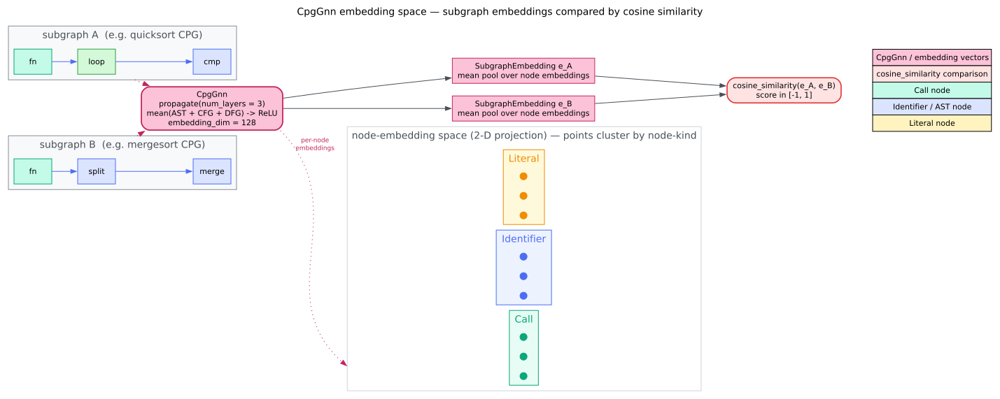

# Embeddings

Once [message passing](message-passing.md) has run, every node carries a learned vector. `libcpg` wraps those vectors in two small value types — `NodeEmbedding` and `SubgraphEmbedding` — that add an [L2 norm](../../GLOSSARY.md#embedding) and [cosine similarity](../../GLOSSARY.md#cosine-similarity). This page covers both types, how to build them from `CpgGnn` output, how similarity behaves, and how they serialise.

> **Feature gate.** These types and their vector math require the `gnn` feature (see [Overview](overview.md)).

## `CpgGnn` returns raw vectors; the wrappers add behaviour

A subtle but important point: `CpgGnn` itself returns bare `ndarray::Array1<f32>` values —

- `gnn.node_embedding(id) -> Option<Array1<f32>>`
- `gnn.subgraph_embedding(&nodes) -> Array1<f32>`

The `NodeEmbedding`/`SubgraphEmbedding` types are **wrappers you construct** around those vectors to get `norm()` and `cosine_similarity()`. They are not returned by the GNN directly.

## `NodeEmbedding`

```rust
// requires: features = ["gnn"]
use libcpg::NodeId;
use ndarray::Array1;

pub struct NodeEmbedding {
    pub node_id: NodeId,
    pub vector: Array1<f32>, // present only under `gnn`; skipped by serde (see below)
    pub dim: usize,
}
```

Build one from a GNN result and inspect it:

```rust
// requires: features = ["gnn"]
use libcpg::gnn::NodeEmbedding;
use libcpg::{GraphNeuralNetwork, NodeId};

// `gnn` has already had `propagate` called on it.
let raw = gnn.node_embedding(node_id).expect("node has an embedding");
let emb = NodeEmbedding::new(node_id, raw); // `dim` is inferred from the vector length

println!("dim:  {}", emb.dim);
println!("norm: {:.3}", emb.norm()); // L2 norm
```

`NodeEmbedding::new(node_id, vector)` records the vector and sets `dim = vector.len()`. `norm()` is the Euclidean length $`\lVert v \rVert = \sqrt{\sum_i v_i^2}`$.

## `SubgraphEmbedding`

A subgraph embedding summarises many nodes — typically a whole function — as one vector.

```rust
// requires: features = ["gnn"]
use libcpg::NodeId;
use ndarray::Array1;
use libcpg::gnn::AggregationMethod;

pub struct SubgraphEmbedding {
    pub node_ids: Vec<NodeId>,
    pub vector: Array1<f32>,           // present only under `gnn`; skipped by serde
    pub dim: usize,
    pub aggregation: AggregationMethod, // a LABEL — see the honesty note below
}
```

```rust
// requires: features = ["gnn"]
use libcpg::gnn::{SubgraphEmbedding, AggregationMethod};
use libcpg::{GraphNeuralNetwork, NodeId};

// Collect a function's nodes: the function node plus its AST descendants.
let cpg = gnn.cpg();
let nodes: Vec<NodeId> = std::iter::once(func_id).chain(cpg.ast_descendants(func_id)).collect();

let vector = gnn.subgraph_embedding(&nodes); // mean pooling (see below)
let emb = SubgraphEmbedding::new(nodes, vector, AggregationMethod::Mean);

println!("{} nodes summarised", emb.node_count());
```

`node_count()` is available even without the `gnn` feature (it just reads `node_ids.len()`); `norm()` and `cosine_similarity()` require `gnn`.

## Aggregation methods — only `Mean` is computed

```rust
// requires: features = ["gnn"]
pub enum AggregationMethod {
    Mean,         // default
    Sum,
    Max,
    Attention,    // reserved placeholder
    Hierarchical, // reserved placeholder
}
```

**Honesty note.** `CpgGnn::subgraph_embedding` **always mean-pools** — it sums the node vectors and divides by the count, regardless of any `AggregationMethod`. The `aggregation` field on `SubgraphEmbedding` is therefore *metadata you attach*, a label describing how you intend the vector to be read; it does not change how the GNN computed it. `Attention` and `Hierarchical` are reserved placeholders with no implementation anywhere in the crate, and even `Sum`/`Max` are not applied by the built-in GNN. If you want sum or max pooling, compute it yourself from the per-node vectors:

```rust
// requires: features = ["gnn"]
use ndarray::Array1;
use libcpg::{GraphNeuralNetwork, NodeId};

// Element-wise MAX pooling — libcpg does not do this for you.
fn max_pool(gnn: &impl GraphNeuralNetwork, nodes: &[NodeId]) -> Option<Array1<f32>> {
    let mut acc: Option<Array1<f32>> = None;
    for &id in nodes {
        if let Some(v) = gnn.node_embedding(id) {
            acc = Some(match acc {
                None => v,
                Some(a) => a.iter().zip(v.iter()).map(|(x, y)| x.max(*y)).collect(),
            });
        }
    }
    acc
}
```

## Cosine similarity

The primary way to compare embeddings is [cosine similarity](../../GLOSSARY.md#cosine-similarity):

```math
\cos(u, v) = \frac{u \cdot v}{\lVert u \rVert \, \lVert v \rVert}
```

Both `NodeEmbedding` and `SubgraphEmbedding` expose `cosine_similarity(&self, other: &Self) -> f32`. It returns `0.0` as a safe fallback when the two dimensionalities differ or when either vector has zero norm; otherwise it returns the value above.

```rust
// requires: features = ["gnn"]
use libcpg::gnn::NodeEmbedding;
use libcpg::GraphNeuralNetwork;

let a = NodeEmbedding::new(id1, gnn.node_embedding(id1).expect("embedding"));
let b = NodeEmbedding::new(id2, gnn.node_embedding(id2).expect("embedding"));

let sim = a.cosine_similarity(&b);
println!("similarity: {sim:.3}");
```

Cosine similarity is mathematically in $`[-1, 1]`$. Because `CpgGnn` applies [ReLU](../../GLOSSARY.md#relu) every round, propagated embeddings are **non-negative**, so in practice observed similarities fall in $`[0, 1]`$. A rough reading:

| Score | Interpretation |
|---|---|
| $`\ge 0.95`$ | near-identical (clones, trivial edits) |
| $`0.80`$–$`0.95`$ | very similar (same shape, minor changes) |
| $`0.60`$–$`0.80`$ | related (similar structure, different details) |
| $`0.40`$–$`0.60`$ | weakly related |
| $`< 0.40`$ | unrelated |

These bands are heuristic guidance, not calibrated thresholds; tune them to your corpus.



*Figure — subgraph embeddings and cosine similarity. Source: [`diagrams/embedding-space.dot`](../../diagrams/embedding-space.dot).*

## Patterns

### Finding similar functions

Uses only real API — `functions()` yields `&CpgNode`, whose `id` is a field:

```rust
// requires: features = ["gnn"]
use libcpg::gnn::{CpgGnn, SubgraphEmbedding};
use libcpg::{GraphNeuralNetwork, NodeId};

fn subgraph(gnn: &CpgGnn, func: NodeId) -> SubgraphEmbedding {
    let nodes: Vec<NodeId> = std::iter::once(func)
        .chain(gnn.cpg().ast_descendants(func))
        .collect();
    let vector = gnn.subgraph_embedding(&nodes);
    SubgraphEmbedding::new(nodes, vector, Default::default()) // AggregationMethod::Mean
}

/// Rank every other function by similarity to `query`, keeping those at or above `threshold`.
fn find_similar(gnn: &CpgGnn, query: NodeId, threshold: f32) -> Vec<(NodeId, f32)> {
    let q = subgraph(gnn, query);
    let mut hits: Vec<(NodeId, f32)> = gnn
        .cpg()
        .functions()
        .filter(|f| f.id != query)
        .map(|f| (f.id, q.cosine_similarity(&subgraph(gnn, f.id))))
        .filter(|(_, s)| *s >= threshold)
        .collect();
    hits.sort_by(|a, b| b.1.partial_cmp(&a.1).unwrap_or(std::cmp::Ordering::Equal));
    hits
}
```

### Clustering

`libcpg` does not ship a clustering routine. Extract per-node (or per-function) vectors with `gnn.node_embedding`/`gnn.subgraph_embedding`, then hand them to an external clusterer — e.g. k-means from the `linfa` ecosystem (reachable via the `ml-linfa` feature) — treating each `Array1<f32>` as a sample. The GNN's job ends at producing the vectors.

## Serialization — the vector is skipped

`NodeEmbedding` and `SubgraphEmbedding` derive `serde` when the `serde` feature is on, but the `vector` field is annotated `#[serde(skip)]`. Only the lightweight metadata round-trips:

- `NodeEmbedding` → `node_id`, `dim`.
- `SubgraphEmbedding` → `node_ids`, `dim`, `aggregation`.

```rust
// requires: features = ["gnn", "serde"]
use libcpg::gnn::NodeEmbedding;
use libcpg::GraphNeuralNetwork;

let emb = NodeEmbedding::new(node_id, gnn.node_embedding(node_id).expect("embedding"));

let json = serde_json::to_string(&emb)?;      // stores node_id + dim only
let restored: NodeEmbedding = serde_json::from_str(&json)?;

// `restored.vector` comes back EMPTY (the field was skipped); `restored.dim` is preserved.
// Recompute the vector from the GNN before calling norm()/cosine_similarity() on it.
```

This is a deliberate choice: embeddings are cheap to recompute from a CPG and expensive to store, and they depend on the (currently untrained) network, so the format keeps only the identifiers needed to recompute. There is **no** bespoke on-disk embedding format — round-tripping goes through your own `serde_json` (or any `serde` backend). To persist full vectors, write the `Array1<f32>` components yourself alongside the metadata.

## Related reading

- [Overview](overview.md) — `CpgGnn`, configuration, and use cases.
- [Message passing](message-passing.md) — how the vectors these types wrap are produced.
- [Similarity metrics](../patterns/vf2-matching.md) — graph-level `GraphSimilarity` (Jaccard/Cosine/Weisfeiler-Lehman/GraphEdit), a structural alternative to embedding similarity.
- [Theory: graph neural networks](../../theory/09-graph-neural-networks.md) and [API: pattern & analysis reference](../../api/pattern-reference.md).

## References

1. Scarselli, F., Gori, M., Tsoi, A. C., Hagenbuchner, M., Monfardini, G. (2009). *The Graph Neural Network Model.* IEEE Transactions on Neural Networks 20(1). DOI: [10.1109/TNN.2008.2005605](https://doi.org/10.1109/TNN.2008.2005605)
