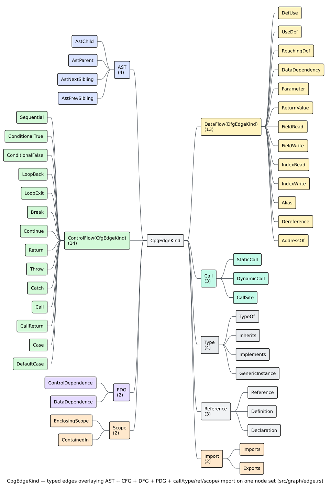
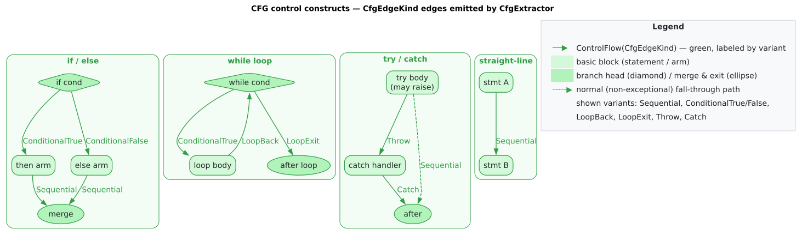

# CPG Edges

Edges are the typed relationships that turn a bag of
[`CpgNode`](nodes.md)s into a
[Code Property Graph](../../GLOSSARY.md#code-property-graph-cpg). Every overlay —
[AST](../../GLOSSARY.md#abstract-syntax-tree-ast),
[CFG](../../GLOSSARY.md#control-flow-graph-cfg),
[DFG](../../GLOSSARY.md#data-flow-graph-dfg),
[PDG](../../GLOSSARY.md#program-dependence-graph-pdg), and the call/type/scope
graphs — is just a differently-typed *subset of the edge set* over the shared
nodes. This page documents the edge structure, the `CpgEdgeKind` taxonomy, the
control- and data-flow sub-kinds, and how to filter edges by overlay.

## Edge structure

`CpgEdge` has **public fields** — `edge.source`, `edge.target`, and `edge.kind`
are read directly, not through accessor methods:

```rust
pub struct CpgEdge {
    /// Unique edge identifier.
    pub id: EdgeId,
    /// Source node.
    pub source: NodeId,
    /// Target node.
    pub target: NodeId,
    /// The typed relationship.
    pub kind: CpgEdgeKind,
    /// Optional human-readable label.
    pub label: Option<String>,
}

pub struct EdgeId(pub u32);   // NodeId's sibling: EdgeId::new(u32), .as_u32(), From<u32>
```

## The edge-kind taxonomy

`CpgEdgeKind` enumerates every relationship type. The two flow overlays are
**wrapped** sub-enums: control flow is `ControlFlow(CfgEdgeKind)` and data flow
is `DataFlow(DfgEdgeKind)`. The full set, by group:



*Figure — `CpgEdgeKind` grouped into AST, control-flow, data-flow, program-
dependence, call, type, reference, scope, and import families. Source:
[`diagrams/edge-kind-taxonomy.puml`](../../diagrams/edge-kind-taxonomy.puml).*

| Group | Variants | Meaning |
|-------|----------|---------|
| AST | `AstChild`, `AstParent`, `AstNextSibling`, `AstPrevSibling` | syntactic containment and sibling order |
| CFG | `ControlFlow(CfgEdgeKind)` | possible execution order (14 sub-kinds) |
| DFG | `DataFlow(DfgEdgeKind)` | value flow from definitions to uses (13 sub-kinds) |
| PDG | `ControlDependence`, `DataDependence` | control/data *dependence* (added by `PdgBuilder`) |
| Call | `StaticCall`, `DynamicCall`, `CallSite` | call site → callee |
| Type | `TypeOf`, `Inherits`, `Implements`, `GenericInstance` | type relationships |
| Reference | `Reference`, `Definition`, `Declaration` | use↔def and declaration links |
| Scope | `EnclosingScope`, `ContainedIn` | lexical scoping |
| Import | `Imports`, `Exports` | module dependency |

## AST edges

AST edges encode the concrete syntax tree. `AstChild` (parent → child) is the
primary one; `AstParent` is its reverse, and `AstNextSibling` / `AstPrevSibling`
thread siblings in source order. The child edges are inserted in source order and
carry monotonically increasing [`EdgeId`](#edge-structure)s, which is how
`ast_children` recovers true source order even though petgraph iterates a node's
edges newest-first.

```rust
use libcpg::{CodePropertyGraph, CpgEdgeKind, NodeId};

// The AST children of a node, straight from the raw edges.
// (The built-in `ast_children` accessor does exactly this and sorts by edge id.)
fn ast_child_targets(cpg: &CodePropertyGraph, id: NodeId) -> Vec<NodeId> {
    cpg.outgoing_edges(id)
        .filter(|e| matches!(e.kind, CpgEdgeKind::AstChild))
        .map(|e| e.target)
        .collect()
}
```

## CFG edges

Control-flow edges are wrapped as `CpgEdgeKind::ControlFlow(CfgEdgeKind)`. There
are **14** `CfgEdgeKind` variants:

| Variant | Meaning |
|---------|---------|
| `Sequential` | fallthrough to the next statement |
| `ConditionalTrue` | branch taken when a condition is true |
| `ConditionalFalse` | branch taken when a condition is false |
| `LoopBack` | back edge to a loop header |
| `LoopExit` | edge leaving a loop |
| `Break` | `break` out of a loop |
| `Continue` | `continue` to the loop head |
| `Return` | to the function exit |
| `Throw` | exception raised |
| `Catch` | exception caught |
| `Call` | into a callee |
| `CallReturn` | back from a callee |
| `Case` | a `match`/`switch` case |
| `DefaultCase` | the default arm |

Note the conditional edges are `ConditionalTrue` / `ConditionalFalse` — there is
no `BranchTrue` / `BranchFalse`. The `CfgEdgeKind` type offers three convenience
classifiers: `is_conditional()` (the two conditionals plus `Case` / `DefaultCase`),
`is_loop()` (`LoopBack`, `LoopExit`, `Break`, `Continue`), and `is_exception()`
(`Throw`, `Catch`).



*Figure — the control-flow shapes the `CfgExtractor` produces for `if`, `while`,
and `try` constructs, showing where each `CfgEdgeKind` is used. Source:
[`diagrams/cfg-control-constructs.dot`](../../diagrams/cfg-control-constructs.dot).*

Reach a node's control-flow successors with `cfg_successors`, which returns
`Vec<(NodeId, CfgEdgeKind)>` — the target id paired with the edge label:

```rust
use libcpg::CfgEdgeKind;

for (succ, kind) in cpg.cfg_successors(node_id) {
    match kind {
        CfgEdgeKind::Sequential      => println!("→ {succ:?} (fallthrough)"),
        CfgEdgeKind::ConditionalTrue  => println!("→ {succ:?} (then)"),
        CfgEdgeKind::ConditionalFalse => println!("→ {succ:?} (else)"),
        CfgEdgeKind::LoopBack         => println!("→ {succ:?} (loop back)"),
        other                         => println!("→ {succ:?} ({other:?})"),
    }
}
```

`cfg_predecessors` is the mirror image (returning the *source* id with its edge
kind). The [`cyclomatic_complexity`](../../GLOSSARY.md#cyclomatic-complexity) of
a graph, `` $`M = E - N + 2`$ ``, is computed purely from these CFG edges and the
CFG node count; see [`theory/02-control-flow-and-complexity.md`](../../theory/02-control-flow-and-complexity.md).

## DFG edges

Data-flow edges are wrapped as `CpgEdgeKind::DataFlow(DfgEdgeKind)`. There are
**13** `DfgEdgeKind` variants:

| Variant | Meaning |
|---------|---------|
| `DefUse` | a definition reaches this use |
| `UseDef` | a use back to its definition |
| `ReachingDef` | a [reaching definition](../../GLOSSARY.md#reaching-definition) |
| `DataDependency` | a general data dependency |
| `Parameter` | argument passed into a parameter |
| `ReturnValue` | value returned from a function |
| `FieldRead` | read of an object field |
| `FieldWrite` | write to an object field |
| `IndexRead` | read of an array/index element |
| `IndexWrite` | write to an array/index element |
| `Alias` | two names for the same storage |
| `Dereference` | pointer dereference |
| `AddressOf` | address-of operation |

There is no `Phi` and no `UseUse`: `libcpg`'s data flow is
[AST-ordered reaching definitions](../../GLOSSARY.md#ast-ordered-reaching-definitions),
not [SSA](../../GLOSSARY.md#static-single-assignment-ssa), so there are no
`` $`\phi`$ ``-nodes. `DfgEdgeKind` classifiers are `is_read()` (`DefUse`, `FieldRead`,
`IndexRead`, `Dereference`) and `is_write()` (`UseDef`, `FieldWrite`,
`IndexWrite`).


*Figure — definitions linked to the uses they reach by `DefUse` / `ReachingDef`
edges. Source: [`diagrams/def-use-example.dot`](../../diagrams/def-use-example.dot).*

The graph exposes the two data-flow directions directly:

```rust
// Definitions that reach a use site (incoming DefUse / ReachingDef edges).
let defs: Vec<_> = cpg.reaching_definitions(use_id);

// Uses reached by a definition (outgoing DefUse edges).
let uses: Vec<_> = cpg.uses_of_definition(def_id);

// Every data-flow successor, with its edge kind.
for (target, kind) in cpg.dfg_successors(def_id) {
    println!("{def_id:?} --{kind:?}--> {target:?}");
}
```

`dfg_predecessors` mirrors `dfg_successors`. See [`components/builder/dfg.md`](../builder/dfg.md)
for how these edges are produced.

## PDG, call, type, reference, scope, and import edges

The remaining overlays are single-level `CpgEdgeKind` variants:

- **PDG.** `ControlDependence` and `DataDependence` are added on demand by
  [`PdgBuilder`](../builder/pdg-and-slicing.md) and are the substrate for
  [program slicing](../../GLOSSARY.md#program-slicing). `DataDependence` is a
  re-projection of DFG def-use edges; `ControlDependence` comes from the
  [reverse dominance frontier](../../GLOSSARY.md#dominance-frontier--reverse-dominance-frontier).
- **Call graph.** `StaticCall`, `DynamicCall`, and `CallSite` connect a
  [call site to its callee](../../GLOSSARY.md#call-graph); query them with
  `call_sites`, `callees`, and `callers`.
- **Type.** `TypeOf`, `Inherits`, `Implements`, and `GenericInstance` relate
  nodes to types and types to each other (the GoF detectors read `Inherits` /
  `Implements`).
- **Reference.** `Reference` (use → def), `Definition`, and `Declaration`.
- **Scope.** `EnclosingScope` and `ContainedIn`.
- **Import.** `Imports` and `Exports`.

## Constructing edges

You rarely build edges by hand — the extractors do — but the constructors and
`connect` are available for hand-built graphs and tests. The typed constructors
name the overlay for you:

```rust
use libcpg::{CpgEdge, EdgeId, NodeId, CfgEdgeKind, DfgEdgeKind};

let a = EdgeId::new(0);   // placeholder; add_edge reassigns the real id
let ast  = CpgEdge::ast_child(a, NodeId::new(0), NodeId::new(1));
let cfg  = CpgEdge::control_flow(a, NodeId::new(0), NodeId::new(1), CfgEdgeKind::Sequential);
let dfg  = CpgEdge::data_flow(a, NodeId::new(0), NodeId::new(1), DfgEdgeKind::DefUse);
let du   = CpgEdge::def_use(a, NodeId::new(0), NodeId::new(1));   // DataFlow(DefUse)
```

`reference` and `call_site` constructors exist too. The most convenient way to
add an edge to a graph is `connect(source, target, kind)`, which builds the edge
and assigns its id in one step:

```rust
use libcpg::{CpgEdgeKind, CfgEdgeKind};

cpg.connect(src, tgt, CpgEdgeKind::ControlFlow(CfgEdgeKind::Sequential));
```

`connect` returns `Option<EdgeId>` — `None` if either endpoint id is unknown to
the graph.

## Filtering edges by overlay

`CpgEdgeKind` carries six classifier methods so you can select an overlay
without spelling out every variant: `is_ast()`, `is_cfg()`, `is_dfg()`,
`is_pdg()`, `is_call()`, and `is_type()`. Pair them with `edges_by_kind`, which
takes a predicate over `&CpgEdgeKind`:

```rust
// Count edges per overlay.
let ast = cpg.edges_by_kind(|k| k.is_ast()).count();
let cfg = cpg.edges_by_kind(|k| k.is_cfg()).count();
let dfg = cpg.edges_by_kind(|k| k.is_dfg()).count();
let pdg = cpg.edges_by_kind(|k| k.is_pdg()).count();
```

To inspect the edges incident to a single node, use `outgoing_edges(id)` and
`incoming_edges(id)` — both yield `&CpgEdge` **directly** (there is no
`edge(id)` id→edge lookup step), so you read `edge.kind`, `edge.source`, and
`edge.target` on the spot:

```rust
use libcpg::{CpgEdgeKind, DfgEdgeKind};

for edge in cpg.outgoing_edges(node_id) {
    if let CpgEdgeKind::DataFlow(k) = &edge.kind {
        if k.is_write() {
            println!("writes into {:?}", edge.target);
        }
    }
}
```

`edges()` iterates every edge in the graph, and `edges_between(source, target)`
returns the (possibly multiple) edges connecting a specific pair. All of these
return borrowed `&CpgEdge`, so filtering is allocation-free until you `collect`.

## Where to go next

- [Traversal](traversal.md) — using these edges to walk the graph, including a
  worked taint/reachability example.
- [Nodes](nodes.md) — the endpoints these edges connect.
- [Overview](overview.md) — the CPG and its overlays at a glance.
- [`components/builder/cfg.md`](../builder/cfg.md) and
  [`components/builder/dfg.md`](../builder/dfg.md) — how CFG and DFG edges are
  produced.
- [`api/graph-reference.md`](../../api/graph-reference.md) — the exhaustive
  edge-kind reference.
</content>
