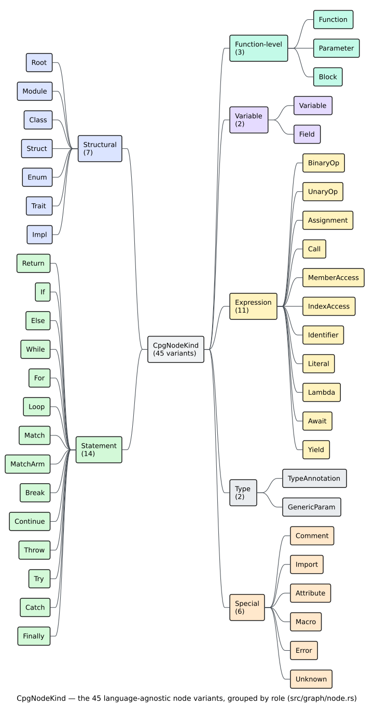

# CPG Nodes

A [`CpgNode`](../../GLOSSARY.md#node-kind--edge-kind) is a single syntactic
element from the source program — a function, an `if`, a call, a literal. Nodes
are the **shared substrate** of the whole
[Code Property Graph](../../GLOSSARY.md#code-property-graph-cpg): the
[AST](../../GLOSSARY.md#abstract-syntax-tree-ast),
[CFG](../../GLOSSARY.md#control-flow-graph-cfg),
[DFG](../../GLOSSARY.md#data-flow-graph-dfg), and
[PDG](../../GLOSSARY.md#program-dependence-graph-pdg) overlays all attach their
edges to the same nodes. This page documents the node structure, the 45 node
kinds, and the small value types (`SourceRange`, `TypeInfo`, `MethodSignature`,
`Visibility`) that nodes carry.

## Node structure

`CpgNode` has **public fields** — you read `node.kind` and `node.range`
*directly*; they are not accessor methods.

```rust
pub struct CpgNode {
    /// Unique node identifier within the graph.
    pub id: NodeId,
    /// Node kind with its associated data.
    pub kind: CpgNodeKind,
    /// Source code span (bytes + line/column).
    pub range: SourceRange,
    /// Original source text, present for terminals/leaves.
    pub text: Option<Arc<str>>,
    /// Extra key/value metadata.
    pub properties: FxHashMap<PropertyKey, PropertyValue>,
    /// AST children, in source order.
    pub children: SmallVec<[NodeId; 4]>,
    /// AST parent, if any.
    pub parent: Option<NodeId>,
}
```

Construct nodes with `CpgNode::new(id, kind, range)` and refine them with the
chainable builders `with_text`, `with_property`, `with_child`, and `with_parent`:

```rust
use libcpg::{CpgNode, CpgNodeKind, NodeId, SourceRange};

let node = CpgNode::new(NodeId::new(0), CpgNodeKind::Return, SourceRange::default())
    .with_text("return x");
```

When you add a node to a graph with `add_node`, the graph assigns the real
[`NodeId`](#nodeid) and overwrites the placeholder you passed — so `NodeId::new(0)`
is the idiomatic filler at construction time.

## Node kinds

`CpgNodeKind` has **45 variants**. Most are *unit* variants (`Root`, `If`,
`Return`), but many are *struct* variants that carry data (`Function { signature }`,
`Call { target, is_method }`, `Variable { name, .. }`). Grouping them by role:



*Figure — the 45 `CpgNodeKind` variants organised into structural,
function-level, variable, statement, expression, type, and special groups.
Source: [`diagrams/node-kind-taxonomy.puml`](../../diagrams/node-kind-taxonomy.puml).*

### Structural nodes (7)

The top-level shape of a compilation unit.

| Variant | Fields | Example |
|---------|--------|---------|
| `Root` | — | the compilation unit / file root |
| `Module` | `name: Arc<str>` | `mod foo`, a namespace |
| `Class` | `name: Arc<str>`, `is_abstract: bool` | `class Foo { }` |
| `Struct` | `name: Arc<str>` | `struct Bar { }` |
| `Enum` | `name: Arc<str>` | `enum Baz { }` |
| `Trait` | `name: Arc<str>` | `trait T { }` / `interface I { }` |
| `Impl` | `for_type: Option<Arc<str>>`, `trait_name: Option<Arc<str>>` | `impl T for Bar { }` |

### Function-level nodes (3)

| Variant | Fields | Example |
|---------|--------|---------|
| `Function` | `signature: MethodSignature` | `fn foo(x: i32) -> i32` |
| `Parameter` | `name: Arc<str>`, `param_type: Option<TypeInfo>`, `is_variadic: bool` | `x: i32`, `*args` |
| `Block` | `scope: ScopeId` | `{ stmt1; stmt2; }` |

Both free functions and methods use the single `Function` variant; the
distinction lives in the [`MethodSignature`](#methodsignature) (its `visibility`
and `is_static`).

### Variable nodes (2)

| Variant | Fields | Example |
|---------|--------|---------|
| `Variable` | `name: Arc<str>`, `var_type: Option<TypeInfo>`, `scope: ScopeId`, `is_mutable: bool` | `let x = 5` |
| `Field` | `name: Arc<str>`, `field_type: Option<TypeInfo>`, `visibility: Visibility` | `struct S { x: i32 }` |

### Statement nodes (14)

Control-flow and structural statements. These are all *unit* variants — their
operands are AST children, not inline fields.

| Variants |
|----------|
| `Return`, `If`, `Else`, `While`, `For`, `Loop`, `Match`, `MatchArm`, `Break`, `Continue`, `Throw`, `Try`, `Catch`, `Finally` |

The [`CfgExtractor`](../builder/cfg.md) reads these to lay down
[control-flow edges](edges.md#cfg-edges): an `If`'s children are interpreted as
`[condition, then, else]`, a `While`'s last child as its body, and so on.

### Expression nodes (11)

| Variant | Fields | Example |
|---------|--------|---------|
| `BinaryOp` | `operator: Arc<str>` | `a + b`, `x && y` |
| `UnaryOp` | `operator: Arc<str>` | `-x`, `!flag` |
| `Assignment` | `operator: Arc<str>` | `x = 1`, `y += 2` |
| `Call` | `target: Option<NodeId>`, `is_method: bool` | `foo(arg)`, `obj.bar()` |
| `MemberAccess` | `member: Arc<str>` | `obj.field` |
| `IndexAccess` | — | `arr[i]` |
| `Identifier` | `name: Arc<str>`, `definition: Option<NodeId>` | `x` (with resolved def) |
| `Literal` | `kind: LiteralKind` | `42`, `"hi"`, `true` |
| `Lambda` | `captures: SmallVec<[NodeId; 4]>` | `|x| x + 1` |
| `Await` | — | `fut.await` |
| `Yield` | — | `yield v` |

`Call.target` and `Identifier.definition` hold resolved `NodeId`s when the
builder could resolve them, letting you jump straight from a use to its
definition or from a call site to its callee.

### Type nodes (2)

| Variant | Fields | Example |
|---------|--------|---------|
| `TypeAnnotation` | `type_info: TypeInfo` | `: i32` |
| `GenericParam` | `name: Arc<str>` | `<T>` |

### Special nodes (6)

| Variant | Fields | Example |
|---------|--------|---------|
| `Comment` | `is_doc: bool` | `// note`, `/// doc` |
| `Import` | `path: Arc<str>` | `use std::io`, `import os` |
| `Attribute` | `name: Arc<str>` | `#[derive(..)]`, `@Override` |
| `Macro` | `name: Arc<str>` | `println!` |
| `Error` | `message: Arc<str>` | parser error-recovery node |
| `Unknown` | `kind: Arc<str>` | grammar node with no direct mapping |

`Error` and `Unknown` are how `libcpg` stays robust: an unfamiliar or malformed
construct becomes a typed node (carrying the original grammar kind string)
rather than aborting construction.

### Literal kinds

The `Literal` variant carries a `LiteralKind` (9 variants); the scalar kinds
embed their parsed value:

```rust
pub enum LiteralKind {
    Integer(i64),
    Float(f64),
    String(Arc<str>),
    Char(char),
    Bool(bool),
    Null,     // null / None / nil
    Array,    // [1, 2, 3]
    Object,   // { key: value }
    Regex(Arc<str>),
}
```

## Node methods

### `name()`

`name(&self) -> Option<&str>` returns the identifying name for the kinds that
have one — `Module`, `Class`, `Struct`, `Enum`, `Trait`, `Function` (via its
signature), `Variable`, `Field`, `Parameter`, `Identifier`, `MemberAccess`,
`Import`, `Attribute`, `Macro`, and `GenericParam` — and `None` for the rest.

```rust
for func in cpg.functions() {
    // start_line is 0-indexed; add 1 for human-facing output.
    println!("fn {} at line {}", func.name().unwrap_or("<anonymous>"), func.range.start_line + 1);
}
```

### Category predicates

Five predicates classify a node by role. Their exact membership (from the
source) is:

| Predicate | True for |
|-----------|----------|
| `is_declaration()` | `Module`, `Class`, `Struct`, `Enum`, `Trait`, `Function`, `Variable`, `Field`, `Parameter` |
| `is_statement()` | `Return`, `If`, `While`, `For`, `Loop`, `Match`, `Break`, `Continue`, `Throw`, `Try` |
| `is_expression()` | `BinaryOp`, `UnaryOp`, `Assignment`, `Call`, `MemberAccess`, `IndexAccess`, `Identifier`, `Literal`, `Lambda`, `Await`, `Yield` |
| `is_control_flow()` | `If`, `While`, `For`, `Loop`, `Match`, `Break`, `Continue`, `Return`, `Throw`, `Try` |
| `is_error()` | `Error` |

## Querying nodes by kind

Because `node.kind` is a public enum, the general query is `nodes_by_kind`, which
takes a **predicate over `&CpgNodeKind`** (it is *not* `nodes_of_kind(kind)`).
Use `matches!` to select struct variants without naming their fields:

```rust
use libcpg::{CpgNodeKind, LiteralKind};

// Count call sites.
let calls = cpg.nodes_by_kind(|k| matches!(k, CpgNodeKind::Call { .. })).count();

// Every string literal (useful for security review).
for node in cpg.nodes_by_kind(|k| matches!(k, CpgNodeKind::Literal { kind: LiteralKind::String(_) })) {
    if let Some(text) = node.text.as_deref() {
        println!("string literal {text:?} at line {}", node.range.start_line + 1);
    }
}
```

For the four most common kinds there are dedicated convenience iterators —
`functions()`, `classes()`, `variables()`, and `calls()` — each yielding
`&CpgNode`. To read the data inside a struct variant, pattern-match on
`&node.kind`:

```rust
use libcpg::CpgNodeKind;

for func in cpg.functions() {
    if let CpgNodeKind::Function { signature } = &func.kind {
        // `params` holds parameter *types* (each a `TypeInfo`); the parameter
        // *names* live on the function's `Parameter` child nodes.
        let param_types: Vec<&str> = signature.params.iter().map(|t| t.name.as_ref()).collect();
        print!("fn {}({})", signature.name, param_types.join(", "));
        if let Some(ret) = &signature.return_type {
            print!(" -> {}", ret.name);
        }
        println!();
    }
}
```

## `NodeId`

`NodeId` is a compact, `Copy` handle — a newtype around `u32`:

```rust
pub struct NodeId(pub u32);
```

Its API is `NodeId::new(u32)`, `as_u32() -> u32`, and `From` conversions in
**both** directions (`u32 → NodeId` and `NodeId → u32`). There is no `.index()`
method:

```rust
use libcpg::NodeId;

let id = NodeId::new(7);
assert_eq!(id.as_u32(), 7);

let from_u32: NodeId = 7u32.into();
let back: u32 = id.into();
assert_eq!(back, 7);
```

Node ids are stable across serialisation, which is why analysis code and the
on-disk form both refer to nodes by `NodeId` rather than by petgraph's internal
`NodeIndex`. Resolving an id to a node is `cpg.node(id) -> Option<&CpgNode>` (an
`` $`O(1)`$ `` map lookup returning `None` for an unknown id).

## `SourceRange`

Every node records where it came from. `SourceRange` has **six `u32` fields** —
a byte span plus 0-indexed line/column endpoints:

```rust
pub struct SourceRange {
    pub start: u32,       // start byte offset
    pub end: u32,         // end byte offset (exclusive)
    pub start_line: u32,  // 0-indexed
    pub start_col: u32,   // 0-indexed
    pub end_line: u32,    // 0-indexed
    pub end_col: u32,     // 0-indexed
}
```

Construct one with `SourceRange::new(start, end, start_line, start_col,
end_line, end_col)` or `SourceRange::from_bytes(start, end)` (which zeroes the
line/column fields). Helpers: `len() -> u32` (byte length), `is_empty() -> bool`,
and `to_text_range() -> text_size::TextRange`.

Because the byte offsets index the original text, you can recover a node's exact
source slice when you retained the source:

```rust
use libcpg::CpgNode;

fn node_text<'a>(source: &'a str, node: &CpgNode) -> &'a str {
    &source[node.range.start as usize .. node.range.end as usize]
}
```

## Supporting types

Nodes reference a handful of small value types.

### `TypeInfo`

A lightweight type descriptor. Note `generics` is a `SmallVec` of **name
strings**, not nested `TypeInfo`s:

```rust
pub struct TypeInfo {
    pub name: Arc<str>,
    pub is_reference: bool,
    pub is_mutable: bool,
    pub generics: SmallVec<[Arc<str>; 2]>,
}
```

Build one fluently:

```rust
use libcpg::TypeInfo;

let ty = TypeInfo::new("Vec")
    .with_generic("String")
    .with_reference(true);
assert_eq!(ty.name.as_ref(), "Vec");
```

### `MethodSignature`

Carried by every `Function` node. Parameters are a `SmallVec<[TypeInfo; 4]>`:

```rust
pub struct MethodSignature {
    pub name: Arc<str>,
    pub params: SmallVec<[TypeInfo; 4]>,
    pub return_type: Option<TypeInfo>,
    pub is_static: bool,
    pub is_async: bool,
    pub visibility: Visibility,
}
```

### `Visibility`

```rust
pub enum Visibility {
    Public,
    Private,     // the Default
    Protected,
    Package,     // package/module-private
    Crate,       // Rust `pub(crate)`
}
```

### `ScopeId`

A `u32` newtype tagging lexical scopes, carried by `Block` and `Variable` nodes.
`ScopeId::GLOBAL` is the constant `ScopeId(0)`; make others with
`ScopeId::new(id)`.

### Properties: `PropertyKey` / `PropertyValue`

Beyond the typed fields above, a node can hold ad-hoc metadata in its
`properties` map. Keys are a small enum with a `Custom` escape hatch, and values
are a tagged union (note the integer/boolean variants are `Int` / `Uint` /
`Bool`, not `Integer` / `Boolean`):

```rust
pub enum PropertyKey { Name, Type, Scope, Visibility, Mutable, Static, Async, Custom(Arc<str>) }

pub enum PropertyValue { String(Arc<str>), Int(i64), Uint(u64), Bool(bool), Float(f64), List(Vec<PropertyValue>), Null }
```

`PropertyValue` offers `as_str() -> Option<&str>`, `as_int() -> Option<i64>`,
and `as_bool() -> Option<bool>` for convenient extraction:

```rust
use libcpg::PropertyKey;

if let Some(v) = node.properties.get(&PropertyKey::Name) {
    if let Some(name) = v.as_str() {
        println!("name property: {name}");
    }
}
```

## Where to go next

- [Edges](edges.md) — how nodes are wired into the four overlays.
- [Traversal](traversal.md) — navigating from a node to its children,
  successors, and data-flow neighbours.
- [Overview](overview.md) — the CPG at a glance.
- [`api/graph-reference.md`](../../api/graph-reference.md) — the exhaustive
  node-type reference.
</content>
