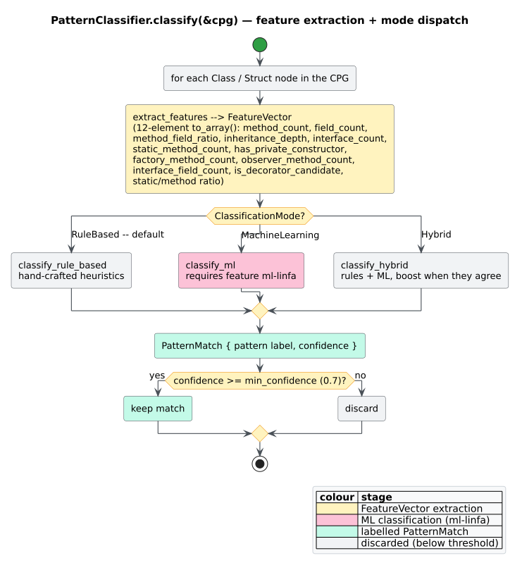

# Pattern Classification

`patterns::classification::PatternClassifier` is a lighter-weight, name- and shape-aware
alternative to [VF2](vf2-matching.md) template matching. Instead of searching for a
subgraph, it walks each class, summarises it as a fixed-length
[feature vector](../../GLOSSARY.md#feature-vector-classification), and applies hand-written
rules (optionally blended with a machine-learning model) to label a
[design pattern](../../GLOSSARY.md#design-pattern). It recognises five patterns —
Singleton, Factory, Observer, Strategy, Decorator — and lives in the feature-gated
`patterns` module, so it needs the `design-patterns` feature.

The trade-off versus the [Gang-of-Four detector](gang-of-four.md): classification is
linear in the number of classes (no exponential subgraph search) and exploits naming
conventions the structural matcher ignores, at the cost of narrower coverage and lower
precision.



*Figure — the classifier pipeline: per-class feature extraction, mode-selected scoring, and a confidence filter. Source: [`diagrams/classification-flow.puml`](../../diagrams/classification-flow.puml).*

## Classification modes

`ClassificationMode` selects the scoring strategy; `RuleBased` is the default.

| `ClassificationMode` | Behaviour |
| :------------------- | :-------- |
| `RuleBased` *(default)* | hand-crafted heuristics only — always available |
| `MachineLearning` | ML scoring, intended for the `ml-linfa` feature |
| `Hybrid` | run both and boost confidence where they agree |

An honest disclosure about the ML path: the shipped `MachineLearning` and `Hybrid` modes
**fall back to the rule-based scorer**. Even with `ml-linfa` enabled, the ML branch
currently delegates to the rule-based routine rather than loading a trained model, so
`Hybrid` effectively averages the rule-based score with itself and applies a small boost
($`\times 1.1`$, capped at $`1.0`$). Treat `MachineLearning`/`Hybrid` as
forward-looking hooks, not a distinct classifier today.

## The feature vector

`FeatureVector` records eleven measured properties of a class; `to_array()` emits a
**12-element** `[f64; 12]` (the eleven fields plus one derived ratio) for ML models.

| # | Field | Meaning |
| :- | :---- | :------ |
| 1 | `method_count` | number of methods in the class |
| 2 | `field_count` | number of fields |
| 3 | `method_field_ratio` | methods ÷ fields (methods when fieldless) |
| 4 | `inheritance_depth` | count of `Inherits` edges out of the class |
| 5 | `interface_count` | count of `Implements` edges out of the class |
| 6 | `static_method_count` | number of static methods |
| 7 | `has_private_constructor` | a `new`/`init` method with private visibility |
| 8 | `factory_method_count` | methods named `create*`, `make*`, `build*`, `new_*`, or `new` |
| 9 | `observer_method_count` | methods named `register*`, `subscribe*`, `notify*`, `update*`, `add_observer*`, `remove_observer*` |
| 10 | `interface_field_count` | fields typed as an implemented interface |
| 11 | `is_decorator_candidate` | the class implements an interface it also holds a field of |

`to_array()` appends a twelfth element — the derived ratio
`static_method_count / max(method_count, 1)` — after emitting the eleven fields (booleans
as $`0.0`$/$`1.0`$). Features are extracted by walking the class's AST descendants for
methods and fields and inspecting its outgoing `Implements`/`Inherits` edges.

Do not confuse this with the graph feature vector used by the `Cosine`
[similarity metric](vf2-matching.md#graph-similarity); they are unrelated.

## The rule-based detectors

`RuleBased` mode runs five detectors per class, each emitting at most one `PatternMatch`
with an evidence-weighted score. The labels are plain strings — note the creational
factory is labelled `"Factory"` here, whereas the GoF detector's enum variant is
`FactoryMethod`.

| Label | Fires when | Score |
| :---- | :--------- | :---- |
| `Singleton` | static "instance"/"get" accessor (`+0.4`), self-typed instance field (`+0.3`), private constructor (`+0.2`), few methods (`+0.1`); kept if $` \ge 0.5`$ | $`0.5`$–$`1.0`$ |
| `Factory` | $`\ge 2`$ factory-named methods, or exactly one with $`\le 3`$ methods total | $`0.5`$–$`0.9`$ (or $`0.6`$) |
| `Observer` | $`\ge 2`$ observer-named methods | $`0.5`$–$`0.9`$ |
| `Strategy` | holds $`\ge 1`$ interface-typed field **and** implements no interface (a context) | $`0.6`$–$`0.9`$ |
| `Decorator` | implements an interface it also holds a field of (`is_decorator_candidate`) | $`0.75`$ |

Because these detectors lean on naming, they catch patterns whose *shape* the structural
matcher would also see but whose *names* make the intent unambiguous (a `create_widget`
method, a `notify_all` method), and they miss patterns that follow the structure without the
conventional names.

## Using the classifier

```rust
// requires: features = ["design-patterns"]
use libcpg::patterns::classification::{PatternClassifier, ClassificationMode};

let classifier = PatternClassifier::new()
    .with_mode(ClassificationMode::RuleBased) // the default
    .with_min_confidence(0.7);                // the default floor

let matches = classifier.classify(&cpg);      // scans every Class/Struct node
for m in &matches {
    println!("{} — {:.0}%", m.pattern_name, m.confidence * 100.0);
    if let Some(evidence) = m.metadata.get("evidence") {
        println!("  because: {evidence}");    // Singleton records its evidence
    }
}
```

`classify` inspects each `Class`/`Struct` node, applies the mode's scorer, drops matches
below `min_confidence` (default `0.7`), and returns the survivors sorted by confidence,
descending. With the default `0.7` floor, low-scoring hits (a bare `Observer` at `0.5`, a
single-method `Factory` at `0.6`) are filtered out; lower the threshold to surface them.
`supported_patterns()` returns the five labels the classifier can emit.

## Structural metrics: `PatternMetrics`

Independent of the classifier, `patterns::design::PatternMetrics` computes object-oriented
design metrics over a whole CPG — useful both as classification inputs and as standalone
code-quality signals. Two of its fields are the classic Chidamber-Kemerer metrics
[[14]](#references): **LCOM** (Lack of Cohesion of Methods) and **CBO** (Coupling Between
Objects).

```rust
// requires: features = ["design-patterns"]
use libcpg::patterns::design::PatternMetrics;

let m = PatternMetrics::compute(&cpg);
println!("classes={} interfaces={} inherit={} compose={}",
    m.class_count, m.interface_count, m.inheritance_count, m.composition_count);
println!("avg methods/class={:.1}  LCOM={:.2}  CBO={:.2}",
    m.avg_methods_per_class, m.cohesion, m.coupling);
```

**LCOM (`cohesion`).** For each class with at least two methods and at least one field,
`libcpg` builds the set of fields each method accesses (via member access or direct
identifier reference), then partitions the method pairs into $`Q`$ — pairs that share at
least one field — and $`P`$ — pairs that share none. The classic definition is
$`\mathrm{LCOM} = \max(0, |P| - |Q|)`$; `libcpg` normalises it to $`[0, 1]`$ by dividing
by the pair count and averages over classes:

```math
\mathrm{LCOM} = \frac{\max\!\left(0,\ |P| - |Q|\right)}{|P| + |Q|}
```

Higher means *less* cohesion — the methods touch disjoint field sets, a hint the class does
too much.

**CBO (`coupling`).** For each class, `libcpg` counts the number of *distinct other*
classes it references — through field, variable, parameter, and annotation types, and
through `Inherits`/`Implements` edges (self-references excluded) — then averages over
classes:

```math
\mathrm{CBO}(c) = \left| \{\, d \ne c : c \text{ references type } d \,\} \right|
```

Higher coupling means a change to one class is more likely to ripple into others. The
remaining `PatternMetrics` fields (`class_count`, `interface_count`, `inheritance_count`,
`composition_count`, `avg_methods_per_class`) are direct structural counts.

## Honesty about the classifier

- Coverage is **five patterns** (Singleton, Factory, Observer, Strategy, Decorator), versus
  the 23 of the [Gang-of-Four detector](gang-of-four.md). For anything else, use the
  structural detector or a [DPML template](dpml.md).
- `MachineLearning` and `Hybrid` modes currently delegate to the rule-based scorer; there
  is no trained model shipped. The `to_array()` output and `ml-linfa` feature exist to
  support future model training, not present-day ML inference.
- Scores are heuristic and naming-sensitive: renaming `create_user` to `spawn_user` hides
  the class from the `Factory` rule even though the structure is unchanged. Prefer the
  classifier for a fast first pass and the structural detector for shape-only queries.

## See also

- [Gang-of-Four patterns](gang-of-four.md) — the 23-pattern structural detector.
- [VF2 subgraph matching](vf2-matching.md) — the matching engine and graph similarity.
- [DPML templates](dpml.md) — declare additional templates in YAML/TOML.
- [Pattern detection overview](overview.md) — the four detection approaches.
- Theory: [design-pattern detection](../../theory/07-design-pattern-detection.md).
- API: [pattern reference](../../api/pattern-reference.md).

## References

14. Chidamber, S. R., Kemerer, C. F. (1994). *A Metrics Suite for Object Oriented Design.* IEEE Transactions on Software Engineering 20(6). DOI: [10.1109/32.295895](https://doi.org/10.1109/32.295895) *(LCOM/CBO.)*
