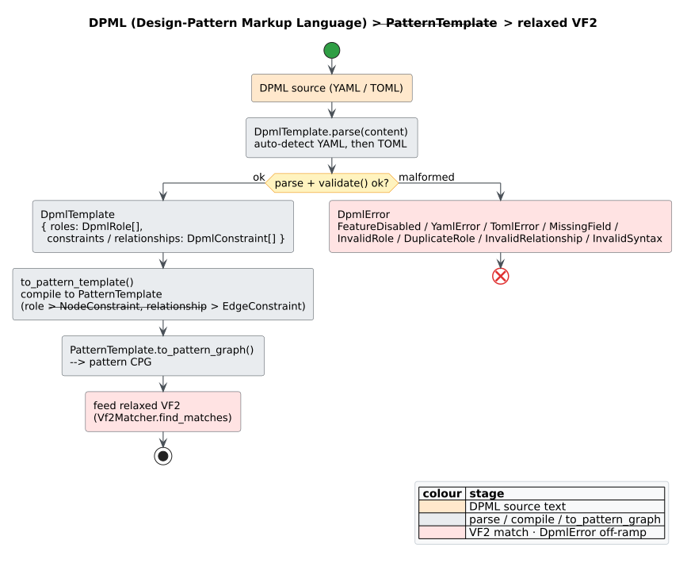

# DPML — Design-Pattern Markup Language

[DPML](../../GLOSSARY.md#dpml-design-pattern-markup-language) is `libcpg`'s small
declarative schema for describing a structural pattern as **roles** and **relationships**,
in YAML or TOML, without writing Rust. A DPML document loads into a `DpmlTemplate`, which
compiles to a [`PatternTemplate`](vf2-matching.md#building-the-pattern-graph) and then to a
matchable pattern CPG — the same pipeline the [Gang-of-Four](gang-of-four.md) detector uses
internally. DPML lives in the `patterns::design` module and needs the `design-patterns`
feature.

The motivation is extensibility: analysts and tooling can add or tune pattern templates by
editing text, and the templates travel as data (files, config, network payloads) rather
than compiled code.



*Figure — the DPML lifecycle: parse → validate → compile to a `PatternTemplate` → lower to a pattern CPG → match with VF2. Source: [`diagrams/dpml-flow.puml`](../../diagrams/dpml-flow.puml).*

## The schema

A DPML document has a header, a list of roles, and a list of relationships. The Rust types
mirror it one-to-one.

```rust
// requires: features = ["design-patterns"]
pub struct DpmlTemplate {
    pub name: String,          // required; empty name fails validation
    pub description: String,   // optional
    pub category: String,      // optional: "Creational" | "Structural" | "Behavioral"
    pub roles: Vec<DpmlRole>,
    pub relationships: Vec<DpmlConstraint>, // deserialises from `relationships` or `constraints`
}

pub struct DpmlRole {
    pub id: String,            // unique within the template
    pub role_type: String,     // YAML/TOML key `type`; mapped to a node matcher
    pub cardinality: String,   // YAML/TOML `cardinality`; defaults to "1"
}

pub struct DpmlConstraint {
    pub source: String,        // a role id
    pub target: String,        // a role id
    pub constraint_type: String, // YAML/TOML key `type`; defaults to "contains"
}
```

Two deserialisation conveniences are worth noting: the relationship list accepts either the
key `relationships` or the alias `constraints`, and `cardinality` / `constraint_type` have
defaults, so minimal documents stay terse.

### Example — Singleton in YAML

```yaml
name: Singleton
description: Ensures a class has only one instance
category: Creational

roles:
  - id: singleton_class
    type: class
    cardinality: "1"
  - id: instance_field
    type: field
  - id: get_instance
    type: method

relationships:
  - source: singleton_class
    target: instance_field
    type: contains
  - source: singleton_class
    target: get_instance
    type: contains
```

### Example — the same template in TOML

```toml
name = "Singleton"
category = "Creational"

[[roles]]
id = "singleton_class"
type = "class"

[[roles]]
id = "instance_field"
type = "field"

[[relationships]]
source = "singleton_class"
target = "instance_field"
type = "contains"
```

## Role types → node matchers

Each `role.type` string is lower-cased and mapped to a
[`NodeKindMatcher`](vf2-matching.md#strict-versus-relaxed-matching) used as the role's node
constraint. Unrecognised strings fall through to `Any` (a wildcard).

| `role.type` | `NodeKindMatcher` |
| :---------- | :---------------- |
| `class` | `Exact(Class)` |
| `struct` | `Exact(Struct)` |
| `interface`, `trait` | `Exact(Trait)` |
| `method`, `function` | `Exact(Function)` |
| `field` | `Exact(Field)` |
| `parameter` | `Exact(Parameter)` |
| `variable` | `Exact(Variable)` |
| `call` | `Exact(Call)` |
| `block` | `Exact(Block)` |
| `declaration` | `AnyDeclaration` |
| `expression` | `AnyExpression` |
| `statement` | `AnyStatement` |
| `loop` | `AnyOf(While, For, Loop)` |
| `while` | `Exact(While)` |
| `for` | `Exact(For)` |
| *anything else* | `Any` |

## Relationship types → edge matchers

Each `relationship.type` string is lower-cased and mapped to an
[`EdgeKindMatcher`](vf2-matching.md#strict-versus-relaxed-matching). Unrecognised strings
fall through to `Any`.

| `relationship.type` | `EdgeKindMatcher` | Overlay |
| :------------------ | :---------------- | :------ |
| `contains`, `has`, `ast`, `child` | `AnyAst` | [AST](../../GLOSSARY.md#abstract-syntax-tree-ast) |
| `calls`, `invokes` | `AnyCall` | [call graph](../../GLOSSARY.md#call-graph) |
| `uses`, `dataflow`, `depends` | `AnyDfg` | [DFG](../../GLOSSARY.md#data-flow-graph-dfg) |
| `flows`, `control`, `next` | `AnyCfg` | [CFG](../../GLOSSARY.md#control-flow-graph-cfg) |
| *anything else* | `Any` | any |

## Parsing and compiling

`DpmlTemplate::parse` auto-detects the format — it tries YAML first, then TOML, and returns
`DpmlError::InvalidSyntax` if the content is neither. `parse_yaml` and `parse_toml` target a
specific format. All three require the `design-patterns` feature; YAML parsing additionally
uses the serde-gated derives, so enable the crate's `serde` feature too (or use `full`) when
you parse YAML.

```rust
// requires: features = ["design-patterns", "serde"]
use libcpg::patterns::design::{DpmlTemplate, DpmlError};
use libcpg::pattern::{Vf2Matcher, SubgraphMatcher};

fn detect_from_dpml(source: &str, target: &libcpg::CodePropertyGraph)
    -> Result<usize, DpmlError>
{
    // 1. Parse text into a DpmlTemplate (YAML or TOML, auto-detected).
    let dpml = DpmlTemplate::parse(source)?;

    // 2. Validate + compile to a PatternTemplate (validation runs inside).
    let template = dpml.to_pattern_template()?;

    // 3. Lower the PatternTemplate to a matchable pattern CPG, then run VF2.
    let pattern_cpg = template.to_pattern_graph();
    let matches = Vf2Matcher::new().find_matches(&pattern_cpg, target);

    Ok(matches.len())
}
```

The compilation step, `to_pattern_template`, does exactly this:

```text
to_pattern_template(dpml):
  1. validate(dpml)                              # see the rules below; may return DpmlError
  2. template ← PatternTemplate::new(name, description)
  3. for each (index, role) in dpml.roles:       # roles become node constraints, in order
       matcher ← role_type_to_node_matcher(role.type)
       template.add NodeConstraint(index) with matcher
       remember role.id → index
  4. for each rel in dpml.relationships:         # relationships become edge constraints
       s ← index_of(rel.source);  t ← index_of(rel.target)
       matcher ← constraint_type_to_edge_matcher(rel.type)
       template.add EdgeConstraint(s, t) with matcher
  5. return template
```

Because roles compile to node constraints in declaration order, the *i*-th role becomes
node index *i* — the indices a relationship's `source`/`target` are resolved against.

## Validation and errors

`validate` (also invoked by `to_pattern_template`) enforces three rules and surfaces
violations as `DpmlError`:

1. the template `name` is non-empty;
2. every role `id` is non-empty and unique; and
3. every relationship's `source` and `target` name an existing role.

`DpmlError` has **eight** variants, each `Display`-formatted and implementing
`std::error::Error`:

| Variant | Raised when |
| :------ | :---------- |
| `FeatureDisabled(String)` | `parse` is called without the `design-patterns` feature |
| `YamlError(String)` | `serde_yaml` fails to parse the document |
| `TomlError(String)` | `toml_edit` fails to parse the document |
| `MissingField(String)` | a required field is absent (e.g. an empty `name`, or a missing TOML `name`) |
| `InvalidRole(String)` | a role has an empty `id` |
| `DuplicateRole(String)` | two roles share an `id` |
| `InvalidRelationship(String)` | a relationship references an unknown role |
| `InvalidSyntax(String)` | content is neither valid YAML nor TOML |

`DpmlError` is its own error type — it is distinct from the crate-wide
[`libcpg::Error`](../../api/pattern-reference.md), so DPML APIs return
`Result<_, DpmlError>`.

```rust
// requires: features = ["design-patterns"]
use libcpg::patterns::design::{DpmlTemplate, DpmlRole, DpmlConstraint, DpmlError};

// Two roles with the same id → DuplicateRole.
let bad = DpmlTemplate::new("Broken")
    .with_role(DpmlRole::new("r", "class"))
    .with_role(DpmlRole::new("r", "method"));
assert!(matches!(bad.validate(), Err(DpmlError::DuplicateRole(_))));

// A relationship to a nonexistent role → InvalidRelationship.
let dangling = DpmlTemplate::new("Broken")
    .with_role(DpmlRole::new("subject", "class"))
    .with_relationship(DpmlConstraint::new("subject", "ghost", "contains"));
assert!(matches!(dangling.validate(), Err(DpmlError::InvalidRelationship(_))));
```

## Building a template programmatically

You need not parse text — the builder methods construct a `DpmlTemplate` directly, which is
handy for generated or parameterised templates. This path needs only `design-patterns`
(no serde, since nothing is deserialised).

```rust
// requires: features = ["design-patterns"]
use libcpg::patterns::design::{DpmlTemplate, DpmlRole, DpmlConstraint};

let observer = DpmlTemplate::new("Observer")
    .with_description("Subject notifies a collection of observers")
    .with_category("Behavioral")
    .with_role(DpmlRole::new("subject", "class"))
    .with_role(DpmlRole::new("observer", "trait"))
    .with_role(DpmlRole::new("notify", "method"))
    .with_relationship(DpmlConstraint::new("subject", "notify", "contains"))
    .with_relationship(DpmlConstraint::new("subject", "observer", "uses"));

let template = observer.to_pattern_template().expect("valid template");
assert_eq!(template.node_constraints.len(), 3); // three roles → three node constraints
assert_eq!(template.edge_constraints.len(), 2); // two relationships → two edge constraints
```

`DpmlRole::new(id, role_type)` defaults `cardinality` to `"1"` (override with
`with_cardinality`), and `DpmlConstraint::new(source, target, constraint_type)` sets all
three fields explicitly.

## Honesty about the schema

- DPML compiles to the *same* relaxed pattern-matching pipeline as everything else in
  `patterns`; matches are [advisory](gang-of-four.md#honesty-about-coverage), scored by
  [confidence](../../GLOSSARY.md#confidence-pattern-match), not proofs.
- `cardinality` is carried on `DpmlRole` for expressiveness but is **not** interpreted by
  `to_pattern_template` — each role compiles to exactly one node constraint regardless of
  its cardinality string. Treat it as documentation for now.
- Unrecognised `role.type` or `relationship.type` strings degrade to the `Any` wildcard
  rather than erroring, so typos widen a template silently instead of failing loudly —
  prefer the recognised keywords in the tables above.

## See also

- [VF2 subgraph matching](vf2-matching.md) — the matcher DPML templates compile down to.
- [Gang-of-Four patterns](gang-of-four.md) — the built-in templates DPML generalises.
- [Pattern detection overview](overview.md) — where template-based detection fits.
- API: [pattern reference](../../api/pattern-reference.md).

## References

This page introduces no external citations — DPML is a `libcpg`-specific schema. For the
subgraph-isomorphism algorithm DPML templates compile down to, see
[VF2 subgraph matching](vf2-matching.md#references) and
[the theory of subgraph isomorphism](../../theory/05-subgraph-isomorphism-vf2.md).
