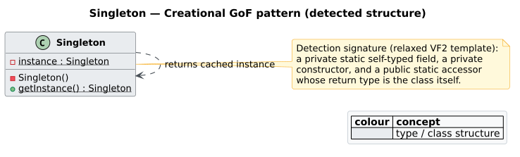
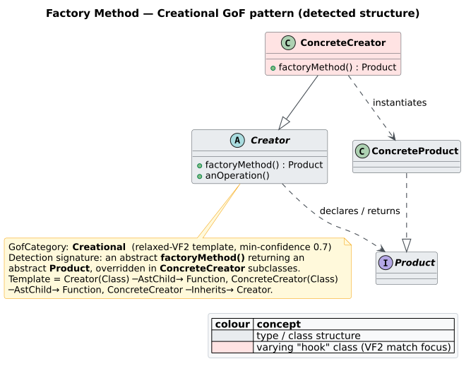
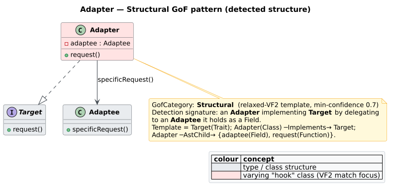
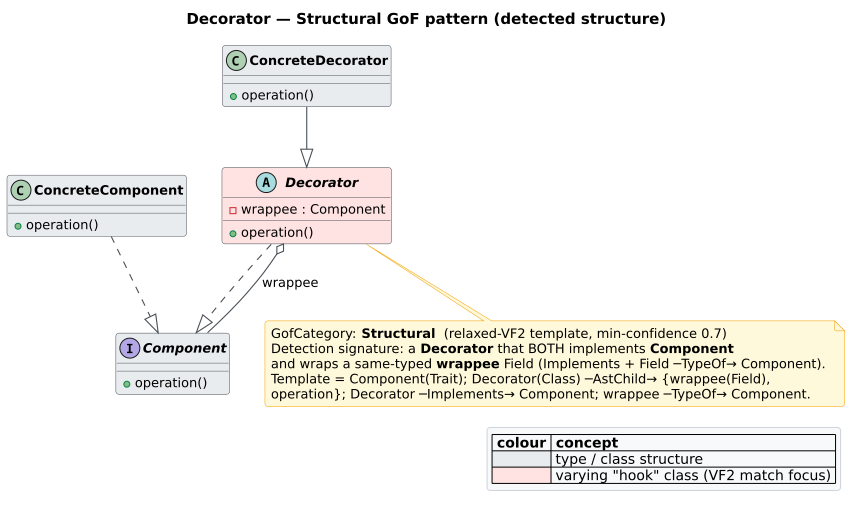
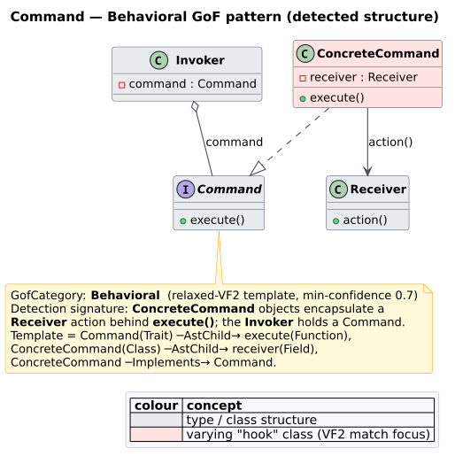
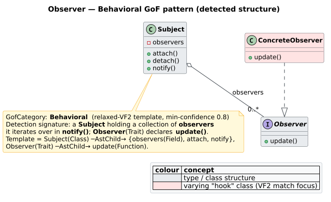
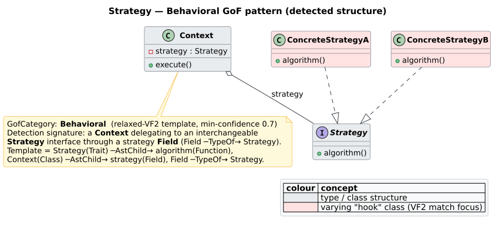

# Gang-of-Four Patterns

`patterns::GofPatternDetector` recognises the 23 [Gang-of-Four](../../GLOSSARY.md#gang-of-four-gof)
(GoF) design patterns [[10]](#references) structurally, by compiling each pattern into a
small template CPG and matching it against your code with a **relaxed**
[VF2](../../GLOSSARY.md#vf2) matcher. It lives in the feature-gated `patterns` module and
requires the `design-patterns` feature.

> Throughout, the enum variant for the creational factory pattern is
> `GofPattern::FactoryMethod` — there is no `GofPattern::Factory`.

## How detection works

For each requested pattern the detector:

1. builds a template CPG of the pattern's roles and relationships
   (`build_pattern_cpg`);
2. runs a [VF2](vf2-matching.md) matcher configured for **recall** — both strictness
   toggles off (`strict_kinds = false`, `strict_edges = false`), so a role matches any
   node in the same broad [category](vf2-matching.md#strict-versus-relaxed-matching) and a
   relationship matches any edge in the same overlay;
3. scores each embedding against the template's completeness (`calculate_confidence`);
4. keeps embeddings whose confidence is at or above `min_confidence` (default `0.7`); and
5. returns the survivors sorted by confidence, descending.

Because matching is relaxed and structural, results are **advisory**: they report that the
*shape* of a pattern is present, keyed on [node kinds](../../GLOSSARY.md#node-kind--edge-kind)
and containment, not that the program provably behaves as the pattern. Tune precision with
the confidence threshold.


*Figure — the GoF catalogue as `libcpg` enumerates it: `GofCategory::Creational` (5), `Structural` (7), and `Behavioral` (11). Source: [`diagrams/gof-taxonomy.puml`](../../diagrams/gof-taxonomy.puml).*

## Using the detector

`GofPatternDetector` implements the `PatternDetector` trait, so bring that trait into scope
to call `.detect()`.

```rust
// requires: features = ["design-patterns"]
use libcpg::patterns::{GofPatternDetector, PatternDetector};

// Detect every pattern with the default 0.7 confidence floor.
let detector = GofPatternDetector::new();
let matches = detector.detect(&cpg);

for m in &matches {
    println!("{} — {:.0}%", m.pattern_name, m.confidence * 100.0);
}
```

### Restricting and thresholding

`with_patterns` limits the search set (cheaper, and avoids unrelated hits);
`with_min_confidence` moves the acceptance floor.

```rust
// requires: features = ["design-patterns"]
use libcpg::patterns::{GofPatternDetector, GofPattern, PatternDetector};

let detector = GofPatternDetector::new()
    .with_patterns(vec![
        GofPattern::Singleton,
        GofPattern::FactoryMethod,   // note: FactoryMethod, never Factory
        GofPattern::Observer,
    ])
    .with_min_confidence(0.8);

let matches = detector.detect(&cpg);
```

### Reading the metadata

Every match the detector emits carries two metadata keys: `category` (the
`GofCategory` name) and `pattern_type` (always `"GoF"`).

```rust
// requires: features = ["design-patterns"]
for m in &matches {
    let category = m.metadata.get("category").map(String::as_str).unwrap_or("?");
    let kind = m.metadata.get("pattern_type").map(String::as_str).unwrap_or("?");
    println!("{} [{} / {}] rooted at {:?}", m.pattern_name, kind, category, m.root);
}
```

### Categories

`GofPattern::category()` maps a pattern to its `GofCategory`, and `GofCategory::name()`
gives the display string.

```rust
// requires: features = ["design-patterns"]
use libcpg::patterns::GofPattern;
use libcpg::patterns::design::GofCategory;

assert_eq!(GofPattern::Singleton.category(), GofCategory::Creational);
assert_eq!(GofPattern::Adapter.category(),  GofCategory::Structural);
assert_eq!(GofPattern::Observer.category(), GofCategory::Behavioral);
```

## Confidence scoring

The confidence of a match blends how much of the template was filled with the template's
own `min_confidence`. Let $`c`$ be the *completeness* — the number of mapped nodes over
the number of node constraints in the template — and let $`b`$ be the template's
`min_confidence`. Then:

```math
\mathrm{confidence} = c \cdot b + (1 - c)\cdot \tfrac{1}{2}\, b = b\left(\tfrac{1}{2} + \tfrac{1}{2}\,c\right)
```

Two consequences follow directly and are worth internalising:

- A **complete** match ($`c = 1`$) scores exactly $`b`$. So each template's
  `min_confidence` is really the *ceiling* a perfect match can attain, not a floor.
- A **half** match ($`c = 0.5`$) scores $`0.75\,b`$; the score never drops below
  $`0.5\,b`$.

This interacts with the detector-level `min_confidence` (default `0.7`): a pattern whose
template ceiling $`b`$ is below the detector threshold can never be reported at that
threshold. In the shipped templates only **Facade** has $`b = 0.6`$, so it is invisible
at the default floor — lower the detector threshold (e.g. `with_min_confidence(0.6)`) to
see it. The remaining templates use $`b \in \{0.7, 0.8\}`$.

| Score band | Interpretation |
| :--------- | :------------- |
| $`0.90+`$ | strong — near-complete fill of a high-ceiling template |
| $`0.75`$–$`0.90`$ | good — most roles mapped |
| $`0.60`$–$`0.75`$ | partial — core roles mapped |
| $` < 0.60`$ | weak — likely coincidental |

## Detection signatures

Each pattern's **signature** below is the template CPG the detector matches: its *roles*
(node kinds) and *relationships* (edges — AST containment written "contains", plus the
semantic `Implements` / `Inherits` / `TypeOf` / `CallSite` / data-flow edges the templates
encode). "Ceiling $`b`$" is the template `min_confidence` — the score a complete match
attains. Relaxed matching means role kinds and names are guidance, not strict requirements.

---

## Creational patterns

Patterns concerned with object creation. `GofCategory::Creational` — 5 patterns.

### Singleton — `GofPattern::Singleton`

**Intent.** Ensure a class has exactly one instance and provide a global access point to
it.

**Signature** (ceiling $`b = 0.8`$; 4 role constraints). A `Class` that *contains* a
private instance `Field`, a constructor `Function`, and a static accessor `Function`; the
accessor contains a `Return` that reads the instance field (a `FieldRead` data-flow edge).



*Figure — the Singleton template: one class owning its own sole instance behind a static accessor. Source: [`diagrams/gof-singleton.puml`](../../diagrams/gof-singleton.puml).*

### Factory Method — `GofPattern::FactoryMethod`

**Intent.** Define an interface for creating an object, but let subclasses decide which
class to instantiate.

**Signature** (ceiling $`b = 0.7`$; 4 constraints). An abstract `Class` (Creator) that
*contains* a factory `Function`, and a second `Class` (ConcreteCreator) that `Inherits` the
Creator and *contains* an overriding factory `Function`.



*Figure — the Factory Method template: creation deferred from an abstract Creator to its concrete subclasses. Source: [`diagrams/gof-factory-method.puml`](../../diagrams/gof-factory-method.puml).*

### Abstract Factory — `GofPattern::AbstractFactory`

**Intent.** Provide an interface for creating families of related or dependent objects
without specifying their concrete classes.

**Signature** (ceiling $`b = 0.7`$; 4 constraints). A `Trait` (AbstractFactory) that
*contains* two creation `Function`s (`createProductA`, `createProductB`), plus a `Class`
(ConcreteFactory) that `Implements` the trait.

### Builder — `GofPattern::Builder`

**Intent.** Separate the construction of a complex object from its representation so the
same process can build different representations.

**Signature** (ceiling $`b = 0.7`$; 4 constraints). A `Class` (Builder) that *contains*
two chained setter `Function`s and a terminal `build` `Function`.

### Prototype — `GofPattern::Prototype`

**Intent.** Create new objects by copying an existing prototypical instance.

**Signature** (ceiling $`b = 0.8`$; 3 constraints). A `Trait` (Prototype) that *contains*
a `Function` named `clone`, and a `Class` (ConcretePrototype) that `Implements` it.

---

## Structural patterns

Patterns concerned with composition of classes and objects. `GofCategory::Structural` — 7
patterns.

### Adapter — `GofPattern::Adapter`

**Intent.** Convert the interface of a class into another interface clients expect,
letting incompatible interfaces collaborate.

**Signature** (ceiling $`b = 0.7`$; 4 constraints). A `Class` (Adapter) that `Implements`
a `Trait` (Target), *contains* an adaptee `Field`, and *contains* a `request` `Function`
that delegates to it.



*Figure — the Adapter template: a class satisfies the Target interface by delegating to a wrapped Adaptee. Source: [`diagrams/gof-adapter.puml`](../../diagrams/gof-adapter.puml).*

### Bridge — `GofPattern::Bridge`

**Intent.** Decouple an abstraction from its implementation so the two can vary
independently.

**Signature** (ceiling $`b = 0.7`$; 3 constraints). An abstract `Class` (Abstraction)
that *contains* a `Field` whose `TypeOf` is a `Trait` (Implementor), plus an `operation`
`Function`.

### Composite — `GofPattern::Composite`

**Intent.** Compose objects into tree structures to represent part-whole hierarchies,
letting clients treat individual objects and compositions uniformly.

**Signature** (ceiling $`b = 0.7`$; 4 constraints). A `Trait` (Component) that *contains*
an `operation` `Function`, and a `Class` (Composite) that `Implements` it and *contains* a
`children` `Field` collection (plus an `add` `Function`).

### Decorator — `GofPattern::Decorator`

**Intent.** Attach additional responsibilities to an object dynamically, as a flexible
alternative to subclassing.

**Signature** (ceiling $`b = 0.7`$; 4 constraints). A `Class` (Decorator) that
`Implements` a `Trait` (Component), *contains* a wrapped `Field` whose `TypeOf` is that same
Component, and *contains* an `operation` `Function` that delegates.



*Figure — the Decorator template: implement the interface, wrap an instance of it, and add behaviour around the delegated call. Source: [`diagrams/gof-decorator.puml`](../../diagrams/gof-decorator.puml).*

### Facade — `GofPattern::Facade`

**Intent.** Provide a unified, simplified interface to a set of interfaces in a subsystem.

**Signature** (ceiling $`b = 0.6`$; 4 constraints). A `Class` (Facade) that *contains*
two or more subsystem `Field`s and a simplified `operation` `Function`. Because its ceiling
is `0.6`, Facade is only reported when the detector threshold is lowered below `0.7`.

### Flyweight — `GofPattern::Flyweight`

**Intent.** Use sharing to support large numbers of fine-grained objects efficiently.

**Signature** (ceiling $`b = 0.7`$; 4 constraints). A `Trait` (Flyweight) that *contains*
an `operation` `Function`, and a `Class` (FlyweightFactory) that *contains* a cache `Field`
and a `getFlyweight` `Function` returning shared instances.

### Proxy — `GofPattern::Proxy`

**Intent.** Provide a surrogate or placeholder for another object to control access to it.

**Signature** (ceiling $`b = 0.7`$; 4 constraints). A `Trait` (Subject) that *contains* a
`request` `Function`, and a `Class` (Proxy) that `Implements` it and *contains* a
real-subject `Field`.

---

## Behavioral patterns

Patterns concerned with algorithms and the assignment of responsibilities between objects.
`GofCategory::Behavioral` — 11 patterns.

### Chain of Responsibility — `GofPattern::ChainOfResponsibility`

**Intent.** Avoid coupling a request's sender to its receiver by giving several objects a
chance to handle it along a chain.

**Signature** (ceiling $`b = 0.7`$; 5 constraints). A `Trait` (Handler) that *contains*
`handle` and `setNext` `Function`s, plus a `Class` (ConcreteHandler) that `Implements` it
and *contains* a `next` `Field` referencing the successor.

### Command — `GofPattern::Command`

**Intent.** Encapsulate a request as an object, letting you parameterise clients, queue or
log requests, and support undo.

**Signature** (ceiling $`b = 0.7`$; 4 constraints). A `Trait` (Command) that *contains*
an `execute` `Function`, and a `Class` (ConcreteCommand) that `Implements` it and *contains*
a `receiver` `Field`.



*Figure — the Command template: a request becomes an object; a ConcreteCommand binds a Receiver behind execute(). Source: [`diagrams/gof-command.puml`](../../diagrams/gof-command.puml).*

### Interpreter — `GofPattern::Interpreter`

**Intent.** Given a language, define a representation for its grammar and an interpreter
that uses the representation to interpret sentences.

**Signature** (ceiling $`b = 0.7`$; 3 constraints). A `Trait` (Expression) that
*contains* an `interpret` `Function`, with `Class`es (TerminalExpression,
NonTerminalExpression) that `Implements` it.

### Iterator — `GofPattern::Iterator`

**Intent.** Provide sequential access to the elements of an aggregate without exposing its
underlying representation.

**Signature** (ceiling $`b = 0.8`$; 3 constraints). A `Trait` (Iterator) that *contains*
a `next` `Function` and a `hasNext` `Function`.

### Mediator — `GofPattern::Mediator`

**Intent.** Define an object that encapsulates how a set of objects interact, promoting
loose coupling.

**Signature** (ceiling $`b = 0.7`$; 4 constraints). A `Trait` (Mediator) that *contains*
a `notify` `Function`, and a `Class` (Colleague) that *contains* a `Field` whose `TypeOf`
is the Mediator.

### Memento — `GofPattern::Memento`

**Intent.** Capture and externalise an object's internal state so it can later be restored,
without violating encapsulation.

**Signature** (ceiling $`b = 0.8`$; 4 constraints). A `Class` (Originator) that *contains*
a `state` `Field`, a `save` `Function`, and a `restore` `Function`.

### Observer — `GofPattern::Observer`

**Intent.** Define a one-to-many dependency so that when one object changes state, all its
dependents are notified and updated automatically.

**Signature** (ceiling $`b = 0.8`$; 6 constraints). A `Class` (Subject) that *contains*
an `observers` `Field` collection, an `attach` `Function`, and a `notify` `Function`; plus
a `Trait` (Observer) that *contains* an `update` `Function`. Observer carries the highest
node count and, with Iterator/Memento/Prototype/Singleton/Visitor, a `0.8` ceiling.



*Figure — the Observer template: a Subject broadcasts to a collection of Observers through their common update() interface. Source: [`diagrams/gof-observer.puml`](../../diagrams/gof-observer.puml).*

### State — `GofPattern::State`

**Intent.** Allow an object to alter its behaviour when its internal state changes,
appearing to change its class.

**Signature** (ceiling $`b = 0.7`$; 4 constraints). A `Trait` (State) that *contains* a
`handle` `Function`, and a `Class` (Context) that *contains* a `Field` whose `TypeOf` is the
State (plus a `setState` `Function`).

### Strategy — `GofPattern::Strategy`

**Intent.** Define a family of algorithms, encapsulate each one, and make them
interchangeable behind a common interface.

**Signature** (ceiling $`b = 0.7`$; 4 constraints). A `Trait` (Strategy) that *contains*
an `execute` `Function`, and a `Class` (Context) that *contains* a `Field` whose `TypeOf`
is the Strategy (plus a `setStrategy` `Function`). Structurally near-identical to State;
the two are distinguished by role naming, not shape.



*Figure — the Strategy template: a Context delegates a swappable algorithm to a Strategy interface. Source: [`diagrams/gof-strategy.puml`](../../diagrams/gof-strategy.puml).*

### Template Method — `GofPattern::TemplateMethod`

**Intent.** Define the skeleton of an algorithm in an operation, deferring some steps to
subclasses.

**Signature** (ceiling $`b = 0.7`$; 4 constraints). An abstract `Class` that *contains* a
`templateMethod` `Function` and two primitive-operation `Function`s; the template method
`CallSite`s each primitive operation.

### Visitor — `GofPattern::Visitor`

**Intent.** Represent an operation to be performed on the elements of an object structure,
letting you define new operations without changing the element classes.

**Signature** (ceiling $`b = 0.8`$; 5 constraints). A `Trait` (Visitor) that *contains*
two `visit…` `Function`s, and a `Trait` (Element) that *contains* an `accept` `Function`.

---

## Complete pattern list

### Creational (5)

| Pattern | `GofPattern` variant | Intent |
| :------ | :------------------- | :----- |
| Abstract Factory | `AbstractFactory` | create families of related objects |
| Builder | `Builder` | construct a complex object step by step |
| Factory Method | `FactoryMethod` | defer instantiation to subclasses |
| Prototype | `Prototype` | create objects by cloning a prototype |
| Singleton | `Singleton` | guarantee a single instance |

### Structural (7)

| Pattern | `GofPattern` variant | Intent |
| :------ | :------------------- | :----- |
| Adapter | `Adapter` | convert an interface to the one clients expect |
| Bridge | `Bridge` | separate an abstraction from its implementation |
| Composite | `Composite` | tree structures for part-whole hierarchies |
| Decorator | `Decorator` | add responsibilities by wrapping |
| Facade | `Facade` | a unified interface to a subsystem |
| Flyweight | `Flyweight` | share fine-grained objects |
| Proxy | `Proxy` | a surrogate controlling access to a subject |

### Behavioral (11)

| Pattern | `GofPattern` variant | Intent |
| :------ | :------------------- | :----- |
| Chain of Responsibility | `ChainOfResponsibility` | pass a request along a chain of handlers |
| Command | `Command` | encapsulate a request as an object |
| Interpreter | `Interpreter` | represent and interpret a grammar |
| Iterator | `Iterator` | sequential access without exposing structure |
| Mediator | `Mediator` | centralise object interaction |
| Memento | `Memento` | capture and restore state externally |
| Observer | `Observer` | one-to-many change notification |
| State | `State` | change behaviour with internal state |
| Strategy | `Strategy` | interchangeable algorithm family |
| Template Method | `TemplateMethod` | algorithm skeleton with variable steps |
| Visitor | `Visitor` | operations over an object structure |

## Honesty about coverage

- Detection is **relaxed and structural**. It keys on node kinds and containment, so it
  tolerates naming and kind variation — and therefore reports *advisory* matches, not
  proofs. Distinct patterns with the same shape (State and Strategy; Command, Proxy, and
  Mediator all being "interface + concrete class with a field") are told apart only by
  role naming, which relaxed matching does not enforce. Expect confusable behavioral
  patterns and calibrate `min_confidence` accordingly.
- A complete match scores exactly the template ceiling $`b`$, so **Facade** (ceiling
  `0.6`) is never reported at the default `0.7` threshold; lower the threshold to surface
  it.
- For a lighter-weight, name-aware alternative covering five patterns (Singleton, Factory,
  Observer, Strategy, Decorator), see the [heuristic classifier](classification.md).

## See also

- [Pattern detection overview](overview.md) — the four detection approaches.
- [VF2 subgraph matching](vf2-matching.md) — the relaxed matcher these templates use.
- [DPML templates](dpml.md) — author your own pattern templates in YAML/TOML.
- [Pattern classification](classification.md) — the heuristic alternative + `PatternMetrics`.
- Theory: [design-pattern detection](../../theory/07-design-pattern-detection.md).
- API: [pattern reference](../../api/pattern-reference.md).

## References

10. Gamma, E., Helm, R., Johnson, R., Vlissides, J. (1994). *Design Patterns: Elements of Reusable Object-Oriented Software.* Addison-Wesley. ISBN 978-0201633610 (no DOI).
