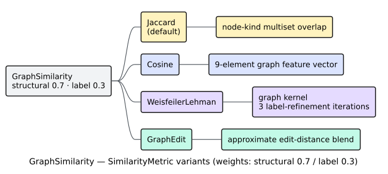
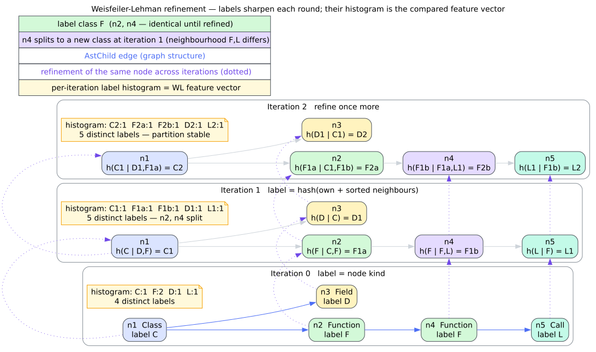

# VF2 Subgraph Matching

`pattern::Vf2Matcher` is `libcpg`'s engine for [subgraph isomorphism](../../GLOSSARY.md#isomorphism--subgraph-isomorphism):
given a small **pattern** CPG and a large **target** CPG, it finds every placement of the
pattern inside the target. It is the substrate under every template and every
[Gang-of-Four](gang-of-four.md) detector, and — because it lives in the always-on
`pattern` module — it needs no feature flag.

## What subgraph isomorphism asks

A **graph isomorphism** is a bijection between two graphs' nodes that preserves edges.
**Subgraph isomorphism** relaxes this to a question of containment: does the target graph
contain a subgraph isomorphic to the pattern? Equivalently, is there an injective map from
pattern nodes to target nodes under which every pattern edge has a corresponding target
edge?

Deciding subgraph isomorphism is [NP-complete](../../GLOSSARY.md#isomorphism--subgraph-isomorphism)
in general, so no algorithm avoids exponential worst-case cost. What makes it tractable in
practice is that CPGs are **sparse** and pattern graphs are **small**, and that a good
search prunes aggressively. VF2 is exactly such a search.


*Figure — the matching question: locate every copy of the pattern (left) inside the target (right). Source: [`diagrams/vf2-pattern-target.dot`](../../diagrams/vf2-pattern-target.dot).*

## The VF2 algorithm

[VF2](../../GLOSSARY.md#vf2) (Cordella, Foggia, Sansone, and Vento [[4]](#references)) grows a
partial mapping $`M`$ from pattern nodes to target nodes one pair at a time, depth-first,
backtracking whenever a partial mapping cannot be completed. Three ideas make it efficient:

1. **Terminal sets.** Rather than trying every unmapped pair, VF2 prefers candidate pairs
   drawn from the [terminal sets](../../GLOSSARY.md#terminal-set-vf2) — the "fringe" of
   still-unmapped nodes adjacent to the current mapping. Growing the mapping along existing
   edges lets edge constraints reject bad pairs immediately.
2. **Feasibility rules.** Before a pair $`(p, t)`$ is added, VF2 checks that $`p`$ and
   $`t`$ are compatible in [kind](../../GLOSSARY.md#node-kind--edge-kind) and that every
   already-mapped neighbour of $`p`$ is joined to $`t`$ by a compatible edge in the
   target. Infeasible pairs never enter the mapping.
3. **Exact backtracking.** When a branch is exhausted, the mapping *and the terminal sets*
   are restored to precisely their pre-push state, so the search explores every embedding
   without corruption.

### State

`pattern::Vf2State` carries the partial mapping and the bookkeeping the feasibility rules
need. Its fields (all private; you interact through `Vf2Matcher`):

```rust
use rustc_hash::{FxHashMap, FxHashSet};
use libcpg::{CodePropertyGraph, NodeId};

pub struct Vf2State<'a> {
    pattern: &'a CodePropertyGraph,          // the pattern graph
    target: &'a CodePropertyGraph,           // the target graph
    mapping: FxHashMap<NodeId, NodeId>,      // pattern node → target node
    reverse_mapping: FxHashMap<NodeId, NodeId>, // target node → pattern node
    unmapped_pattern: FxHashSet<NodeId>,     // pattern nodes not yet mapped
    unused_target: FxHashSet<NodeId>,        // target nodes not yet used
    pattern_terminal: FxHashSet<NodeId>,     // fringe on the pattern side
    target_terminal: FxHashSet<NodeId>,      // fringe on the target side
    // ...plus a private push-order stack `order` used for exact backtracking.
}
```

The `order` stack is the correctness lynchpin. Each `push_mapping` records a frame — the
mapped pair, whether each node was already in its terminal set, and exactly which terminal
entries the push *newly inserted*. The matching `pop_mapping` pops that frame and reverses
precisely those edits. This is what the regression test
`test_multi_embedding_backtracking` in `src/pattern/vf2.rs` guards (see
[the diamond example](#the-diamond-a-backtracking-litmus-test)).


*Figure — the VF2 search as a state machine: extend on feasibility, emit on completeness, and pop-restore on backtrack. Source: [`diagrams/vf2-state-machine.puml`](../../diagrams/vf2-state-machine.puml).*

### The search, as literate pseudocode

The recursion mirrors `Vf2Matcher::vf2_search` line for line:

```text
search(state, matches):
  1. if a match cap is set and matches is full:          # honour with_max_matches
        return
  2. if state.is_complete():                             # every pattern node mapped
        matches.push(state.to_pattern_match())           # record this embedding
        return
  3. candidates ← state.candidate_pairs()                # fringe-first candidate pairs
  4. for each (p, t) in candidates:
       5. if is_feasible(state, p, t):                   # kind + incident-edge checks
            6. state.push_mapping(p, t)                  # extend M, grow terminal sets
            7. search(state, matches)                    # recurse deeper
            8. state.pop_mapping()                       # exact undo of step 6
            9. if the cap is now full: return
```

**Candidate generation** (`candidate_pairs`, step 3). If both terminal sets are non-empty,
VF2 picks one pattern-terminal node and pairs it with *every* target-terminal node —
staying on the connected fringe. Only if the fringe is empty (a disconnected pattern, or
the very first node) does it fall back to pairing an arbitrary unmapped pattern node with
every unused target node.

**Feasibility** (`is_feasible`, step 5). A pair $`(p, t)`$ survives when:

- `p` and `t` have compatible kinds (strict or relaxed — see below); and
- for every pattern edge $`p \to q`$ whose head `q` is *already mapped* to some $`t_q`$,
  the target has a compatible edge $`t \to t_q`$; and symmetrically for every incoming
  pattern edge $`q \to p`$ with `q` already mapped.

Newly relevant edges are only checked against *already-mapped* neighbours, so feasibility
is cheap and grows the mapping consistently.

### Complexity

Because subgraph isomorphism is NP-complete, VF2's worst case is exponential: with $`N`$
the number of nodes, the search is $`O(N!\,N)`$ in the pathological dense case (every
ordering of an all-to-all mapping). Terminal-set ordering and feasibility pruning collapse
this dramatically on real CPGs, where the practical cost tracks the number of *partial*
mappings that survive pruning rather than the factorial bound. Two levers keep it bounded:
cap the result count with `with_max_matches`, and raise strictness to shrink the candidate
set.

## Using `Vf2Matcher`

`Vf2Matcher` is a small configuration object; matching is exposed through the
`SubgraphMatcher` trait (re-exported at the crate root), so bring that trait into scope.

```rust
use libcpg::pattern::{Vf2Matcher, SubgraphMatcher};

let matcher = Vf2Matcher::new()
    .with_strict_kinds(true)    // exact node-kind equality (default: false)
    .with_strict_edges(false)   // relaxed edge matching   (default: false)
    .with_max_matches(0);       // 0 = unlimited           (default: 0)

let matches = matcher.find_matches(&pattern_cpg, &target_cpg);
```

The `SubgraphMatcher` trait provides three more entry points on top of `find_matches`:

| Method | Returns | Meaning |
| :----- | :------ | :------ |
| `find_matches(&pattern, &target)` | `Vec<PatternMatch>` | every embedding (respecting `max_matches`) |
| `find_matches_limited(&pattern, &target, limit)` | `Vec<PatternMatch>` | at most `limit`, truncating the full result |
| `contains_pattern(&pattern, &target)` | `bool` | is there at least one embedding? |
| `algorithm_name()` | `&str` | `"VF2"` |

```rust
use libcpg::pattern::{Vf2Matcher, SubgraphMatcher};

let matcher = Vf2Matcher::new();
let exists = matcher.contains_pattern(&pattern_cpg, &target_cpg); // early-out at first hit
let first_five = matcher.find_matches_limited(&pattern_cpg, &target_cpg, 5);
```

### Strict versus relaxed matching

Strictness governs *both* the node and edge feasibility tests independently.

**Node kinds.** With `strict_kinds(true)`, two nodes match only when their
[`NodeKindTag`](../../api/pattern-reference.md) is identical. With `strict_kinds(false)`
(the default and what the GoF detector uses), two nodes match when they fall in the same
broad category, or when their tags are equal:

| Category | Kinds that match one another under relaxed mode |
| :------- | :---------------------------------------------- |
| Declaration | `Module`, `Class`, `Struct`, `Enum`, `Trait`, `Function`, `Variable`, `Field` |
| Expression | `BinaryOp`, `UnaryOp`, `Call`, `MemberAccess`, `IndexAccess`, `Identifier`, `Literal`, `Lambda` |
| Statement | `Return`, `If`, `While`, `For`, `Loop`, `Match`, `Break`, `Continue` |

**Edge kinds.** With `strict_edges(true)`, edge kinds must be equal. With
`strict_edges(false)`, edges match by overlay: an [AST](../../GLOSSARY.md#abstract-syntax-tree-ast)
edge matches any AST edge, and a non-AST edge matches when both are
[CFG](../../GLOSSARY.md#control-flow-graph-cfg), both are [DFG](../../GLOSSARY.md#data-flow-graph-dfg),
or both are [call](../../GLOSSARY.md#call-graph) edges. An AST edge never matches a non-AST
edge in relaxed mode.

Relaxed matching trades precision for recall: it is the right default for design-pattern
templates (which care that "a class contains a method", not about the exact terminal kind),
and strict matching is the right choice for exact structural queries.

### Building the pattern graph

Two paths produce the small pattern CPG that `find_matches` consumes.

**Hand-built**, node by node — the feature-free surface:

```rust
use libcpg::{CodePropertyGraph, CpgNode, CpgNodeKind, CpgEdgeKind, Language, NodeId, SourceRange};

let mut pattern = CodePropertyGraph::new(Language::Unknown);
let if_id = pattern.add_node(CpgNode::new(NodeId::new(0), CpgNodeKind::If, SourceRange::default()));
let ret_id = pattern.add_node(CpgNode::new(NodeId::new(0), CpgNodeKind::Return, SourceRange::default()));
pattern.connect(if_id, ret_id, CpgEdgeKind::AstChild);
```

`add_node` assigns the real `NodeId`; the id you pass to `CpgNode::new` is a placeholder
overwritten on insertion, and `connect(src, tgt, kind)` adds the edge.

**Compiled from a `PatternTemplate`**, which is more declarative and reusable:

```rust
use libcpg::pattern::{
    PatternTemplate, NodeConstraint, EdgeConstraint,
    NodeKindMatcher, NodeKindTag, EdgeKindMatcher, Vf2Matcher, SubgraphMatcher,
};

let template = PatternTemplate::new("If→Return", "a guarded return")
    .with_node(NodeConstraint::new(0).with_kind(NodeKindMatcher::Exact(NodeKindTag::If)))
    .with_node(NodeConstraint::new(1).with_kind(NodeKindMatcher::Exact(NodeKindTag::Return)))
    .with_edge(EdgeConstraint::new(0, 1).with_kind(EdgeKindMatcher::AnyAst));

let pattern_cpg = template.to_pattern_graph();   // constraints → a matchable CPG
let matches = Vf2Matcher::new().find_matches(&pattern_cpg, &target_cpg);
```

`to_pattern_graph()` instantiates one representative node per `NodeConstraint` (using the
`name_pattern` where given) and one edge per `EdgeConstraint`, yielding a CPG the matcher
can consume. The template's own `min_confidence` is metadata for downstream scoring; the
matcher itself does not read it.

## The diamond: a backtracking litmus test

VF2's subtlety is *partial* backtracking — popping only part of the mapping and retrying.
A path pattern against a diamond target exercises it precisely.


*Figure — the diamond target has exactly two embeddings of the path pattern; they diverge at the middle node. Source: [`diagrams/vf2-diamond.dot`](../../diagrams/vf2-diamond.dot).*

The pattern is a directed path $`p_0 \to p_1 \to p_2`$. The target is a diamond
$`A \to \{B, C\} \to D`$. There are exactly **two** embeddings — $`A{-}B{-}D`$ and
$`A{-}C{-}D`$ — and they differ only at the *middle* node. After mapping $`p_0 \to A`$,
the node $`p_1`$ has two feasible targets. Finding the second embedding requires the
search to backtrack *partially* out of the first — pop $`p_2`$ and $`p_1`$ but **keep**
$`p_0 \to A`$ — and retry $`p_1 \to C`$.

```rust
use libcpg::{CodePropertyGraph, CpgNode, CpgNodeKind, CpgEdgeKind, Language, NodeId, SourceRange};
use libcpg::pattern::{Vf2Matcher, SubgraphMatcher};

fn node(g: &mut CodePropertyGraph) -> NodeId {
    g.add_node(CpgNode::new(NodeId::new(0), CpgNodeKind::If, SourceRange::default()))
}

// Pattern: path p0 → p1 → p2.
let mut pattern = CodePropertyGraph::new(Language::Rust);
let p: Vec<NodeId> = (0..3).map(|_| node(&mut pattern)).collect();
pattern.connect(p[0], p[1], CpgEdgeKind::AstChild);
pattern.connect(p[1], p[2], CpgEdgeKind::AstChild);

// Target: diamond t0 → {t1, t2} → t3.
let mut target = CodePropertyGraph::new(Language::Rust);
let t: Vec<NodeId> = (0..4).map(|_| node(&mut target)).collect();
target.connect(t[0], t[1], CpgEdgeKind::AstChild);
target.connect(t[0], t[2], CpgEdgeKind::AstChild);
target.connect(t[1], t[3], CpgEdgeKind::AstChild);
target.connect(t[2], t[3], CpgEdgeKind::AstChild);

let matches = Vf2Matcher::new().find_matches(&pattern, &target);
assert_eq!(matches.len(), 2); // both embeddings, no more, no fewer
```

All nodes share a kind so structure alone decides the matches. An earlier implementation
popped an *arbitrary* map entry and never restored the terminal sets, so the partial
backtrack corrupted state and dropped the $`A{-}C{-}D`$ embedding. The frame-stack undo
described above is what makes this test pass; it is `libcpg`'s realisation of the standard
VF2 stack discipline.

## Graph similarity

When you want a *degree of resemblance* between two whole graphs rather than an exact
sub-shape, use `pattern::GraphSimilarity`. It scores a pair of CPGs on $`[0, 1]`$ under a
selectable metric.

```rust
use libcpg::pattern::{GraphSimilarity, SimilarityMetric};

let score = GraphSimilarity::new()                  // structural/label weights 0.7 / 0.3
    .with_metric(SimilarityMetric::Jaccard)         // the default metric
    .similarity(&cpg_a, &cpg_b);
```



*Figure — the four `SimilarityMetric` strategies and what each compares. Source: [`diagrams/similarity-metrics.puml`](../../diagrams/similarity-metrics.puml).*

The four metrics:

| `SimilarityMetric` | Compares | Notes |
| :----------------- | :------- | :---- |
| `Jaccard` *(default)* | multisets of node kinds | fastest; overlap of node-kind histograms |
| `Cosine` | a 9-feature graph vector | node/edge counts, AST/CFG/DFG edge ratios, function/class counts, depth, complexity |
| `WeisfeilerLehman` | refined-label histograms | 3 refinement iterations; cosine over the label counts |
| `GraphEdit` | node/edge count deltas + Jaccard | approximate; the *only* metric that reads the weights |

**Jaccard** takes the [Jaccard index](../../GLOSSARY.md#jaccard-similarity) of the two
node-kind multisets $`A`$ and $`B`$:

```math
J(A, B) = \frac{|A \cap B|}{|A \cup B|}
```

with the convention that two empty graphs score $`1`$.

**Weisfeiler-Lehman** applies [label refinement](../../GLOSSARY.md#weisfeiler-lehman-kernel--label-refinement):
each node's label becomes a hash of its own label plus the sorted multiset of its
neighbours' labels; after 3 iterations the histogram of labels is compared by
[cosine](../../GLOSSARY.md#cosine-similarity). It captures $`k`$-hop neighbourhood
structure that a flat node-kind count misses.



*Figure — one Weisfeiler-Lehman refinement round rewrites every node's label from its neighbourhood. Source: [`diagrams/wl-kernel.dot`](../../diagrams/wl-kernel.dot).*

A precision note on the weights: `GraphSimilarity::new()` sets `structural_weight = 0.7`
and `label_weight = 0.3`, but these are consulted **only** by the `GraphEdit` metric, which
blends a structural term (node/edge count agreement) with a label term (Jaccard). The
`Jaccard`, `Cosine`, and `WeisfeilerLehman` metrics return their score directly and ignore
the weights. The deeper theory of all four metrics lives in
[graph similarity](../../theory/06-graph-similarity.md).

## See also

- [Pattern detection overview](overview.md) — where VF2 sits among the four approaches.
- [Gang-of-Four patterns](gang-of-four.md) — relaxed VF2 applied to 23 templates.
- [DPML templates](dpml.md) — authoring pattern graphs in YAML/TOML.
- Theory: [subgraph isomorphism & VF2](../../theory/05-subgraph-isomorphism-vf2.md),
  [graph similarity](../../theory/06-graph-similarity.md).
- API: [pattern reference](../../api/pattern-reference.md).

## References

4. Cordella, L. P., Foggia, P., Sansone, C., Vento, M. (2004). *A (Sub)graph Isomorphism Algorithm for Matching Large Graphs.* IEEE TPAMI 26(10). DOI: [10.1109/TPAMI.2004.75](https://doi.org/10.1109/TPAMI.2004.75)
9. Shervashidze, N., Schweitzer, P., van Leeuwen, E. J., Mehlhorn, K., Borgwardt, K. M. (2011). *Weisfeiler-Lehman Graph Kernels.* JMLR 12. Open access: <https://jmlr.org/papers/v12/shervashidze11a.html> (no DOI). Original method: Weisfeiler, B., Leman, A. (1968).
