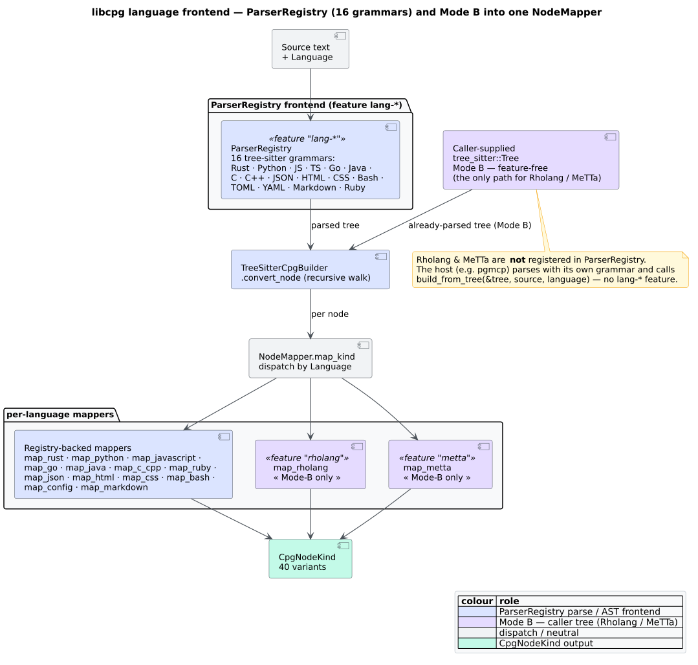

# 0002 — Mode B: `build_from_tree` and grammar-free language toggles

## Status

**Accepted.** Realised by `TreeSitterCpgBuilder::build_from_tree` in
`src/builder/tree_sitter.rs`, the empty `rholang` / `metta` features in
`Cargo.toml`, and the `#[cfg(feature = "…")]`-gated `map_rholang` / `map_metta`
arms in `src/builder/node_mapper.rs`. It is the only construction path for
[Rholang](../GLOSSARY.md#rholang) and [MeTTa](../GLOSSARY.md#metta), and the
integration seam for [pgmcp](../architecture/language-frontends.md).

## Context

The default construction path — call it **Mode A** — is
`CpgBuilder::build(source, language)`: `libcpg` looks the language up in its
[`ParserRegistry`](../GLOSSARY.md#tree-sitter), parses the source with the
[tree-sitter](../GLOSSARY.md#tree-sitter) grammar it links for that language, and
builds the CPG. Mode A is convenient but it carries two hard constraints:

1. **It needs `libcpg` to link the grammar.** Under `default = []`
   (see [ADR-0005](0005-feature-flag-taxonomy.md)) *no* grammar is linked, so
   `build` returns `Error::UnsupportedLanguage` for every language until a
   `lang-*` feature is switched on. The registry's real coverage is
   `ParserRegistry::supports(lang)`, not the static list `supported_languages()`
   returns.
2. **It assumes there *is* a grammar to link.** [Rholang](../GLOSSARY.md#rholang)
   and [MeTTa](../GLOSSARY.md#metta) — the [F1R3FLY.io](https://f1r3fly.io)
   languages `libcpg` most wants to serve — have grammars that live in sibling
   workspaces (`rholang-tree-sitter`, `tree-sitter-metta`), not versioned
   crates.io dependencies libcpg can pin like `tree-sitter-rust`.

There is also a **link-time hazard** that Mode A makes worse. Each
`tree-sitter-<lang>` crate compiles a C grammar that exports a symbol named
`tree_sitter_<lang>`. If two crates in one dependency graph link the *same*
grammar at *different* versions, the linker sees two definitions of that C
symbol and fails. The primary consumer of `libcpg` in this ecosystem —
[pgmcp](../architecture/language-frontends.md) — already parses source with its
*own* tree-sitter grammars (it is an indexer; parsing is its day job). If
`libcpg` also pulled those grammars in as ordinary dependencies, a pgmcp build
would carry two copies of every shared grammar and risk exactly this
duplicate-`tree_sitter_<lang>` collision, for no benefit — pgmcp already holds a
parsed tree it would like to reuse.

So the requirement is: let a caller that **already has a parsed tree** build a
CPG from it, without `libcpg` re-parsing, without `libcpg` linking that
language's grammar, and without turning the F1R3FLY languages into
second-class citizens that need a nonexistent `build()` path.

## Decision

**Accept a caller-supplied `tree_sitter::Tree` through a second entry point,
`build_from_tree` (Mode B), and keep the F1R3FLY language toggles as empty,
dependency-free `cfg` switches.**

### 1. `build_from_tree` — the Mode-B entry point

```rust
// feature-free: build_from_tree needs no `lang-*` feature — the caller owns
// the grammar and the parse. This is the exact API in src/builder/tree_sitter.rs.
pub fn build_from_tree(
    &self,
    tree: &tree_sitter::Tree,   // the caller already parsed this
    source: &str,
    language: Language,         // selects the NodeMapper
) -> Result<CodePropertyGraph>
```

Its post-parse pipeline is **identical** to `build` — AST construction, then
config-gated CFG and DFG extraction — with two differences: it skips the
internal parse (the caller did it) and it skips the `max_file_size` guard (the
caller already owns and sized the tree; see
[`../security/01-input-and-resource-hardening.md`](../security/01-input-and-resource-hardening.md)).
The `language` argument only selects the [`NodeMapper`](../GLOSSARY.md#node-kind--edge-kind);
the caller must guarantee `tree` came from a grammar whose node-kind strings that
mapper understands, or nodes fall through to the generic mapping.

Because the pipelines are the same, the two paths are provably shape-equivalent.
The inline test `test_build_from_tree_matches_build` (`src/builder/tree_sitter.rs`)
parses one source both ways and asserts:

```rust
// requires: features = ["lang-rust"]  (Mode A parse to obtain a tree, then Mode B)
assert!(from_tree.node_count() > 1);
assert_eq!(from_tree.node_count(),  from_source.node_count());
assert_eq!(from_tree.edge_count(),  from_source.edge_count());
assert_eq!(from_tree.language(),    Language::Rust);
```

### 2. Empty `rholang` / `metta` features — logical toggles, zero dependencies

```toml
# From Cargo.toml — intentionally EMPTY feature lists.
rholang = []
metta   = []
```

These pull in **nothing**. They are pure `cfg` switches that gate *only* the
`map_rholang` / `map_metta` arms (and their `map_kind` / `should_include`
dispatch) in `src/builder/node_mapper.rs`:

```rust
// From map_kind in src/builder/node_mapper.rs — the arms are cfg-gated.
#[cfg(feature = "rholang")]
Language::Rholang => self.map_rholang(ts_kind, node, source),
#[cfg(feature = "metta")]
Language::MeTTa   => self.map_metta(ts_kind, node, source),
_ => self.map_generic(ts_kind, node, source),
```

The mapper arms reference only `ts_kind` **strings** and `tree_sitter::Node`
navigation — never a `tree_sitter_rholang` / `tree_sitter_metta` symbol — so
there is nothing for the feature to link. The ρ-calculus / [S-expression](../GLOSSARY.md#s-expression)
CPG is built from the caller's already-parsed tree via `build_from_tree`. A
caller that wants the Rholang-aware mapping enables `rholang` and hands over its
tree:

```rust
// requires: features = ["rholang"]  — selects the ρ-calculus NodeMapper.
// build_from_tree itself is feature-free; the CALLER owns the grammar + parse
// (e.g. pgmcp, which already links tree-sitter-rholang and holds `tree`).
use libcpg::{TreeSitterCpgBuilder, Language};

// `tree` was parsed by the caller with its own tree-sitter-rholang grammar;
// `source` is the matching text.
let cpg = TreeSitterCpgBuilder::new()
    .build_from_tree(&tree, source, Language::Rholang)?;
// contract → Function, x!(…) send → Call, `new`-bound channel → Variable, rho: URI → Import.
```

### 3. Grammar pins matched to pgmcp

For the grammars `libcpg` *does* optionally vendor (the `lang-*` ones), the pins
are chosen to **match pgmcp's**, so that when both crates are in one build the
shared `tree_sitter_<lang>` C symbol has a single version. The `Cargo.toml`
records this directly:

> versions of grammars that pgmcp also links must match pgmcp's pins so the
> shared `tree_sitter_<lang>` C symbol is not duplicated at link time
> (python/javascript → 0.25, c → 0.24). See pgmcp P7b design section 4.3.

Concretely `tree-sitter = "0.26"` (core), with `tree-sitter-python` and
`tree-sitter-javascript` at `0.25` and `tree-sitter-c` at `0.24` to line up with
pgmcp. The rationale is the same one recorded in the upstream pgmcp integration
design (referenced from `libcpg`'s own `Cargo.toml` and `node_mapper.rs` as
*ADR-041 §7 / §7.2 D1*): never let two crates disagree on a grammar version.

### 4. Grammars linked only as test-only dev-dependencies

The Rholang/MeTTa grammars *are* linked — but strictly as **path
`[dev-dependencies]`**, to drive the Mode-B unit tests:

```toml
# [dev-dependencies] — TEST-ONLY. Cargo never propagates these downstream.
tree-sitter-rholang = { package = "rholang-tree-sitter", path = "…/rholang-tree-sitter" }
tree-sitter-metta   = { package = "tree-sitter-metta",   path = "…/tree-sitter-metta" }
```

Because Cargo does not propagate dev-dependencies to downstream crates, a
consumer that links `libcpg` never pulls these in transitively, so the
duplicate-symbol hazard cannot arise from libcpg's side.

## Consequences

### Positive

- **No double parse, no double grammar.** A caller with a tree reuses it; pgmcp
  parses once and hands the tree to `libcpg`.
- **Rholang and MeTTa are first-class Mode-B languages, today** — implemented
  mappers (`map_rholang`, `map_metta`), not "planned" and not stubs — without
  `libcpg` taking a single runtime grammar dependency for them.
- **The duplicate-`tree_sitter_<lang>` link error is designed out.** Empty
  runtime features plus test-only dev-deps plus pgmcp-matched pins mean the
  shared C symbols stay single-version.
- **One pipeline, two doors.** `build` and `build_from_tree` share the AST → CFG
  → DFG post-parse pipeline, so the two paths cannot silently diverge — pinned by
  the equivalence test.

### Negative

- **The caller owns correctness of the tree.** `build_from_tree` trusts that
  `tree` matches `language` and `source`; a mismatch yields a degraded (generic)
  mapping rather than an error. Mode A's grammar coupling made that mistake
  impossible.
- **The `max_file_size` guard is skipped in Mode B.** The caller must bound
  input size itself if the source is untrusted — an explicit hardening note
  ([`../security/01-input-and-resource-hardening.md`](../security/01-input-and-resource-hardening.md)).
- **Grammar pins are coupled to an external project.** Keeping `libcpg`'s
  `lang-*` versions aligned with pgmcp is a manual, cross-repository discipline;
  a drift reintroduces exactly the link hazard this decision avoids.
- **The `rholang` / `metta` mapping only fires when the feature is on.** With the
  feature off, `Language::Rholang`/`MeTTa` fall through to `map_generic`, so a
  caller must remember to enable the (free) toggle to get the language-aware CPG.

## Alternatives considered

1. **Vendor the Rholang/MeTTa grammars as ordinary optional dependencies and
   register them in `ParserRegistry`** (make them Mode-A `build()` languages).
   *Rejected.* It makes `libcpg` carry grammars that its main consumer already
   links, reintroducing the duplicate-`tree_sitter_<lang>` collision, and it
   couples `libcpg` to sibling-workspace grammars that are not published crates.

2. **Take the parsed tree as an opaque `&[u8]`/serialized blob** rather than a
   live `tree_sitter::Tree`. *Rejected.* tree-sitter has no stable
   cross-version tree serialization; passing the live `Tree` reference is
   zero-copy and lets the mapper navigate real `tree_sitter::Node`s.

3. **A trait-object `Grammar` the caller registers at run time.** *Rejected* as
   over-engineered for the need: the caller already holds a `Tree`; a
   registration indirection adds surface without removing the fundamental
   requirement that *somebody* linked the grammar. `build_from_tree` says that
   plainly — you bring the tree.

4. **Gate the F1R3FLY mappers behind a grammar-linking feature** (so `rholang`
   pulls `tree-sitter-rholang`). *Rejected.* That is the very coupling this
   record removes; the mapper needs only node-kind *strings*, so a
   dependency-free `cfg` toggle is sufficient and safe.


*Figure — Mode B: the caller (e.g. pgmcp) parses `source` with its own tree-sitter grammar and passes the resulting `Tree` to `build_from_tree`, which runs the same AST → CFG → DFG pipeline as `build`. Source: [`diagrams/mode-b-sequence.puml`](../diagrams/mode-b-sequence.puml).*



*Figure — both doors converge on the `NodeMapper`: Mode A parses via `ParserRegistry` (needs a `lang-*` feature); Mode B accepts the caller's tree (feature-free; `rholang`/`metta` select the mapper). Source: [`diagrams/language-frontend-pipeline.puml`](../diagrams/language-frontend-pipeline.puml).*

## Related decisions and further reading

- Why nothing is on by default, and what the `lang-*` pins mean:
  [ADR-0005](0005-feature-flag-taxonomy.md) and
  [`../engineering/01-build-and-features.md`](../engineering/01-build-and-features.md).
- The mappers in detail (`map_rholang`, `map_metta`, `map_kind` dispatch):
  [`../components/builder/node-mapper.md`](../components/builder/node-mapper.md).
- Using Mode B end-to-end for the F1R3FLY languages:
  [`../usage/06-f1r3fly-rholang-metta.md`](../usage/06-f1r3fly-rholang-metta.md)
  and [`../architecture/language-frontends.md`](../architecture/language-frontends.md).

## References

1. Yamaguchi, F., Golde, N., Arp, D., Rieck, K. (2014). *Modeling and Discovering Vulnerabilities with Code Property Graphs.* 2014 IEEE Symposium on Security and Privacy. DOI: [10.1109/SP.2014.44](https://doi.org/10.1109/SP.2014.44)
