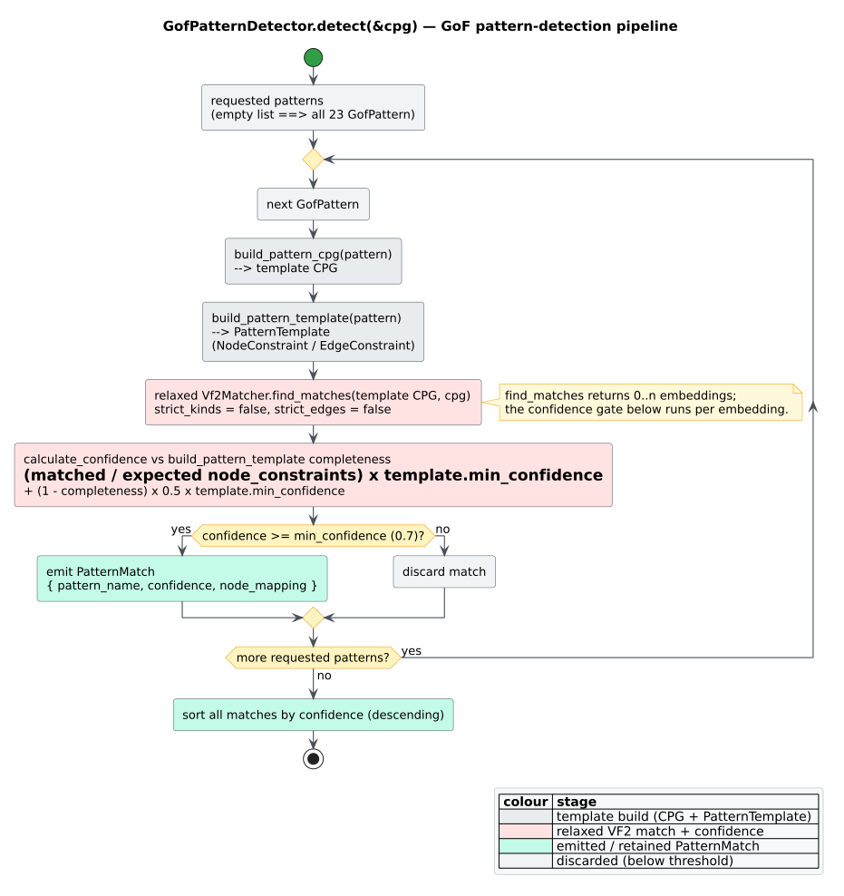
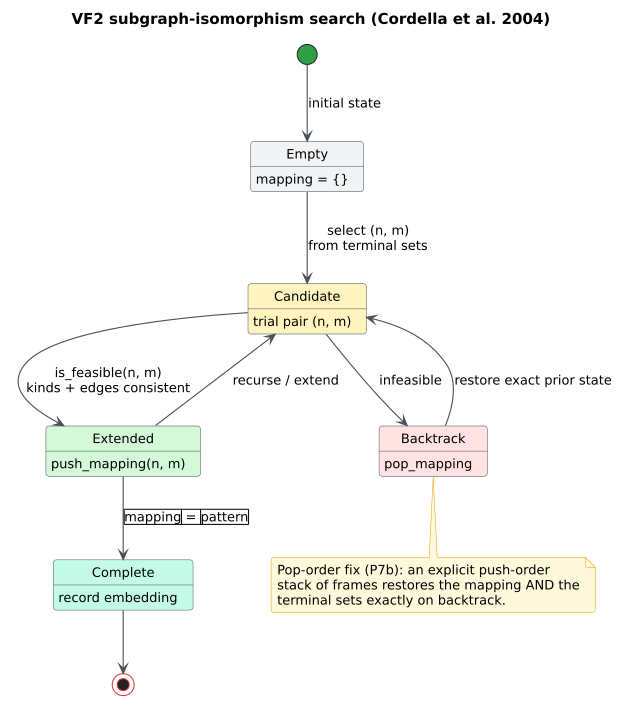

# 0004 — Relaxed VF2 detection with confidence scoring

## Status

**Accepted.** The [VF2](../GLOSSARY.md#vf2) core lives in `src/pattern/vf2.rs`
(`Vf2Matcher`, always compiled — the `pattern` module). The
[Gang-of-Four](../GLOSSARY.md#gang-of-four-gof) detector that drives it in relaxed
mode lives in `src/patterns/design/gang_of_four.rs` (`GofPatternDetector`, behind
the `design-patterns` feature — the `patterns` module). The two modules are
distinct: `pattern` is the always-on matcher/similarity toolkit; `patterns` is
the feature-gated GoF catalogue built on top of it.

## Context

A [design pattern](../GLOSSARY.md#design-pattern) is a *shape*, not a string: a
Gang-of-Four pattern is a small template of roles and relationships — for Observer,
a subject that holds a collection of observers implementing a common interface
and notifies them. `libcpg` encodes each template as a tiny CPG plus a
[`PatternTemplate`](../components/patterns/vf2-matching.md) over
[node kinds](../GLOSSARY.md#node-kind--edge-kind) like `Trait` (an interface),
`Class`, `Field`, and `Function`, joined by `AstChild` / `Inherits` /
`Implements` / `TypeOf` edges (`src/patterns/design/templates.rs`). Detecting a
pattern is then [subgraph isomorphism](../GLOSSARY.md#isomorphism--subgraph-isomorphism):
find an occurrence of the template inside the program's CPG.

Real code, though, never matches a textbook template exactly. An observer in the
wild has extra methods, differently named fields, a partially implemented
interface, an abstract base instead of a pure interface. Two forces pull against
each other:

- **Strict [isomorphism](../GLOSSARY.md#isomorphism--subgraph-isomorphism)** —
  requiring the exact node kinds and exact edge kinds of the template — is
  precise but brittle: it rejects nearly every real occurrence, driving recall
  toward zero. A pattern detector that finds nothing is useless.
- **A pure machine-learning classifier** could tolerate variation, but it needs
  labelled training data and a model dependency, and it returns a *label*
  without an explainable **node-to-node mapping** — you learn "this looks like
  Observer" but not *which* class is the subject.

We want the middle: find plausible occurrences with an **explainable mapping**
(which program node plays which template role) and a **tunable score** so callers
can trade recall for precision.

## Decision

**Detect patterns with a *relaxed* VF2 matcher that matches at the level of
node/edge *categories*, then score each match by template *completeness* and keep
those at or above a confidence threshold.**

### 1. Relaxed VF2 (category-level feasibility)

`Vf2Matcher` carries two toggles and a cap:

```rust
// feature-free: the VF2 core is always compiled (the `pattern` module).
pub struct Vf2Matcher {
    strict_kinds: bool,   // exact node-kind tag vs. category
    strict_edges: bool,   // exact edge kind vs. overlay class
    max_matches: usize,   // 0 = unlimited
}
```

With `strict_kinds = false`, two nodes are *compatible* when they fall in the
same **category** — both declarations, both expressions, or both statements — or
share an exact [`NodeKindTag`](../GLOSSARY.md#node-kind--edge-kind); with
`strict_kinds = true` only the exact tag matches. Symmetrically, with
`strict_edges = false` two edges are compatible when they belong to the same
**overlay class** (`is_ast` with `is_ast`, `is_cfg` with `is_cfg`, `is_dfg` with
`is_dfg`, `is_call` with `is_call`); with `strict_edges = true` the kinds must be
identical. This is the pruning ("feasibility") predicate of Cordella et al.'s
VF2 [1], loosened from equality to category membership so structural variation
does not veto a candidate.

Correctness of the search is unchanged by relaxation: VF2 grows a partial mapping
depth-first and backtracks with an explicit push-order stack that restores the
mapping and [terminal sets](../GLOSSARY.md#terminal-set-vf2) exactly on pop, so it
finds **all** embeddings. The regression `test_multi_embedding_backtracking`
(`src/pattern/vf2.rs`) pins this: matching a path pattern `p0 → p1 → p2` against a
diamond `A → {B, C} → D` — where every node shares a kind, so structure alone
decides — yields **exactly two** embeddings (`A-B-D` and `A-C-D`).

```rust
// feature-free: relaxed VF2 over two CodePropertyGraphs — `pattern_cpg` (the
// template) and `target_cpg` (the program), both built earlier.
use libcpg::pattern::{Vf2Matcher, SubgraphMatcher};

let matcher = Vf2Matcher::new()
    .with_strict_kinds(false)   // category-level node match (recall)
    .with_strict_edges(false)   // overlay-class edge match
    .with_max_matches(0);       // 0 = find them all
let matches = matcher.find_matches(&pattern_cpg, &target_cpg); // Vec<PatternMatch>
```

### 2. Completeness-scaled confidence

`GofPatternDetector::detect` runs the matcher in relaxed mode explicitly —
`Vf2Matcher::new().with_strict_kinds(false).with_strict_edges(false)`, commented
in source as *"Allow relaxed matching for better recall"* — then assigns each
match a [confidence](../GLOSSARY.md#confidence-pattern-match) from how completely
it fills the template:

```math
\mathrm{conf}(m) \;=\; c\,b \;+\; (1 - c)\cdot \tfrac{1}{2}\,b \;=\; b\left(\tfrac{1}{2} + \tfrac{1}{2}\,c\right)
```

where `` $`c = |\mathrm{matched}|\,/\,|\mathrm{template}|`$ `` is the fraction of
template node-constraints the match covers (`match_size()` over
`template.node_constraints.len()`), and `` $`b`$ `` is the template's own
`min_confidence` weight. So a *full* match (`` $`c = 1`$ ``) scores `` $`b`$ ``,
and a half-covered match (`` $`c = 0.5`$ ``) scores `` $`0.75\,b`$ ``. The
detector then keeps matches whose score meets its acceptance threshold and sorts
the survivors best-first:

```rust
// requires: features = ["design-patterns"]
// `cpg` is the program's CodePropertyGraph (built via build / build_from_tree).
use libcpg::patterns::{GofPatternDetector, GofPattern, PatternDetector};

let detector = GofPatternDetector::new()      // detector min_confidence defaults to 0.7
    .with_patterns(vec![GofPattern::Observer, GofPattern::Strategy]) // FactoryMethod, never Factory
    .with_min_confidence(0.7);
let matches = detector.detect(&cpg);          // Vec<PatternMatch>, sorted by confidence DESC
for m in &matches {
    // m.pattern_name; m.confidence in [0,1]; m.node_mapping maps template node → program node.
    let _ = (&m.pattern_name, m.confidence, &m.node_mapping);
}
```

Two `min_confidence` values play distinct roles — a point worth stating plainly
because they are easy to conflate:

| Value | Where | Role |
| :--- | :--- | :--- |
| **Template `min_confidence`** (`` $`b`$ ``) | per template in `templates.rs` (e.g. Observer `0.8`, most others `0.7`, Facade `0.6`) | the *weight* `` $`b`$ `` that scales a match's score |
| **Detector `min_confidence`** | `GofPatternDetector` (default `0.7`, set by `new()`) | the *acceptance gate*: keep `` $`\mathrm{conf}(m) \ge`$ `` this |

## Consequences

### Positive

- **High recall on real code.** Category-level matching accepts the structural
  variation that strict isomorphism would veto, so genuine-but-imperfect pattern
  instances are found.
- **Explainable results.** Every [`PatternMatch`](../GLOSSARY.md#confidence-pattern-match)
  carries `node_mapping` (template role → program node), so a report can say
  *which* class is the subject and *which* is the observer — impossible from a
  bare classifier label.
- **Tunable precision.** Raising the detector's `min_confidence` trims weak,
  partial matches; the per-template weight lets a fragile pattern (Observer at
  `0.8`) demand more coverage than a lax one (Facade at `0.6`).
- **Best-first output.** Sorting by confidence descending puts the most complete
  matches on top for triage.
- **One matcher, reused.** The always-on `pattern::Vf2Matcher` also serves
  [`PatternTemplate`](../components/patterns/vf2-matching.md) matching and, alongside
  [`GraphSimilarity`](../GLOSSARY.md#similarity-metric), the similarity metrics —
  the GoF layer is a thin feature-gated cap on shared machinery.

### Negative

- **Over-generation, hence false positives.** Relaxing feasibility to categories
  means the matcher proposes candidates that are structurally pattern-shaped but
  semantically unrelated; confidence and the threshold filter *some*, not all.
  Results are **advisory**, not verdicts.
- **Confidence is a completeness heuristic, not a probability.** `` $`\mathrm{conf}(m)`$ ``
  measures how much of the template was covered, weighted by a hand-set
  `` $`b`$ ``; it is not calibrated against a labelled corpus and must not be
  read as `P(pattern)`.
- **Category conflation.** Treating all "declarations" (or all "expressions") as
  interchangeable can match a `Struct` where the template meant a `Class`; a
  caller who needs that distinction should set `strict_kinds = true`.
- **Worst-case cost.** VF2 is `` $`O(N!\,N)`$ `` in the worst case (subgraph
  isomorphism is [NP-complete](../GLOSSARY.md#isomorphism--subgraph-isomorphism));
  pruning makes it practical, and `with_max_matches` bounds the search when a
  program contains many embeddings.

## Alternatives considered

1. **Strict subgraph isomorphism** (`strict_kinds = true`, `strict_edges = true`).
   *Rejected as the default for GoF.* Precise but brittle — it rejects the
   overwhelming majority of real, slightly-off pattern instances, yielding
   near-zero recall. The strict toggles remain available for callers who want
   exact template matching.

2. **A pure ML classifier as the only path.** *Rejected as the sole approach.*
   It needs labelled training data and a model dependency and returns a label
   with no node mapping. `libcpg` still *offers* classification as a
   complementary mode — `patterns::classification::PatternClassifier` with
   `ClassificationMode::{RuleBased, MachineLearning, Hybrid}` (ML behind
   `ml-linfa`) over a 12-field [feature vector](../GLOSSARY.md#feature-vector-classification) —
   but structural VF2 is the explainable default.

3. **A global [similarity metric](../GLOSSARY.md#similarity-metric)** (Jaccard or
   [Weisfeiler-Lehman](../GLOSSARY.md#weisfeiler-lehman-kernel--label-refinement)
   over whole graphs). *Rejected as the primary GoF mechanism.* Similarity scores
   *whole-graph* likeness; it neither localises an occurrence nor produces a
   role mapping. It is the right tool for "are these two graphs alike?"
   (`GraphSimilarity`), not "where is the Observer here?".

4. **A separate matcher per pattern.** *Rejected.* Twenty-three bespoke matchers
   duplicate the search logic and diverge over time. One relaxed VF2 driven by
   twenty-three declarative templates keeps the algorithm in one tested place.



*Figure — for each GoF pattern: build the template CPG, run relaxed VF2 against the target, score each match by completeness, keep those at or above `min_confidence`, and sort descending. Source: [`diagrams/pattern-detection-pipeline.puml`](../diagrams/pattern-detection-pipeline.puml).*



*Figure — the VF2 search: extend the partial mapping with a feasible candidate pair (category-level under relaxation), recurse, and restore mapping and terminal sets exactly on backtrack. Source: [`diagrams/vf2-state-machine.puml`](../diagrams/vf2-state-machine.puml).*

## Related decisions and further reading

- The algorithm in depth — state-space search, feasibility rules, the pop-order
  correctness fix: [`../theory/05-subgraph-isomorphism-vf2.md`](../theory/05-subgraph-isomorphism-vf2.md).
- GoF theory, confidence, and metrics:
  [`../theory/07-design-pattern-detection.md`](../theory/07-design-pattern-detection.md).
- The matcher and detector APIs:
  [`../components/patterns/vf2-matching.md`](../components/patterns/vf2-matching.md)
  and [`../components/patterns/gang-of-four.md`](../components/patterns/gang-of-four.md).
- The graph these templates match against: [ADR-0001](0001-unified-overlay-graph.md).

## References

1. Cordella, L. P., Foggia, P., Sansone, C., Vento, M. (2004). *A (Sub)graph Isomorphism Algorithm for Matching Large Graphs.* IEEE TPAMI 26(10). DOI: [10.1109/TPAMI.2004.75](https://doi.org/10.1109/TPAMI.2004.75)
