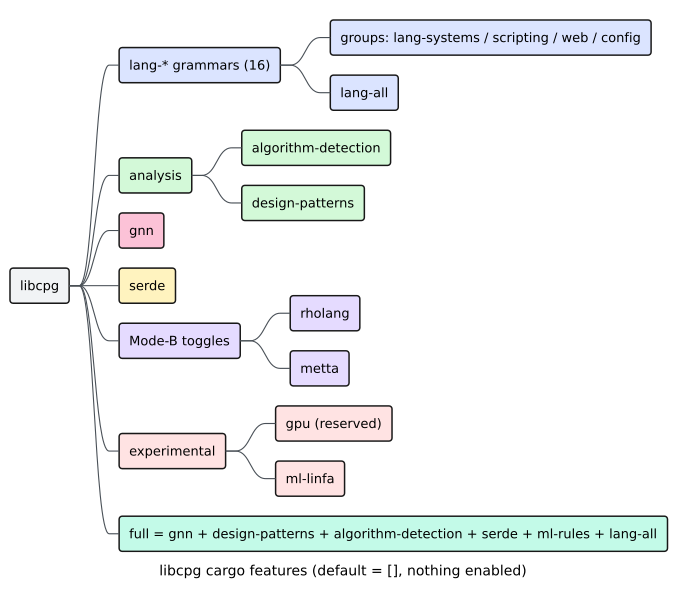

# 0005 — Feature-flag taxonomy (`default = []`)

## Status

**Accepted.** Specified by the `[features]` block of `Cargo.toml` and consumed
throughout the crate via `#[cfg(feature = "…")]`. Tightly coupled to
[ADR-0002](0002-mode-b-build-from-tree.md) (the empty `rholang` / `metta` toggles
and the grammar-pin discipline).

## Context

`libcpg` spans a lot of ground: sixteen tree-sitter grammars, four analysis
families (design-pattern detection, algorithm/complexity detection, the
[GNN](../GLOSSARY.md#graph-neural-network-gnn), serialization), two
classification back-ends, a reserved GPU path, and the two F1R3FLY Mode-B
languages. Almost every one of those pulls its own dependencies —
`tree-sitter-<lang>` C grammars, `ndarray` + `rand` for the GNN, `serde_yaml` +
`toml_edit` for [DPML](../GLOSSARY.md#dpml-design-pattern-markup-language),
`linfa` + `linfa-trees` for ML classification, `wgpu` + `pollster` for GPU — and
each dependency is compile time a consumer pays and attack surface it inherits.

Three pressures shape the choice of what to enable by default:

1. **Compile time and dependency surface.** A "batteries-included" default would
   make every downstream build compile sixteen grammars and several heavy
   numeric/ML crates whether or not the consumer touches them.
2. **Link-time symbol uniqueness.** As [ADR-0002](0002-mode-b-build-from-tree.md)
   records, each `tree-sitter-<lang>` crate exports a C symbol
   `tree_sitter_<lang>`. `libcpg`'s primary consumer, pgmcp, already links its
   own grammars; if `libcpg` linked the same grammars *by default*, a pgmcp build
   would carry two copies and risk a duplicate-symbol link failure.
3. **Pay for what you use.** A library should let an embedder take the graph core
   and one grammar without dragging in a GNN, an ML runtime, and a GPU backend.

## Decision

**Default to *nothing* — `default = []` — and make every grammar and every
analysis an explicit opt-in, organised into a small taxonomy of features.**

### The layers

```toml
# From Cargo.toml
[features]
default = []                                   # nothing on by default

# ── Capability features (each gates a module + its deps) ──────────────
gnn                 = ["ndarray", "rand"]      # Graph Neural Network
gpu                 = ["wgpu", "pollster"]     # RESERVED — no code wired yet
design-patterns     = ["serde_yaml", "toml_edit"]  # GoF + DPML
algorithm-detection = []                       # complexity/algorithm heuristics
serde               = ["dep:serde", "petgraph/serde-1"]
ml-linfa            = ["linfa", "linfa-trees"] # ML classification (heavy)
ml-rules            = []                        # rule-based classification (no ML deps)

# ── Mode-B language toggles (empty; see ADR-0002) ────────────────────
rholang = []
metta   = []

# ── 16 per-grammar features ──────────────────────────────────────────
lang-rust = ["dep:tree-sitter-rust"]           # …python, javascript, typescript,
# go, java, c, cpp, json, html, css, bash, toml, yaml, markdown, ruby

# ── Language groups (unions of lang-*) ───────────────────────────────
lang-systems   = ["lang-rust", "lang-c", "lang-cpp", "lang-go"]
lang-scripting = ["lang-python", "lang-javascript", "lang-typescript", "lang-ruby"]
lang-web       = ["lang-html", "lang-css", "lang-javascript", "lang-typescript"]
lang-config    = ["lang-json", "lang-yaml", "lang-toml"]
lang-all       = ["lang-systems", "lang-scripting", "lang-web",
                  "lang-bash", "lang-markdown", "lang-java"]

# ── Umbrella ─────────────────────────────────────────────────────────
full = ["gnn", "design-patterns", "algorithm-detection", "serde",
        "ml-rules", "lang-all"]
```

The taxonomy has four tiers: **capability** features (one per analysis module,
each also gating its dependencies), the two dependency-free **Mode-B** toggles,
**sixteen per-grammar** `lang-*` features, and **group** features that are simply
unions of `lang-*` for common bundles. `full` is a convenience umbrella over the
usual analysis set plus every language.

### What `full` deliberately excludes

`full` is *not* "everything." It pulls `gnn`, `design-patterns`,
`algorithm-detection`, `serde`, `ml-rules`, and `lang-all` — and pointedly leaves
out four features:

| Excluded from `full` | Why |
| :--- | :--- |
| `gpu` | Reserved — no code is wired to it yet; enabling it would add `wgpu`/`pollster` for nothing. |
| `ml-linfa` | Heavy ML dependency stack; `ml-rules` covers rule-based classification with no ML deps, so it is the umbrella's choice. |
| `rholang`, `metta` | Mode-B toggles ([ADR-0002](0002-mode-b-build-from-tree.md)); they select mappers for caller-supplied trees and are orthogonal to a "build everything" bundle. |

Selecting features from a consumer is a one-liner:

```toml
[dependencies]
# Pay for what you use: two grammars, GoF detection, and serialization.
libcpg = { version = "0.1", default-features = false, features = [
    "lang-rust", "lang-python", "design-patterns", "serde",
] }
```

(`default-features = false` is redundant while `default = []`, but stating it
documents the intent and is future-proof.)

## Consequences

### Positive

- **Minimal downstream cost.** A consumer compiles exactly the grammars and
  analyses it names; the graph core, the always-on `pattern` matcher, and the
  PDG/slicing layer are feature-free and always available.
- **The duplicate-symbol hazard is avoided by construction.** No grammar is
  linked by default, so a consumer that also links grammars (pgmcp) does not
  inherit a second copy from `libcpg` (reinforced by the pgmcp-matched pins in
  [ADR-0002](0002-mode-b-build-from-tree.md)).
- **Ergonomic bundles.** `lang-web`, `lang-systems`, and `full` spare users from
  enumerating grammars while keeping fine-grained control available.
- **Heavy and reserved paths stay opt-in.** `ml-linfa` (ML stack) and `gpu`
  (reserved) never burden a build unless explicitly requested — and `full`
  refuses to drag them in.

### Negative

- **`build` fails out of the box.** With `default = []` and no `lang-*` feature,
  `CpgBuilder::build(source, language)` returns `Error::UnsupportedLanguage` for
  *every* language — only [`build_from_tree`](../GLOSSARY.md#mode-b--build_from_tree)
  and hand-built CPGs work. New users must enable a grammar before Mode A does
  anything:

  ```rust
  // requires: features = ["lang-rust"]  — WITHOUT a lang-* feature this is an Err.
  use libcpg::{CpgBuilder, TreeSitterCpgBuilder, Language};
  let cpg = TreeSitterCpgBuilder::new().build("fn main() {}", Language::Rust)?;
  ```

- **`supported_languages()` overstates availability.** The `CpgBuilder` trait's
  `supported_languages()` returns a *static* list of the sixteen potentially
  supported languages regardless of enabled features; the *real* availability is
  `ParserRegistry::supports(lang)` (a lookup in the feature-gated registry).
  Callers must consult the registry, not the static list, to know what will
  actually parse.
- **Feature combinatorics.** A large flag space means more configurations to test
  (`cargo test --all-features` plus feature-subset runs) and more ways for a
  consumer to under-select and get a confusing `UnsupportedLanguage`.
- **Group drift.** The `lang-*` groups are hand-maintained unions; adding a new
  grammar means remembering to slot it into the right group(s) and, where
  relevant, into `lang-all`.

## Alternatives considered

1. **Batteries-included `default`** (grammars + analyses on). *Rejected.* It
   forces every downstream build to compile sixteen grammars and heavy numeric
   crates, and — fatally — links grammars by default, reintroducing the
   duplicate-`tree_sitter_<lang>` collision for consumers like pgmcp.

2. **`default = ["lang-all"]`** (grammars on, analyses off). *Rejected* for the
   same link-time reason: the problem is *linking grammars by default*, not which
   analyses are on. Any nonempty default grammar set collides with a
   grammar-linking consumer.

3. **Flat features with no groups** (only the sixteen `lang-*` and the capability
   flags). *Rejected* as poor ergonomics: common cases ("all web languages", "the
   works") would force long, error-prone feature lists. The groups are pure
   unions, so they add convenience without new semantics.

4. **A single `languages` feature** that enables all grammars together.
   *Rejected.* It throws away the fine granularity that lets a consumer take one
   grammar; `lang-all` already provides the "all of them" bundle for those who
   want it.



*Figure — the feature taxonomy: `default = []` at the root, sixteen `lang-*` grammars bundled into groups, the capability features with their dependencies, the empty Mode-B toggles, and the `full` umbrella (excluding `gpu`, `ml-linfa`, `rholang`, `metta`). Source: [`diagrams/feature-flag-map.puml`](../diagrams/feature-flag-map.puml).*

## Related decisions and further reading

- The Mode-B toggles and grammar-pin discipline this record depends on:
  [ADR-0002](0002-mode-b-build-from-tree.md).
- The full feature matrix, groups, and how to enable languages:
  [`../engineering/01-build-and-features.md`](../engineering/01-build-and-features.md).
- The definition of a Cargo feature flag in context:
  [feature flag](../GLOSSARY.md#feature-flag-cargo).

## References

This decision rests on project engineering constraints — compile time,
dependency surface, and link-time symbol uniqueness — rather than external
literature, and cites none. The authoritative specification is the `[features]`
block of `Cargo.toml`; its consumer-facing documentation lives in
[`../engineering/01-build-and-features.md`](../engineering/01-build-and-features.md).
