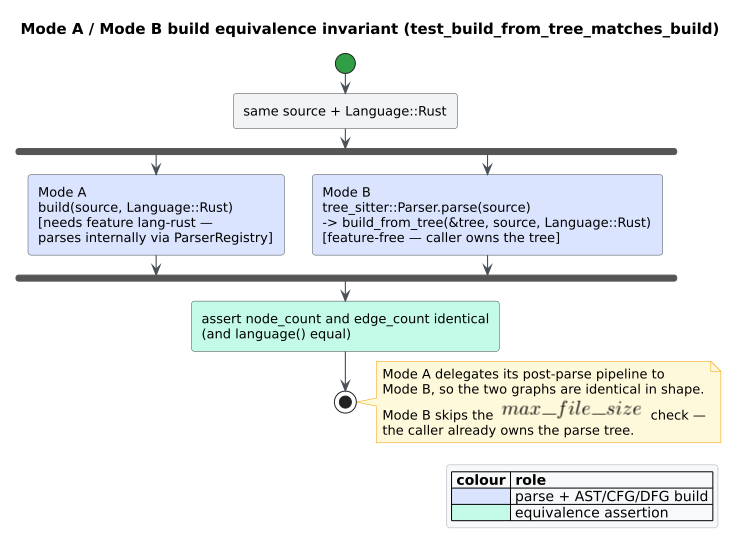

# Testing

`libcpg` is tested by **two complementary methods**, both run by `cargo test`:

- **Example-based tests** state *this input produces that output*. They are
  precise, readable, and are the right tool for a fixed contract — a mapping
  table, a specific control-flow edge, a named algorithm.
- **Property-based tests** (via [`proptest`](https://docs.rs/proptest)) state
  *this law holds for every input*, then let the framework search for a
  counterexample and **shrink** it to a minimal witness. They are the right tool
  for algebraic laws — round-trips, idempotency, ordering axioms, range bounds —
  where the space of inputs is far too large to enumerate.

The method is Claessen & Hughes' QuickCheck, adapted to Rust
(*"QuickCheck: a lightweight tool for random testing of Haskell programs"*,
ICFP 2000, DOI [10.1145/351240.351266](https://doi.org/10.1145/351240.351266)).
Its central insight is that a *specification* is more valuable than a list of
examples, because the specification is checked against inputs no author would
think to write down.

## The census

| Kind | Count | Where |
| --- | ---: | --- |
| Example-based `#[test]` functions | 399 | inline `#[cfg(test)] mod …` next to the code |
| Property-based properties (in 27 `proptest!` blocks) | 63 | inline `mod proptests` / `mod …_regression` |
| Public-API integration tests | 8 | `tests/integration.rs` |
| Malformed-input robustness tests | 5 | `tests/robustness.rs` |
| **Total** | **475** | |

That is up from **99** inline tests and **zero** property tests before this work.

Each property runs many generated cases (`ProptestConfig::with_cases(N)`, with
`N` tuned to the cost of the property: 256 for cheap structural laws, 128 for
mid-weight ones, 64 for parser-backed ones, 32 for the heaviest), so the 63
properties execute on the order of ten thousand distinct inputs per run.

### Not every test compiles under every build

Because whole modules are feature-gated, the number of tests that *run* depends
on the features enabled:

| Command | Lib tests | Notes |
| --- | ---: | --- |
| `cargo test` | 184 | `default = []`: the feature-free surface only |
| `cargo test --features "full rholang metta"` | 462 | the maximal matrix, including the Mode-B mappers |

The feature-free 184 exercise the graph model, exact CFG/call-graph SCC
decomposition, the CFG/DFG/PDG extractors, VF2, and similarity by building CPGs
**by hand** — no grammar required. This is what
the [`arb_well_formed_cpg`](#the-generators) generator exists for.

## Running the tests

```sh
# Feature-free surface (default = []).
cargo test

# The maximal run: every test, including the Mode-B rholang/metta mappers.
cargo test --features "full rholang metta"

# One language plus one analysis.
cargo test --features "lang-rust,design-patterns"

# Scope to one module.
cargo test --features lang-rust builder::tree_sitter

# Just the property tests.
cargo test proptests

# Coverage (aliases defined in `.cargo/config.toml`).
cargo cov-text     # terminal summary
cargo cov          # HTML report
```

`.config/nextest.toml` sets a `slow-timeout` so a runaway property is killed
rather than hanging CI.

## The generators

Property tests are only as good as their generators. `libcpg`'s live in
`src/testutil.rs` (`#[cfg(test)] pub(crate)`), named `arb_*` by convention.
There are **two structural generators**, and the distinction between them is the
single most important thing to understand about this suite:

> `CodePropertyGraph::connect` wires only the petgraph edge. It does **not** set
> `node.parent` / `node.children` — the caller does. Every AST-ancestor analysis
> (DFG, PDG, metrics, algorithm detection) reads those pointers.

| Generator | Shape | Use for |
| --- | --- | --- |
| `arb_cpg_raw` | 1–8 nodes, random kinds, random edges (cycles possible) | analyses that read only node kinds and adjacency: serde, VF2, similarity, ids |
| `arb_well_formed_cpg` | `Function → Block → statements…`, with edges **and** parent pointers **and** child lists set, exactly as a real builder does | CFG/DFG/PDG/metrics/algorithm-detection properties, with no grammar needed |
| `arb_pdg_graph` | nodes joined by random control/data-dependence edges | program-slicing properties |
| `arb_rust_source` | a small, syntactically valid Rust function with bounded nesting | parser-backed properties (`build ≡ build_from_tree`, cyclomatic identity on real CFGs) |

Leaf generators (`arb_name`, `arb_source_range`, `arb_literal_kind`,
`arb_node_kind`, `arb_edge_kind`, …) compose into those four.

When a property fails, `proptest` writes the shrunk seed to a
`proptest-regressions/*.txt` file. **Those files are committed** — they replay
the known-bad input on every subsequent run, so a fixed bug cannot silently
return.

## What the properties assert

The invariants fall into seven families.

| Family | Representative laws |
| --- | --- |
| **Round-trip / identity** | $`\mathit{deserialize} \circ \mathit{serialize} = \mathrm{id}`$ over the whole serializable surface; `NodeId`/`EdgeId`/`SourceRange` conversions; `Language` extension round-trip; $`\mathit{from\_kind} \circ \mathit{to\_cpg\_node\_kind} = \mathrm{id}`$ |
| **Structural** | `add_node` yields sequential ids; `connect` is defined iff both endpoints exist; `ast_children` preserves insertion order; $`M = E - N + 2`$ (`cyclomatic_complexity`); `ast_depth` is bounded by the node count |
| **SCC decomposition** | Every projected node occurs in exactly one component; the partition matches `petgraph::algo::tarjan_scc`; singleton cycles require a self-loop; the condensation graph is acyclic; a 50,000-node path does not overflow the native stack |
| **Idempotency** | a second `CfgExtractor::extract` / `DfgExtractor::extract` / `PdgBuilder::build` adds no edges |
| **Slicing** | $`\lvert S\rvert \le \mathit{max\_nodes}`$; the criterion is in its own backward slice; $`\mathit{max\_nodes} = 0 \Rightarrow S = \varnothing`$; $`S`$ is monotone in $`\mathit{max\_nodes}`$; every sliced id is a real node |
| **Matching & similarity** | VF2 embeddings are injective, kind-consistent, and edge-preserving; relaxed matching $`\supseteq`$ strict; all four metrics land in $`[0,1]`$, are symmetric, and are maximal on self-comparison |
| **Ordering & confidence** | `ComplexityClass::is_better_than` is a strict order (irreflexive, asymmetric, transitive); complexity is monotone in loop nesting; every detector's results are sorted by descending confidence and clear its `min_confidence` |

### Two invariants worth singling out

**Build equivalence.** The crate offers two construction paths — the
internal-parse `build` ("Mode A") and the caller-supplied-tree `build_from_tree`
("Mode B") — and `build` is implemented by *delegating* its post-parse pipeline
to `build_from_tree`. The two must therefore produce identical graphs.



*Figure — `build(source, Rust)` and `build_from_tree(&tree, source, Rust)` must
yield the same node and edge counts and the same language. Source:
[`diagrams/build-equivalence.puml`](../diagrams/build-equivalence.puml).*

`test_build_from_tree_matches_build` pins it on one input; a property test pins
it on every source `arb_rust_source` can generate. The same invariant is
analysed in
[`scientific/01-cpg-invariants-and-equivalence.md`](../scientific/01-cpg-invariants-and-equivalence.md).

**Robustness on malformed input.** `CodePropertyGraph` is an open data
structure: `add_node`, `connect`, and `node_mut` are all public, and `connect`
deliberately leaves `parent`/`children` to the caller. A consumer building a
graph by hand can therefore produce input no builder would — a parent pointer to
a node that does not exist, a cyclic `AstChild` chain, a call to a callee that
was never added. The contract for such input is **robustness, not correctness**:
an analysis may return a meaningless answer, but it must not panic, loop
forever, or overflow the stack.

`tests/robustness.rs` injects ten distinct corruptions into a plausible function
graph and drives *every* public analysis over each one, asserting termination
plus the invariants that must survive (slices stay within budget and contain
only real nodes; confidences stay finite and in $`[0,1]`$; extraction stays
idempotent; the graph still serializes). See
[`security/01-input-and-resource-hardening.md`](../security/01-input-and-resource-hardening.md).

## The mapping tables are executable specifications

The per-language `NodeMapper::map_*` tables are the widest single surface in the
crate, and every arm is a *claim about an external artifact*: "tree-sitter emits
`switch_statement` here". Such a claim rots silently when the grammar is
upgraded — the arm stops matching, the mapper falls through to `Unknown`, and
the CPG quietly loses a construct with no error anywhere.

`src/builder/node_mapper.rs` therefore states each language's table as test data
and checks every row against a snippet that exercises it:

```rust
// requires: features = ["lang-go"]  (shape of the shipped test)
let p = &mapped_kinds(SRC, Language::Go);
maps!(p,
    "source_file"                => CpgNodeKind::Root,
    "expression_switch_statement" => CpgNodeKind::Match,
    "type_switch_statement"       => CpgNodeKind::Match,
    "func_literal"                => CpgNodeKind::Lambda { .. },
    // …
);
```

`assert_maps` (behind the `maps!` macro) fails in **both** directions, which is
what makes it a drift detector rather than a spot check:

1. if the snippet contains no node of that tree-sitter kind, the arm is
   unreachable — the grammar or the snippet has drifted;
2. if it does but maps to something else, the mapping itself is wrong.

Writing these tables found six arms that could never fire against the pinned
grammars (see [below](#defects-found-by-this-suite)).

## Defects found by this suite

Property and robustness tests are worth their cost only if they find real bugs.
This suite found **twelve**, each fixed at the source and frozen as a regression
test beside the fix:

| # | Defect | Consequence | Found by |
| --- | --- | --- | --- |
| 1 | `ast_depth` / `ast_descendants` / `ast_ancestors` recursed with no visited set | infinite loop or stack overflow on a cyclic `AstChild` graph | property |
| 2 | `CfgExtractor::process_node` recursed with no path guard | **stack overflow → process abort** on a cyclic AST | robustness |
| 3 | `visit_reaching` (DFG reaching-defs) recursed with no path guard | same | robustness |
| 4 | `ast_ancestors` returned ids absent from the graph | callers resolving an "ancestor" got `None` | robustness |
| 5 | `CfgExtractor` / DFG auxiliary edge builders were not idempotent | re-extraction silently duplicated edges | property |
| 6 | `ComplexityClass::ordinal` collided (`Cubic == Polynomial(0) == 5`) | `is_better_than` was not a consistent order | property |
| 7 | `Cosine` / `WeisfeilerLehman` similarity could return `1.0000000000000002` | documented $`[0,1]`$ range violated | robustness |
| 8 | VF2 did not verify pattern self-loops | unsound matches | property |
| 9 | VF2 relaxed matching was *stricter* than strict matching for several edge kinds | relaxed ⊉ strict | property |
| 10 | 7 GoF templates had fewer node constraints than their pattern CPG | `completeness` never reached $`1.0`$ | property |
| 11 | `--features design-patterns` did not compile (missing `dep:serde`) | the feature was unusable alone | feature-matrix build |
| 12 | 6 `NodeMapper` arms could never fire against the pinned grammars | constructs silently degraded to `Unknown` | mapping tables |
| 13 | every Rust method call was reported as `is_method: false` | tree-sitter-rust has no `method_call_expression`; `recv.m()` is a `call_expression` over a `field_expression`, so the flag has to be read off the callee | mapping tables |
| 14 | `async fn` was never detected as async (Rust, and latently Python) | tree-sitter-rust groups `async` under a `function_modifiers` node, so the direct-child check never saw it | mapping tables |

Defects 2, 3 and 7 were found by generated input within seconds of the
robustness suite first running — none of them is reachable from any
example-based test that a person would think to write. Defects 12–14 were found
by turning the mapping tables into executable specifications: each is a claim
about a grammar that had quietly stopped being true.

The recursion guards (2, 3) use a **path** set rather than a global visited set,
so a node legitimately reachable from two disjoint branches is still processed
on each path; only a genuine cycle is cut. Tree inputs are unaffected
bit-for-bit, which the 418 example-based tests confirm.

## Coverage

Coverage is measured with
[`cargo-llvm-cov`](https://github.com/taiki-e/cargo-llvm-cov) over the **full**
feature matrix — measuring a `default = []` build would report on a fraction of
the crate and flatter the result.

```sh
cargo cov-text                      # line + region, stable toolchain
cargo +nightly llvm-cov --branch \
  --features "full rholang metta"   # branch coverage needs nightly
```

| Metric | Coverage | Lowest file |
| --- | ---: | --- |
| Lines | **97.40 %** | 93.88 % (`dpml.rs`) |
| Regions | **97.45 %** | — |
| Functions | **97.93 %** | — |
| Branches | **81.34 %** | see below |

Every source file is at or above 93.8 % line coverage; eleven are at 100 %.

**On branch coverage.** `-Z coverage-options=branch` is nightly-only, and it
counts *condition outcomes* (`if`, `&&`, `||`, `while`) — not `match` arms,
which LLVM records as regions. Because `libcpg` is dispatch-heavy (the node
mappers alone are thousands of `match` arms), region coverage is the more
informative measure for this crate.

The branch figure is also *structurally capped* well below 100 %. Classifying
every not-fully-covered branch site shows that roughly a third of them cannot be
covered by any test:

| Category | Share | Why it cannot be covered |
| --- | ---: | --- |
| `assert!(A && B)` inside `#[cfg(test)]` modules | ~33 % | the false outcome fires only when the assertion itself fails |
| `if let Some(n) = cpg.node(id)` where `id` came from the graph | ~12 % | the `None` arm is dead by construction |
| indexed access guarded by a preceding emptiness check | ~7 % | ditto |

The remainder are genuine, and this suite drives them: the heuristic
vocabularies (every queue/stack/visited/memo/factory/observer keyword), the
configuration flags on each extractor, and the arity checks all have explicit
tests. Where a defensive path *is* reachable — every one that a malformed graph
can reach — `tests/robustness.rs` reaches it.

`ml-linfa` and `gpu` are excluded from the matrix: they pull heavy optional
dependencies and are not part of the `full` feature set.

## What is deliberately absent

| Surface | State |
| --- | --- |
| `examples/` directory | present but **empty** — no runnable `cargo run --example …` programs. |
| Doctests | none run — every code fence in a doc comment is marked `ignore` / `rust,ignore`, so `cargo test --doc` executes nothing. Feature-gating individual doctests in a `default = []` crate is awkward; the snippets are instead validated by the documentation snippet-check harness. |
| Benchmarks | `benches/scc_analysis.rs` is an active Criterion target covering 1,000- and 10,000-function paths, rings, and cyclic clusters. Other performance surfaces remain unbenchmarked; see [performance](03-performance.md). |
| `ml-linfa`, `gpu` | not exercised: optional heavy dependencies outside the `full` feature set. |

## Related pages

- [Build and features](01-build-and-features.md) — the feature subsets used above.
- [Performance](03-performance.md) — current SCC measurements and the remaining benchmarking gaps.
- [`scientific/00-overview.md`](../scientific/00-overview.md) — how these tests
  are read as validation evidence.
- [`security/01-input-and-resource-hardening.md`](../security/01-input-and-resource-hardening.md)
  — the malformed-input contract the robustness suite pins.
