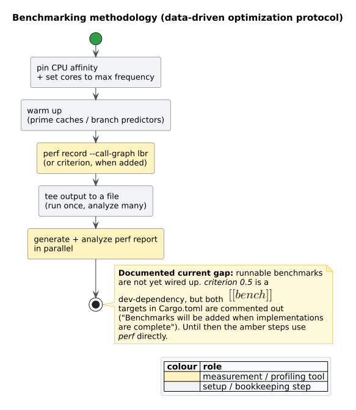

# Performance

This page explains the data-structure choices behind `libcpg`, the asymptotic
cost of its core operations, and — honestly — the current state of benchmarking,
which is a documented gap. It draws a firm line between dependencies that are
**actually wired into `src/`** and dependencies that are **declared in
`Cargo.toml` but not yet used**, so you can reason about real behaviour rather
than aspiration.

## Data structures that are wired in

These are the choices the code actually makes, and why:

| Concern | Choice | Why |
| --- | --- | --- |
| Graph storage | [`petgraph`](../GLOSSARY.md#petgraph) `DiGraph<CpgNode, CpgEdge>` | Mature, well-tested directed-graph store with stable `NodeIndex`/`EdgeIndex` handles and ready-made algorithms — notably `dominators::simple_fast`, reused for PDG construction. One store holds all four [overlays](../GLOSSARY.md#code-property-graph-cpg). |
| Id → index maps | `rustc_hash::FxHashMap` / `FxHashSet` | The CPG keeps `NodeId → NodeIndex` (and edge) maps for O(1)-expected lookup. `FxHash` is a fast, non-cryptographic hasher — a good fit because keys are library-assigned `u32` ids, not attacker-controlled strings. (Security implications: [`security/01`](../security/01-input-and-resource-hardening.md).) |
| Per-node child lists | `smallvec::SmallVec<[NodeId; 4]>` | `CpgNode::children` stores up to four child ids **inline**, with no heap allocation — the common case for AST fan-out — spilling to the heap only for wider nodes. |
| Shared source text | `std::sync::Arc<str>` | `CpgNode::text`, operator strings, and string/regex literal payloads are `Arc<str>`: immutable, shared, and cloned in O(1) by bumping a refcount instead of copying bytes. |
| Source positions | `text-size` `TextRange` | `SourceRange` stores six `u32` offsets compactly; `to_text_range()` converts to `text_size::TextRange` for callers that use that ecosystem. |
| Error handling | `thiserror` | Derives the [`Error`](../GLOSSARY.md#code-property-graph-cpg) enum without hand-written boilerplate. |

The upshot: a CPG is one contiguous petgraph arena of `CpgNode`/`CpgEdge` values,
with small inline child vectors and refcounted text, indexed by fast hash maps.

## Dependencies declared but not yet wired

Several dependencies appear in `Cargo.toml` but have **no call sites in `src/`**.
They are documented here so the performance story is not oversold:

| Dependency | Declared for | Actual state in `src/` |
| --- | --- | --- |
| `rayon` | parallel processing (the crate-level doc comment lists it under "Parallel Processing (planned)") | **Not wired.** There is no `par_iter` / `into_par_iter` / `par_bridge` anywhere in `src/`. Analysis is currently single-threaded. |
| `ahash` | an alternative fast hasher | **Unused.** The code hashes with `rustc_hash::FxHash`; `ahash` is never referenced. |
| `string_cache` | interned string labels | **Unused.** Node labels/text are stored as `Arc<str>`, not `string_cache` atoms. |
| `regex` | pattern matching | **Unused as a crate.** The only `"regex"` occurrences in `src/` are node-kind string literals mapped to a `Literal` kind, not calls into the `regex` crate. |

Wiring rayon into the naturally-parallel passes (per-function CFG/DFG extraction,
independent VF2 searches) is a clear future optimization; per the project's
data-driven-optimization discipline it should be **measured before and after**,
which today is blocked on the benchmarking gap below.

## Preallocation

Preallocation (sizing a collection up front when the element count is known) is a
project-wide best practice, but its current coverage in `libcpg` is **sparse** —
there is essentially one `with_capacity` site, in the PDG builder. Most collections
grow dynamically. Introducing preallocation at the hot construction sites — for
example, reserving `CpgNode`/`CpgEdge` capacity from the tree-sitter node count
before the AST walk — is a safe, mechanical optimization and a good contribution;
see [contributing](04-contributing.md).

## Asymptotic cost of key operations

The table gives *expected* costs. Symbols: $`n`$ = number of tree-sitter /
AST nodes, $`V`$ and $`E`$ = node and edge counts of the (sub)graph an
operation touches, $`L`$ = GNN layers (`num_layers`), $`d`$ = embedding
dimension, $`k`$ = Weisfeiler-Lehman iterations (3).

| Operation | Expected cost | Notes |
| --- | --- | --- |
| CPG construction (AST walk) | $`O(n)`$ | One depth-first pass over the parse tree, one `CpgNode` per kept tree-sitter node. |
| CFG extraction (per function) | $`O(n)`$ | A per-construct walk over the function's AST children. |
| DFG reaching-defs (per function) | $`O(I \cdot n)`$ | An [AST-ordered sweep](../GLOSSARY.md#ast-ordered-reaching-definitions); $`I`$ is bounded by `max_iterations` (default 100), with loop bodies swept twice. |
| PDG construction (per function) | near-linear in $`V + E`$ of the CFG | `petgraph::dominators::simple_fast` on the reversed CFG plus a Cytron reverse-dominance-frontier walk. |
| CFG/call-graph SCC decomposition | $`O(V + E)`$ after adjacency normalization | Iterative Tarjan plus condensation construction; dense indices avoid traversal hash lookups, and explicit stacks avoid native-stack growth with path depth. |
| [`backward_slice`](../GLOSSARY.md#backward-slice--forward-slice) / `forward_slice` | $`O(V + E)`$, capped at `max_nodes` | Breadth-first over PDG edges; returns as soon as the slice reaches `max_nodes`. |
| [VF2](../GLOSSARY.md#vf2) `find_matches` | worst case $`O(N!\,N)`$; pruned in practice | Feasibility rules and `max_matches` cut the state space dramatically; see [`theory/05-subgraph-isomorphism-vf2.md`](../theory/05-subgraph-isomorphism-vf2.md). |
| [Jaccard](../GLOSSARY.md#jaccard-similarity) similarity | $`O(V_1 + V_2)`$ | Over the two graphs' node-kind multisets. |
| Weisfeiler-Lehman similarity | $`O(k(V + E))`$ | $`k = 3`$ label-refinement rounds. |
| GNN `propagate` | $`O(L \cdot (V + E) \cdot d)`$ | Each layer means neighbour vectors over the AST/CFG/DFG overlays, then ReLU. |

Two of these deserve emphasis. VF2 is worst-case super-exponential, which is why
its `max_matches` cap and strict-matching toggles matter for untrusted input
([`security/01`](../security/01-input-and-resource-hardening.md)). The DFG sweep is
made to *terminate* by the `max_iterations` fixpoint cap rather than a proof of
monotone convergence, so it is bounded even on pathological control flow.

## Benchmark coverage and remaining gaps

The SCC analysis has an active Criterion target. It measures feature-free public
call-graph analysis over 1,000- and 10,000-function paths, rings, and cyclic
clusters:

```toml
[[bench]]
name = "scc_analysis"
harness = false
```

Run it directly, or save and compare named baselines:

```sh
cargo bench --bench scc_analysis --no-default-features
cargo bench --bench scc_analysis --no-default-features -- --save-baseline before
cargo bench --bench scc_analysis --no-default-features -- --baseline before
```

CPG construction, pattern matching, DFG/PDG analysis, and GNN propagation still
lack runnable benchmarks. Optimization work on those surfaces must begin by
adding a focused target and establishing a baseline.

### How to add a benchmark

1. **Add a `[[bench]]` target** in `Cargo.toml` and its matching file under
   `benches/`:

   ```toml
   # Cargo.toml
   [[bench]]
   name = "cpg_construction"
   harness = false
   ```

   ```rust
   // benches/cpg_construction.rs — requires: features = ["lang-rust"] when running
   use criterion::{criterion_group, criterion_main, Criterion};
   use libcpg::{CpgBuilder, TreeSitterCpgBuilder, Language};

   fn bench_build(c: &mut Criterion) {
       let builder = TreeSitterCpgBuilder::new();
       let source = "fn main() { let x = 1; let y = x; }";
       c.bench_function("build_rust_small", |b| {
           b.iter(|| builder.build(source, Language::Rust).expect("build"));
       });
   }

   criterion_group!(benches, bench_build);
   criterion_main!(benches);
   ```

   Run it with the grammar enabled: `cargo bench --features lang-rust`.

2. **Follow a rigorous measurement protocol.** The figure below captures it.



*Figure — pin CPU affinity and max frequency, warm up, record once with
`perf record --call-graph lbr` (or criterion), tee the output, and generate/analyze
the report in parallel. Source:
[`diagrams/measurement-methodology.puml`](../diagrams/measurement-methodology.puml).*

Concretely:

```sh
# Pin to an isolated core and record a call-graph profile in one pass.
taskset -c 2 perf record --call-graph lbr -- \
  cargo bench --features lang-rust 2>&1 | tee bench-run.log

# Analyze the recorded profile without re-running the workload.
perf report --stdio | tee perf-report.txt
```

Guidelines that apply specifically to `libcpg` measurements:

- **Isolate and fix the clock.** Pin the benchmark to a dedicated core
  (`taskset`/CPU affinity) and hold the cores at maximum frequency so results are
  reproducible.
- **Record once, analyze many.** `tee` the run to a file and derive every figure
  from that single capture instead of re-running the workload for each number;
  generate and read the `perf` report in parallel with other analysis.
- **Baseline before optimizing.** Establish a criterion baseline, change one thing,
  and compare — the discipline the rayon/preallocation opportunities above are
  waiting on.

The same methodology, framed as a scientific protocol, is in
[`scientific/04-measurement-methodology.md`](../scientific/04-measurement-methodology.md).

## Related pages

- [Build and features](01-build-and-features.md) — which dependencies each feature
  pulls in.
- [Testing](02-testing.md) — correctness tests and benchmark coverage.
- [`security/01`](../security/01-input-and-resource-hardening.md) — the bounds that
  keep worst-case costs finite on hostile input.
