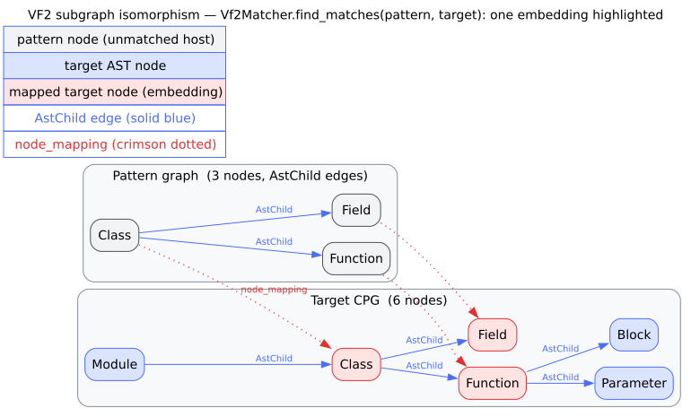
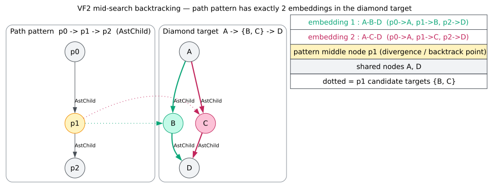

# VF2 completeness

Subgraph matching is only trustworthy if it is **complete**: given a pattern and a target, the matcher must return *every* embedding — no more (soundness) and no fewer (completeness). A matcher that stops at the first hit, or that corrupts its search state on backtracking and drops a later hit, silently under-reports [design patterns](../GLOSSARY.md#design-pattern), taint shapes, and every other structural query. This page validates that `libcpg`'s [VF2](../GLOSSARY.md#vf2) matcher finds all embeddings, grounding the claim in three inline tests of increasing discrimination and quoting each deciding assertion.

The algorithm is the state-space search of Cordella, Foggia, Sansone & Vento [[4]](#references): a depth-first growth of a partial node mapping, pruned by feasibility rules over node kinds and incident edges, backtracking when a partial mapping cannot be extended. Its worst-case cost is $`O(N!\,N)`$ in the number of nodes $`N`$, but feasibility pruning makes it practical on the sparse graphs typical of code. Completeness depends on one delicate detail — that backtracking restores the mapping *and* the [terminal sets](../GLOSSARY.md#terminal-set-vf2) **exactly** — which is precisely what the third experiment stresses.

## 0. The completeness precondition: exhaustive by default

`Vf2Matcher` can cap its output, but the cap is opt-in. The field documents `0` as unlimited:

```rust
/// Maximum number of matches to find (0 = unlimited).
max_matches: usize,
```

and the search loop only truncates when a positive cap is set:

```rust
// Check if we've reached the match limit
if self.max_matches > 0 && matches.len() >= self.max_matches {
    return;
}
```

Because `Vf2Matcher` derives `Default`, `Vf2Matcher::new()` starts with `max_matches == 0` — unlimited. So the *default* matcher used in the completeness test below is exhaustive: any missing embedding is a genuine defect, not a truncation. (The builder setter `with_max_matches` is exercised separately by `test_vf2_matcher_creation`, which asserts `matcher.max_matches == 10` after `with_max_matches(10)`.)



*Figure — a small directed pattern is grown, node by node, into a mapping onto the target; feasibility rules prune incompatible pairs. Source: [`diagrams/vf2-pattern-target.dot`](../diagrams/vf2-pattern-target.dot).*

## 1. Experiment E0 — the soundness floor (empty pattern → no match)

**Hypothesis.** A pattern with no nodes has no embedding; the matcher must return an empty result, not a spurious "trivial" match.

**Experiment.** `test_empty_pattern` (in `src/pattern/vf2.rs`):

```rust
let matcher = Vf2Matcher::new();
let pattern = CodePropertyGraph::new(Language::Rust);
let target = CodePropertyGraph::new(Language::Rust);

let matches = matcher.find_matches(&pattern, &target);
assert!(matches.is_empty());
```

**Result.** `find_matches` returns an empty `Vec<PatternMatch>`. The search does not fabricate a match from nothing — the base case is sound. This is the floor every stronger claim builds on.

## 2. Experiment E1 — node feasibility pruning (kinds must be compatible)

**Hypothesis.** With strict kind matching enabled, a single-node pattern matches exactly the target nodes of the *same* [kind](../GLOSSARY.md#node-kind--edge-kind) — and rejects the rest — so the count equals the number of compatible target nodes.

**Experiment.** `test_single_node_match` builds a one-node `If` pattern against a target holding one `If` and one `While`, with `with_strict_kinds(true)`:

```rust
let matcher = Vf2Matcher::new().with_strict_kinds(true);

let mut pattern = CodePropertyGraph::new(Language::Rust);
pattern.add_node(CpgNode::new(NodeId::new(0), CpgNodeKind::If, SourceRange::default()));

let mut target = CodePropertyGraph::new(Language::Rust);
target.add_node(CpgNode::new(NodeId::new(0), CpgNodeKind::If, SourceRange::default()));
target.add_node(CpgNode::new(NodeId::new(0), CpgNodeKind::While, SourceRange::default()));

let matches = matcher.find_matches(&pattern, &target);
assert_eq!(matches.len(), 1);
```

**Result.** Exactly **one** match: the `If` target node. The `While` node is rejected because strict-kind feasibility compares node-kind tags (`NodeKindTag::from_kind(pattern) == NodeKindTag::from_kind(target)`), and `If != While`. This validates two things at once — that the matcher *does* match a compatible node (completeness on the singleton) and that it *does not* match an incompatible one (soundness of the kind filter). Had feasibility been ignored, the count would be two; had it been too strict, zero.

## 3. Experiment E2 — completeness with exact backtracking (the diamond)

This is the decisive test. It is engineered so that a *broken* backtracker fails while a *correct* one passes — a straight path, by contrast, would pass even with the bug.

**Setup.** A 3-node directed path pattern `p0 → p1 → p2` is matched against a **diamond** target `t0 → {t1, t2} → t3`. All nodes share one kind (`If`), so *structure alone* decides the matches — relaxed matching never rejects a pair on kind. The diamond has exactly two monomorphic embeddings of the path, and they **diverge at the middle node**:

- via t1: `{p0→t0, p1→t1, p2→t3}`
- via t2: `{p0→t0, p1→t2, p2→t3}`

Finding the second after the first requires a **partial** backtrack: pop only `p2` and `p1`, *retain* `p0→t0`, and retry `p1→t2`. A matcher that on backtracking removed an arbitrary mapping entry, or failed to restore the [terminal sets](../GLOSSARY.md#terminal-set-vf2), would corrupt the state mid-search and drop an embedding. The test's own doc-comment records exactly this history:

> This is precisely what the old implementation could not do: `pop_mapping` removed an arbitrary `FxHashMap` entry (via `mapping.iter().last()`) rather than the last-pushed pair, and never restored the terminal sets — so the partial backtrack corrupted the state and dropped an embedding. (A straight path target masks the bug … The diamond forces a mid-search retry that exposes it.)

**Experiment.** `test_multi_embedding_backtracking` builds both graphs and asserts the exact set of embeddings (not merely the count):

```rust
// Pattern: path p0 -> p1 -> p2.
let p: Vec<NodeId> = (0..3).map(|_| node(&mut pattern)).collect();
pattern.connect(p[0], p[1], CpgEdgeKind::AstChild);
pattern.connect(p[1], p[2], CpgEdgeKind::AstChild);

// Target: diamond t0 -> {t1, t2} -> t3.
let t: Vec<NodeId> = (0..4).map(|_| node(&mut target)).collect();
target.connect(t[0], t[1], CpgEdgeKind::AstChild);
target.connect(t[0], t[2], CpgEdgeKind::AstChild);
target.connect(t[1], t[3], CpgEdgeKind::AstChild);
target.connect(t[2], t[3], CpgEdgeKind::AstChild);

let matches = Vf2Matcher::new().find_matches(&pattern, &target);

// Exactly the two embeddings, no more, no fewer.
assert_eq!(
    matches.len(),
    2,
    "expected both diamond embeddings, got {}",
    matches.len()
);
```

It then normalizes each match to a sorted set of `(pattern_id, target_id)` pairs and asserts *both specific* embeddings are present:

```rust
assert!(
    embeddings.contains(&via_t1),
    "missing embedding via t1; found {:?}",
    embeddings
);
assert!(
    embeddings.contains(&via_t2),
    "missing embedding via t2; found {:?}",
    embeddings
);
```

**Result.** The default (unlimited) matcher returns **exactly two** embeddings, and they are exactly `{via_t1, via_t2}`. This settles completeness on the discriminating case in both directions:

- **Completeness** — neither of the two structurally-valid embeddings is dropped, so the partial backtrack (pop `p2`, `p1`; keep `p0→t0`; retry `p1→t2`) restored the mapping and terminal sets correctly.
- **Soundness** — the count is *exactly* two ("no more, no fewer"): the search invents no third, spurious embedding, so it does not double-count the shared endpoints `t0`/`t3`.

Because the assertion pins the *set* of embeddings rather than only their number, a matcher that happened to return two *wrong* mappings could not pass — the experiment discriminates on identity, not cardinality alone.



*Figure — the diamond `t0 → {t1,t2} → t3` and the two monomorphic embeddings of the path pattern that diverge at the middle node, forcing a partial backtrack. Source: [`diagrams/vf2-diamond.dot`](../diagrams/vf2-diamond.dot).*

## 4. What this proves, and its scope

| Experiment | Property | Test | Deciding assertion |
|---|---|---|---|
| E0 | Soundness floor | `test_empty_pattern` | `assert!(matches.is_empty())` |
| E1 | Kind-feasibility pruning | `test_single_node_match` | `assert_eq!(matches.len(), 1)` |
| E2 | Completeness + exact backtracking | `test_multi_embedding_backtracking` | `assert_eq!(matches.len(), 2, …)` + `contains(via_t1)` + `contains(via_t2)` |

Taken together these validate that VF2 (i) does not fabricate matches, (ii) honours node-kind feasibility, and (iii) enumerates the *complete* set of embeddings on the case specifically built to break a faulty backtracker. This is empirical corroboration on a discriminating instance, combined with the algorithm's own completeness guarantee (Cordella et al. [[4]](#references)) — it is not a machine-checked proof of completeness for *all* graphs, and the honest claim is exactly that: the property holds, regression-locked, on the diamond that would expose the class of bug most likely to break it. The matcher API and relaxed-matching semantics used by [design-pattern detection](../GLOSSARY.md#design-pattern) are documented in [`components/patterns/vf2-matching.md`](../components/patterns/vf2-matching.md); the algorithm's state machine and feasibility rules in [`theory/05-subgraph-isomorphism-vf2.md`](../theory/05-subgraph-isomorphism-vf2.md).

## References

4. Cordella, L. P., Foggia, P., Sansone, C., Vento, M. (2004). *A (Sub)graph Isomorphism Algorithm for Matching Large Graphs.* IEEE TPAMI 26(10). DOI: [10.1109/TPAMI.2004.75](https://doi.org/10.1109/TPAMI.2004.75)
