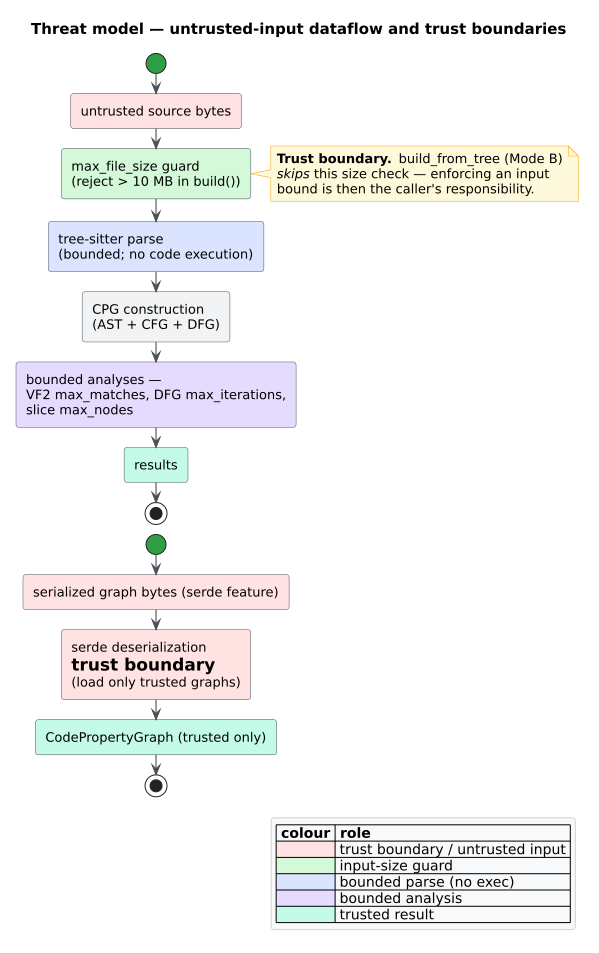

# Threat Model

`libcpg` is a static-analysis library: its entire purpose is to read code — often
code you did not write and do not trust — and answer structural questions about it.
[Code Property Graphs](../GLOSSARY.md#code-property-graph-cpg) were introduced by
Yamaguchi et al. to *discover vulnerabilities* in exactly such untrusted code [[1]](#references),
so the analyzer must itself be robust to hostile input. This page states what is
being protected, from whom, and where the trust boundaries lie. The concrete knobs
that enforce these boundaries are catalogued in
[input and resource hardening](01-input-and-resource-hardening.md).

## Assets

| Asset | Why it matters |
| --- | --- |
| Availability of the host process | The most realistic attack is denial of service: a crafted input that makes construction or analysis consume unbounded time or memory and starve the embedding application. |
| Integrity of the analysis result | A downstream tool may route decisions on `libcpg`'s output; a graph deserialized from an untrusted source could be crafted to mislead. |
| The embedding application's process boundary | `libcpg` runs in-process; a memory-safety failure would compromise the whole host. Rust's safety guarantees and tree-sitter's no-execution parsing are the primary defences here. |

Note what is **not** among the assets: `libcpg` does not manage secrets, open
network connections, spawn processes, or touch the filesystem beyond the one
convenience method `build_file`, which reads a path the caller supplied.

## Threat actors

- **A supplier of untrusted source code.** Anyone who can influence the bytes
  passed to `build`, `build_file`, or `build_from_tree` — for instance a
  code-review bot analyzing an attacker's pull request, or a service that indexes
  arbitrary repositories.
- **A supplier of untrusted serialized graphs.** With the `serde` feature, anyone
  who can influence the bytes handed to a deserializer that reconstructs a
  `CodePropertyGraph`.

Both are *remote, unprivileged* actors: they provide data, not code that `libcpg`
executes.

## Trust boundaries and data flow

There are two independent boundaries. The primary one is the parse-and-analyze
pipeline; the secondary one is graph deserialization.

*Figure — untrusted source bytes pass the `max_file_size` guard (in `build`),
through a no-execution tree-sitter parse, into bounded analyses; deserialization is
a separate boundary. Source:
[`diagrams/threat-model-dataflow.puml`](../diagrams/threat-model-dataflow.puml).*

### Boundary 1 — untrusted source bytes

`build(source, language)` is the guarded entry point. Before parsing it rejects
input larger than `CpgBuilderConfig::max_file_size` (default 10 MB), returning
`Error::Construction`. This is the first-line denial-of-service guard: it caps the
size of the tree, and therefore the size of the CPG and the cost of every
downstream pass, at construction time.

The critical caveat — visible in the diagram's note — is that **Mode B skips this
check**. [`build_from_tree`](../GLOSSARY.md#mode-b--build_from_tree) accepts a tree
the caller already parsed and runs the identical post-parse pipeline *without* the
`max_file_size` test, because at that point the potentially-expensive parse has
already happened and the caller owns the tree. Consequently, **a Mode-B caller
must impose its own input bound** (size, and ideally a parse timeout) before
calling `build_from_tree`. See
[input and resource hardening](01-input-and-resource-hardening.md#parser-timeouts-are-the-callers-job).

### tree-sitter parses; it does not execute

A recurring worry with "run a tool over attacker code" is that the code might
*run*. It does not. [tree-sitter](../GLOSSARY.md#tree-sitter) is a parser: it reads
bytes and produces a concrete syntax tree. It never evaluates, compiles, or
otherwise executes the program under analysis, and `libcpg`'s mappers only read
node kinds and source spans off that tree. There is no `eval`, no macro expansion,
no build step, and no code-loading anywhere in the construction path. The residual
parser risks are resource-exhaustion (bounded above) and parser bugs in the
grammar, not code execution.

### Boundary 2 — untrusted serialized graphs

With the `serde` feature, the graph types derive `Serialize`/`Deserialize` (with
custom helpers for `Arc<str>` fields). There is **no bespoke, validated import
function** — round-tripping is done with the caller's own `serde_json` (or similar),
as described in [`usage/05-serialization.md`](../usage/05-serialization.md).
Deserialization is therefore its own trust boundary: a `CodePropertyGraph`
reconstructed from bytes is only as trustworthy as those bytes. Treat deserializing
a graph like deserializing any other complex structure — **load only graphs from
sources you trust**, because a crafted payload could encode a misleading or
internally inconsistent graph that later analyses take at face value.

## Results are advisory, not authoritative

Several of `libcpg`'s outputs are **heuristics**, and must not be treated as
security guarantees:

- [Design-pattern](../GLOSSARY.md#design-pattern) detection scores structural
  matches by [confidence](../GLOSSARY.md#confidence-pattern-match); a high score is
  evidence, not proof, that a pattern is present.
- [Algorithm-family](../GLOSSARY.md#algorithm-family) and
  [complexity-class](../GLOSSARY.md#complexity-class--big-o) detection infer intent
  from control-flow and recursion shape; they can be wrong, and some declared
  families/classes have no active detector (documented in
  [`components/algorithms/families.md`](../components/algorithms/families.md)).
- [GNN](../GLOSSARY.md#graph-neural-network-gnn) embeddings summarise structure;
  similarity is a soft signal.

Use these to *prioritise* human attention, not to *gate* a security decision on
their own. Exact structural analyses are exact with respect to their input
projection: SCC decomposition exactly partitions the projected CFG or resolved
call graph, and [program slicing](../GLOSSARY.md#program-slicing) exactly traverses
the modelled PDG. Neither claim fills in facts absent from the CPG: unresolved
calls are omitted, and the PDG reflects the dependencies produced by libcpg's
[AST-ordered](../GLOSSARY.md#ast-ordered-reaching-definitions) data flow rather
than a full fixpoint. These results are not guarantees of runtime behaviour.

## Scope

**In scope.** Denial-of-service via oversized or pathological input; the
deserialization trust boundary; being clear about the advisory nature of
heuristics; keeping the parse path free of code execution.

**Out of scope.** Sandboxing the host process; authenticating or encrypting inputs;
supply-chain integrity of the tree-sitter grammars and other dependencies;
side-channel resistance. These are the responsibility of the embedding application
and its build pipeline.

## Mitigations at a glance

| Threat | Mitigation | Where |
| --- | --- | --- |
| Oversized source (DoS) | `max_file_size` guard in `build` (10 MB default) | [hardening §max_file_size](01-input-and-resource-hardening.md#construction-max_file_size) |
| Oversized source via Mode B | Caller must bound size/time before `build_from_tree` | [hardening §parser timeouts](01-input-and-resource-hardening.md#parser-timeouts-are-the-callers-job) |
| Explosive pattern search | VF2 `max_matches` cap + strict toggles | [hardening §VF2](01-input-and-resource-hardening.md#pattern-matching-vf2) |
| Non-terminating data flow | DFG `max_iterations` fixpoint cap (100) | [hardening §DFG](01-input-and-resource-hardening.md#data-flow-max_iterations) |
| Unbounded slice | `backward_slice` / `forward_slice` `max_nodes` cap | [hardening §slicing](01-input-and-resource-hardening.md#slicing-max_nodes) |
| Untrusted serialized graph | Deserialize only trusted bytes | [`usage/05-serialization.md`](../usage/05-serialization.md) |
| Over-trusting heuristics | Treat pattern/algorithm/GNN output as advisory | this page |

## References

1. Yamaguchi, F., Golde, N., Arp, D., Rieck, K. (2014). *Modeling and Discovering Vulnerabilities with Code Property Graphs.* 2014 IEEE Symposium on Security and Privacy. DOI: [10.1109/SP.2014.44](https://doi.org/10.1109/SP.2014.44)
