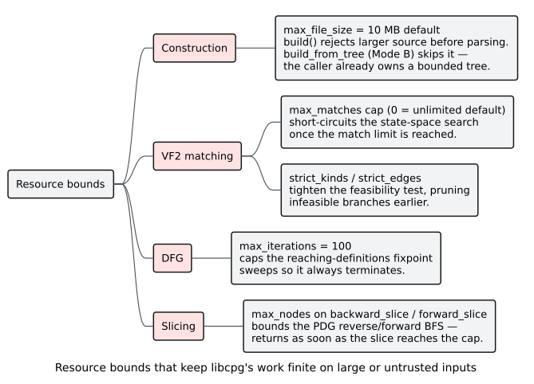

# Input and Resource Hardening

The [threat model](00-threat-model.md) identifies denial-of-service via oversized
or pathological input as the primary risk to an application embedding `libcpg`.
This page is the operator's manual for the bounds that keep the work finite: what
each one defaults to, where it is enforced, how to tighten it, and what to do about
the gaps (notably the Mode-B size-check bypass and the absence of a built-in parser
timeout).



*Figure — the four bound families: construction (`max_file_size`), VF2 matching
(`max_matches`, strict toggles), DFG (`max_iterations`), and slicing (`max_nodes`).
Source: [`diagrams/resource-bounds.puml`](../diagrams/resource-bounds.puml).*

## The bounds at a glance

| Bound | Default | Enforced in | Effect when exceeded |
| --- | --- | --- | --- |
| `CpgBuilderConfig::max_file_size` | 10 MB | `build` only (not `build_from_tree`) | `build` returns `Error::Construction` before parsing |
| `Vf2Matcher::max_matches` | `0` (unlimited) | `pattern::Vf2Matcher` | search short-circuits once the match count is reached |
| `Vf2Matcher` strict toggles | `strict_kinds`/`strict_edges` off | `pattern::Vf2Matcher` | tighter feasibility test prunes branches earlier |
| `DfgExtractorConfig::max_iterations` | `100` | `DfgExtractor` | reaching-definitions sweep stops iterating (guaranteed termination) |
| `backward_slice` / `forward_slice` `max_nodes` | *(caller-supplied argument)* | crate-root slice fns | BFS returns as soon as the slice reaches `max_nodes` |
| AST traversal guards | *(always on)* | `ast_descendants` / `ast_ancestors` / `ast_depth`, `CfgExtractor`, DFG reaching-defs | a cyclic `AstChild` graph terminates instead of looping or overflowing the stack |

All of these are on the **feature-free surface** — you can configure and use them
with `default = []`.

## Construction: `max_file_size`

`build` checks the source length against `CpgBuilderConfig::max_file_size` (default
`10 * 1024 * 1024` bytes) *before* handing anything to the parser, and rejects
oversized input:

```rust
// requires: features = ["lang-rust"]  (the build call needs a grammar)
use libcpg::{CpgBuilder, CpgBuilderConfig, TreeSitterCpgBuilder, Language};

// Tighten the cap well below the 10 MB default for hostile input.
let config = CpgBuilderConfig::new().with_max_file_size(256 * 1024); // 256 KiB
let builder = TreeSitterCpgBuilder::with_config(config);

let result = builder.build(oversized_source, Language::Rust);
assert!(result.is_err()); // Error::Construction, before parsing
```

This is exactly what the shipped `test_file_size_limit` test asserts (with a 10-byte
cap and a longer source). Because the guard runs before parsing, it caps the size of
the parse tree, the CPG, and every downstream pass in one stroke — making it the
single most effective DoS control for the internal-parse path.

### The Mode-B bypass

`build_from_tree` (Mode B) runs the identical post-parse pipeline but **does not
apply the `max_file_size` check** — the caller already parsed the source and owns
the tree. If your Mode-B input is untrusted, you must bound it yourself before
parsing (next section). This is a deliberate design property, not an oversight; see
[`design/0002-mode-b-build-from-tree.md`](../design/0002-mode-b-build-from-tree.md).

## Pattern matching: VF2

[VF2](../GLOSSARY.md#vf2) subgraph isomorphism is worst-case super-exponential —
$`O(N!\,N)`$ — so on adversarial graphs the search space is the concern. Two
controls bound it:

- **`with_max_matches(n)`** stops the state-space search after `n` matches (`0`
  means unlimited, the default). Set it to a small number — or `1` for a pure
  existence check — to guarantee early termination.
- **`with_strict_kinds(true)` / `with_strict_edges(true)`** tighten the feasibility
  test so infeasible branches are pruned sooner, shrinking the search.

```rust
// requires: no features (pattern module is always compiled)
use libcpg::pattern::Vf2Matcher;

let matcher = Vf2Matcher::new()
    .with_max_matches(100)     // never enumerate more than 100 embeddings
    .with_strict_kinds(true)   // prune on node kind …
    .with_strict_edges(true);  // … and on incident edge kinds
let matches = matcher.find_matches(&pattern, &target);
```

Note that the [Gang-of-Four detector](../GLOSSARY.md#gang-of-four-gof) uses a
*relaxed* matcher by design (category-level kind/edge matching); when you run it on
untrusted input, bound the surrounding work instead — cap the number of patterns
searched and the size of the CPG (via `max_file_size`).

## Data flow: `max_iterations`

The [reaching-definitions](../GLOSSARY.md#reaching-definition) analysis is an
[AST-ordered sweep](../GLOSSARY.md#ast-ordered-reaching-definitions) with a loop
double-pass; `DfgExtractorConfig::max_iterations` (default `100`) caps how many
times it may iterate, guaranteeing termination even on pathological control flow.
Lower it if you want a harder ceiling on per-function DFG work:

```rust
// requires: no features (builder is always compiled)
use libcpg::{DfgExtractor, DfgExtractorConfig};

let config = DfgExtractorConfig { max_iterations: 20, ..Default::default() };
let extractor = DfgExtractor::with_config(config);
extractor.extract(&mut cpg); // bounded reaching-defs
```

Because termination rests on this cap rather than on a proof of monotone
convergence, keep it positive; a value of `0` would skip the fixpoint loop entirely.

## Slicing: `max_nodes`

[Backward and forward slices](../GLOSSARY.md#backward-slice--forward-slice) are
breadth-first traversals over PDG edges; both take a **required** `max_nodes`
argument that bounds the result. The traversal returns as soon as the slice reaches
`max_nodes` nodes (and returns empty when `max_nodes == 0` or the criterion node is
absent):

```rust
// requires: no features (PdgBuilder + slices are always compiled)
use libcpg::{PdgBuilder, backward_slice};

PdgBuilder::new().build(&mut cpg, function); // add ControlDependence + DataDependence
let slice = backward_slice(&cpg, criterion, 512); // FxHashSet<NodeId>, at most 512 nodes
```

The functions return an `FxHashSet<NodeId>`; pick a `max_nodes` proportional to how
large a slice your UI or downstream step can handle, so a huge function cannot
produce an unbounded result.

## Parser timeouts are the caller's job

`libcpg` does **not** configure a parse timeout. In the internal-parse path,
`build` constructs a `tree_sitter::Parser` itself and calls `parse` with no
cancellation, so parse time is bounded only indirectly by `max_file_size`. For a
*hard* wall-clock bound on parsing untrusted input, use Mode B: parse with your own
`tree_sitter::Parser` — on which you can set tree-sitter's own cancellation/timeout
controls — and then call `build_from_tree`. In that arrangement you own both the
size bound (which Mode B skips) and the time bound:

```rust
// requires: a grammar you link yourself (Mode B — feature-free in libcpg)
use libcpg::{TreeSitterCpgBuilder, Language};

// 1. Enforce your own size cap (Mode B does not).
if source.len() > MY_MAX_BYTES {
    return; // reject before doing any work
}

// 2. Parse with your own Parser, on which you may set tree-sitter's
//    cancellation/timeout facilities, then build from the tree.
let tree = my_parser.parse(source, None).expect("parse");
let cpg = TreeSitterCpgBuilder::new()
    .build_from_tree(&tree, source, Language::Rust)
    .expect("build_from_tree");
```

## Memory considerations

The size of a CPG is roughly linear in the number of retained AST nodes, which is
in turn bounded by the parsed source size. There is no separate cap on the *total*
node/edge count beyond `max_file_size` (internal-parse path) or the caller's own
bound (Mode B). The graph is a single [petgraph](../GLOSSARY.md#petgraph) arena, so
its footprint is that arena plus the per-node child vectors and `Arc<str>` text; see
[performance](../engineering/03-performance.md) for the data-structure details.

## Malformed graphs: traversal guards

The bounds above cap work on *well-formed* input. A separate hazard is input
that is not well-formed at all.

`CodePropertyGraph` is an **open** data structure: `add_node`, `connect`, and
`node_mut` are public, and `connect` deliberately wires only the petgraph edge —
it does **not** maintain `node.parent` / `node.children`, which the caller is
responsible for. A consumer that assembles a graph by hand (or a language
frontend with a bug, or a deserialized graph from an untrusted source) can
therefore hand the analyses a shape no builder would produce:

- a `parent` pointer to a node that was never added;
- a `children` entry with no corresponding edge, or an edge with no pointers;
- an `AstChild` **cycle**, so the "tree" is not a tree;
- a `Call` whose `target` names a node that does not exist.

Several analyses walk the AST recursively, and an `AstChild` cycle turns such a
walk into an unbounded descent. Two of them — the CFG extractor's mutually
recursive `process_*` handlers and the DFG's reaching-definitions sweep — would
overflow the stack and **abort the process**, which is a denial of service
reachable from any caller that builds a graph by hand.

### The contract

For structurally corrupt input the library guarantees **robustness, not
correctness**: an analysis may return a meaningless answer, but it must

1. **terminate**,
2. **not panic**, and
3. **not overflow the stack**.

### How it is enforced

| Traversal | Guard |
| --- | --- |
| `ast_descendants`, `ast_ancestors`, `ast_depth` | a **visited set** — each node is expanded at most once, so the walk is bounded by the node count |
| `ast_ancestors` | additionally stops at a parent pointer that names a node not in the graph, rather than returning an id `node()` cannot resolve |
| `CfgExtractor::process_node` (and every `process_*` handler) | a **path set** on `CfgContext` — a node already on the current recursion path becomes its own exit instead of being re-entered |
| DFG reaching definitions (`visit_reaching`) | a **path set** — same rule |

A *path* set rather than a global visited set is used in the two extractors so
that a node legitimately reachable from two disjoint branches is still processed
on each path; only a genuine cycle is cut. Tree input is therefore unaffected.

These guarantees are pinned by `tests/robustness.rs`, which injects ten distinct
corruptions into a plausible function graph and drives **every** public analysis
over each one — see
[`engineering/02-testing.md`](../engineering/02-testing.md#what-the-properties-assert).

## Hardening checklist for hostile input

1. **Set a strict `max_file_size`** far below the 10 MB default (e.g. tens to a few
   hundred KiB) for the internal-parse path.
2. **On the Mode-B path, enforce your own size and parse-time bounds** before
   `build_from_tree` — it applies neither.
3. **Cap `Vf2Matcher::max_matches`** (and enable the strict toggles) whenever you
   match patterns against untrusted graphs.
4. **Keep `DfgExtractorConfig::max_iterations` positive but modest** if you need a
   tighter DFG ceiling than 100.
5. **Pass a sensible `max_nodes`** to every slice call.
6. **Deserialize only trusted graphs** (see the [threat model](00-threat-model.md)
   and [`usage/05-serialization.md`](../usage/05-serialization.md)).
7. **Treat detection output as advisory**, never as a security gate.
8. **Validate graphs you did not build yourself** (deserialized or caller-assembled) if you need *meaningful* results — the traversal guards guarantee termination, not that the answer means anything.

## Related pages

- [Threat model](00-threat-model.md) — the assets and boundaries these bounds
  defend.
- [Performance](../engineering/03-performance.md) — the asymptotic costs these
  bounds cap.
- [`usage/04-program-slicing.md`](../usage/04-program-slicing.md) — using slices in
  anger.
