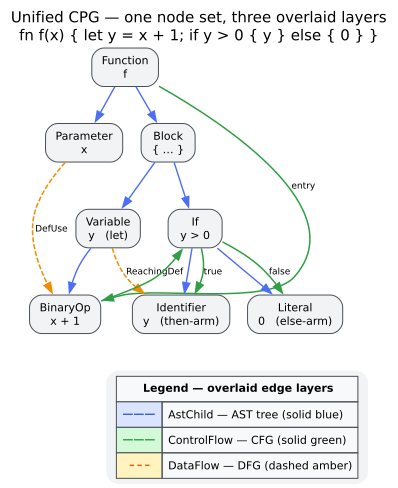

# Theory 00 — What a Code Property Graph Is, and Why Unify the Views

> **The theory pillar.** This is the entry point to `libcpg`'s foundations. It
> motivates the central idea — merge syntax, control, and data views of a program
> onto **one shared node set** — and maps out the pages that formalise each layer.
> Every term used here is defined once in the [Glossary](../GLOSSARY.md); this page
> links to it rather than redefining. Mathematical notation follows the Glossary's
> [notation conventions](../GLOSSARY.md#notation-conventions): a graph is
> `` $`G = (V, E)`$ `` with vertex set `` $`V`$ `` and typed edge set `` $`E`$ ``,
> and `` $`N`$ ``/`` $`E`$ `` denote node/edge **counts** when a scalar is needed.

## 1. Three questions, historically three tools

To reason about a program, an analysis usually needs to answer three different
kinds of question:

- **Syntax** — *"what is written?"* Answered by the
  [Abstract Syntax Tree (AST)](../GLOSSARY.md#abstract-syntax-tree-ast): the tree a
  parser produces, whose interior nodes are language constructs and whose children
  are their syntactic parts.
- **Control** — *"in what order can it run?"* Answered by the
  [Control Flow Graph (CFG)](../GLOSSARY.md#control-flow-graph-cfg): a graph whose
  edges encode the possible execution order between statements.
- **Data** — *"how do values move?"* Answered by the
  [Data Flow Graph (DFG)](../GLOSSARY.md#data-flow-graph-dfg): a graph whose edges
  connect the point that **defines** a value to the points that **use** it.

Classically these are three *separate* data structures, built and queried by three
*separate* passes. A question that spans them — *"can an attacker-controlled value
flow into a buffer size that a surrounding `if` fails to bound?"* — then has to be
stitched together by hand across the AST (to find the syntactic shape), the CFG (to
find the guard), and the DFG (to follow the value). The correspondence between "the
same statement" in three graphs is exactly the accounting that goes wrong.


*Figure — three separate views (AST, CFG, DFG) versus one unified CPG over a single node set. Source: [`diagrams/cpg-vs-traditional.dot`](../diagrams/cpg-vs-traditional.dot).*

## 2. The idea: one node set, many typed overlays

A [Code Property Graph (CPG)](../GLOSSARY.md#code-property-graph-cpg) removes the
stitching by construction. Yamaguchi, Golde, Arp, and Rieck [[1]](#references)
observed that the three views do not need three node sets — they only need three
**edge sets over the same nodes**. Build the AST once; then *overlay* control-flow
edges and data-flow edges onto the very same AST nodes. The result is a single
directed graph in which:

- every node is an AST node (a function, an `if`, an identifier, a literal, …), and
- every edge is **typed** — it is an AST edge, or a CFG edge, or a DFG edge, or a
  dependence edge — so a query can restrict itself to one layer or freely compose
  across layers.

Because the node set is shared, "the same statement in the control view and the
data view" is *literally the same node*. Cross-cutting questions become ordinary
graph traversals that hop between edge types, with no side table to keep consistent.
`libcpg` adds a fourth overlay on demand — the
[Program Dependence Graph (PDG)](../GLOSSARY.md#program-dependence-graph-pdg) of
[control](../GLOSSARY.md#control-dependence)- and
[data](../GLOSSARY.md#data-dependence)-dependence edges — which turns
[program slicing](../GLOSSARY.md#program-slicing) into a single reachability query
(see [Theory 04](04-program-dependence-and-slicing.md)).



*Figure — the AST, CFG, and DFG overlays drawn on one shared node set; each layer is an edge subset over the same vertices. Source: [`diagrams/cpg-overlay.dot`](../diagrams/cpg-overlay.dot).*

## 3. Why unify: the vulnerability-query motivation

The CPG was introduced specifically to *express and discover vulnerabilities as
graph queries* [[1]](#references). A large class of bugs is not visible in any one
view:

- A [taint](../GLOSSARY.md#taint-analysis) bug needs the **DFG** (untrusted value
  reaches a sink) *and* the **CFG/PDG** (no guard on the path sanitises it).
- A missing-check bug needs the **AST** (the call shape) *and* the **control**
  structure around it.
- An injection needs to follow **data** from a source node, classified by its
  **node kind**, to a sink node, classified likewise.

On a unified graph these are single traversals that alternate edge types. The same
substrate then supports higher-level analyses that all reduce to graph operations:
[subgraph-isomorphism](../GLOSSARY.md#isomorphism--subgraph-isomorphism) pattern
detection ([Theory 05](05-subgraph-isomorphism-vf2.md)),
[design-pattern](../GLOSSARY.md#design-pattern) recognition
([Theory 07](07-design-pattern-detection.md)),
[complexity-class](../GLOSSARY.md#complexity-class--big-o) estimation
([Theory 08](08-algorithm-and-complexity-analysis.md)), and
[graph-neural-network](../GLOSSARY.md#graph-neural-network-gnn) embeddings
([Theory 09](09-graph-neural-networks.md)). Each consumes the same
`CodePropertyGraph`; none needs its own bespoke intermediate representation.

## 4. The four overlays at a glance

| Overlay | Question | Edge family | Built by | Detailed in |
|---|---|---|---|---|
| [AST](../GLOSSARY.md#abstract-syntax-tree-ast) | what is written | `AstChild` / `AstParent` / `AstNextSibling` / `AstPrevSibling` | the builder (always) | [Theory 01](01-code-property-graphs.md) |
| [CFG](../GLOSSARY.md#control-flow-graph-cfg) | run order | `ControlFlow(CfgEdgeKind)` — 14 kinds | `CfgExtractor` | [Theory 02](02-control-flow-and-complexity.md) |
| [DFG](../GLOSSARY.md#data-flow-graph-dfg) | value flow | `DataFlow(DfgEdgeKind)` — 13 kinds | `DfgExtractor` | [Theory 03](03-data-flow-and-reaching-definitions.md) |
| [PDG](../GLOSSARY.md#program-dependence-graph-pdg) | what depends on what | `ControlDependence` / `DataDependence` | `PdgBuilder` (on demand) | [Theory 04](04-program-dependence-and-slicing.md) |

All four are subsets of one edge set over one vertex set. The
[node-kind](../GLOSSARY.md#node-kind--edge-kind) and
[edge-kind](../GLOSSARY.md#node-kind--edge-kind) alphabets that make the overlays
addressable are the subject of [Theory 01](01-code-property-graphs.md); the concrete
`petgraph`-backed storage is described in
[`architecture/overview.md`](../architecture/overview.md) and
[`components/graph/overview.md`](../components/graph/overview.md).

## 5. A first taste in code

With a language grammar enabled, the whole unified graph — AST plus CFG plus DFG —
comes from one call, and every overlay is queried through the same
`CodePropertyGraph` value. (`libcpg`'s default feature set is empty, so a
per-language `lang-*` feature is required for the internal-parse `build`; the
feature-free construction paths are covered in [Theory 01](01-code-property-graphs.md)
and [`usage/01-building-cpgs.md`](../usage/01-building-cpgs.md).)

```rust
// requires: features = ["lang-rust"]
use libcpg::{CpgBuilder, TreeSitterCpgBuilder, Language, Result};

fn first_taste() -> Result<()> {
    let source = "fn max(a: i32, b: i32) -> i32 { if a > b { a } else { b } }";

    // One call builds the AST and overlays the CFG and DFG onto its nodes.
    let builder = TreeSitterCpgBuilder::new();
    let cpg = builder.build(source, Language::Rust)?;

    // One value, many views:
    println!("nodes (shared by every overlay): {}", cpg.node_count());
    println!("edges (all overlays combined):   {}", cpg.edge_count());

    // A control-flow metric read straight off the CFG overlay (Theory 02):
    println!("cyclomatic complexity: {}", cpg.cyclomatic_complexity());

    // The AST overlay still tells us the syntactic shape:
    for function in cpg.functions() {
        println!("function: {:?}", function.name());
    }
    Ok(())
}
```

`node_count` counts vertices once no matter how many overlays touch them;
`edge_count` counts every typed edge across all overlays. The `functions()` query
reads the AST layer, while `cyclomatic_complexity()` reads the CFG layer — of the
same graph. Errors are the crate's own [`libcpg::Error`](../api/graph-reference.md)
(there is no `CpgError`).

## 6. Map of the theory pillar

This overview sits above nine formal chapters. Read them in order for a ground-up
development, or jump to the layer you need:

1. **[01 — Code Property Graphs](01-code-property-graphs.md).** The formal model:
   one vertex set, typed edge overlays as edge-induced subgraphs, and the node-kind
   / edge-kind taxonomies that make queries addressable.
2. **[02 — Control Flow and Complexity](02-control-flow-and-complexity.md).** CFG
   theory, [basic blocks](../GLOSSARY.md#basic-block), the 14
   [`CfgEdgeKind`](../GLOSSARY.md#control-flow-graph-cfg) semantics, and McCabe
   [cyclomatic complexity](../GLOSSARY.md#cyclomatic-complexity).
3. **[03 — Data Flow and Reaching Definitions](03-data-flow-and-reaching-definitions.md).**
   Data-flow lattices and fixed points, [reaching definitions](../GLOSSARY.md#reaching-definition),
   and `libcpg`'s [AST-ordered sweep](../GLOSSARY.md#ast-ordered-reaching-definitions).
4. **[04 — Program Dependence and Slicing](04-program-dependence-and-slicing.md).**
   [Dominators](../GLOSSARY.md#dominator--post-dominator), the
   [reverse dominance frontier](../GLOSSARY.md#dominance-frontier--reverse-dominance-frontier),
   the PDG, and Weiser [slicing](../GLOSSARY.md#program-slicing).
5. **[05 — Subgraph Isomorphism and VF2](05-subgraph-isomorphism-vf2.md).**
6. **[06 — Graph Similarity](06-graph-similarity.md).**
7. **[07 — Design-Pattern Detection](07-design-pattern-detection.md).**
8. **[08 — Algorithm and Complexity Analysis](08-algorithm-and-complexity-analysis.md).**
9. **[09 — Graph Neural Networks](09-graph-neural-networks.md).**

For how these ideas are realised in code, cross the bridge to the architecture
pillar ([`architecture/overview.md`](../architecture/overview.md),
[`architecture/data-flow.md`](../architecture/data-flow.md)) and the component
references ([`components/graph/overview.md`](../components/graph/overview.md)).

## References

1. Yamaguchi, F., Golde, N., Arp, D., Rieck, K. (2014). *Modeling and Discovering Vulnerabilities with Code Property Graphs.* 2014 IEEE Symposium on Security and Privacy. DOI: [10.1109/SP.2014.44](https://doi.org/10.1109/SP.2014.44)
