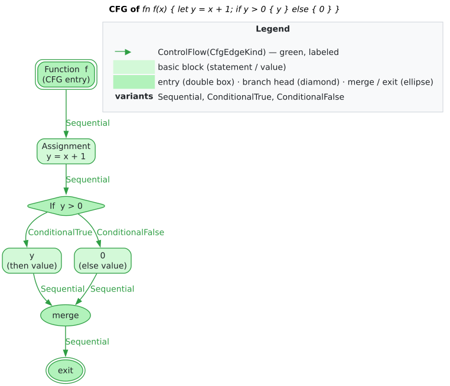

# Theory 02 — Control Flow and Cyclomatic Complexity

> **Where this sits.** [Theory 01](01-code-property-graphs.md) defined the
> [CFG](../GLOSSARY.md#control-flow-graph-cfg) overlay abstractly as the edge subset
> $`E_{\mathrm{CFG}}`$ over the shared vertex set. This chapter gives the
> control-flow theory: what a CFG is, what a [basic block](../GLOSSARY.md#basic-block)
> is, the semantics of `libcpg`'s 14 [`CfgEdgeKind`](../GLOSSARY.md#control-flow-graph-cfg)
> edge types, and McCabe's [cyclomatic complexity](../GLOSSARY.md#cyclomatic-complexity)
> $`M = E - N + 2`$ computed over that overlay. Notation follows the
> [Glossary conventions](../GLOSSARY.md#notation-conventions).

## 1. The control-flow graph

The **control-flow graph** of a procedure is a directed graph

```math
G_{\mathrm{CFG}} = (V,\ E_{\mathrm{CFG}},\ \mathit{entry},\ \mathit{exit})
```

whose edges encode *possible* successor relationships during execution: an edge
$`u \to v`$ means control may pass from $`u`$ to $`v`$ in some run.
A distinguished $`\mathit{entry}`$ has no predecessors and every execution
begins there; the $`\mathit{exit}`$ set collects the points where the
procedure returns. A CFG is an *over-approximation* — it admits every path the
program *could* take, not the (undecidable) set it actually takes — which is exactly
what makes conservative static analysis sound.

In `libcpg` the CFG is not a separate structure: it is the overlay
$`G_{\mathrm{CFG}} = (V, E_{\mathrm{CFG}})`$ over the CPG's shared vertices,
where $`E_{\mathrm{CFG}} = \{\, e : \texttt{is\_cfg}(\tau(e)) \,\}`$. The
`CfgExtractor` populates it, recording each function's entry and exit vertices
(`cfg_entries` / `cfg_exits`), and the graph is queried with `cfg_successors`,
`cfg_predecessors`, and `cfg_nodes`. Crucially, `libcpg` works at **AST-node
granularity** — the vertices are AST nodes, not fused basic blocks — so the CFG
edges thread directly through the same nodes the AST and DFG use.

## 2. Basic blocks

A [basic block](../GLOSSARY.md#basic-block) is a maximal straight-line run of
instructions with a single entry and single exit: control enters only at the top
and leaves only at the bottom, with no branch in between. Basic blocks are the
classical unit of control-flow analysis because within one, execution is
unconditional — analysis facts can be summarised per block rather than per
instruction. `libcpg` keeps analysis at AST-node granularity (finer than blocks) but
can recover **block leaders** — the nodes that begin a basic block — through
`BasicBlockIdentifier`, described in [`components/builder/cfg.md`](../components/builder/cfg.md).
Cyclomatic complexity (§4) is invariant to whether it is computed over blocks or over
the finer per-node CFG, because collapsing a straight-line chain removes equal
numbers of nodes and edges and leaves $`E - N`$ unchanged.

## 3. The 14 control-flow edge kinds

The extractor labels every control edge with a `CfgEdgeKind` so a query can tell a
loop back-edge from a fall-through, or a `true` branch from a `false` one. There are
14, in four semantic clusters:

| Cluster | `CfgEdgeKind` | Meaning | Typical source construct |
|---|---|---|---|
| Straight-line | `Sequential` | fall-through to the next node | statement sequences; function → body; block → first child |
| Branch | `ConditionalTrue` | condition holds → then-branch | `if`, guard tests |
| Branch | `ConditionalFalse` | condition fails → else/join | `if`/`else` |
| Branch | `Case` | switch/match case selected | `match` / `switch` arms |
| Branch | `DefaultCase` | fallback arm selected | `default` / wildcard arm |
| Loop | `LoopBack` | back-edge to the loop head | `while`, `for`, `loop` |
| Loop | `LoopExit` | guard fails → after the loop | `while`, `for` |
| Loop | `Break` | early loop exit | `break` |
| Loop | `Continue` | jump to the loop head | `continue` |
| Non-local | `Return` | to the function exit | `return` |
| Non-local | `Throw` | exception raised | `throw` / `raise` |
| Non-local | `Catch` | into a handler | `try` / `catch` |
| Call | `Call` | into a callee | call sites (when call edges enabled) |
| Call | `CallReturn` | back from a callee | after a call returns |

`CfgEdgeKind` also carries convenience classifiers — `is_conditional()` (the two
`Conditional*` plus `Case`/`DefaultCase`), `is_loop()` (`LoopBack`, `LoopExit`,
`Break`, `Continue`), and `is_exception()` (`Throw`, `Catch`) — used by later
analyses. The `LoopBack` back-edge is the structural fingerprint that
[algorithm and complexity analysis](08-algorithm-and-complexity-analysis.md) reads to
recognise iteration, and the branch edges are what
[control dependence](../GLOSSARY.md#control-dependence) is computed from in
[Theory 04](04-program-dependence-and-slicing.md).



*Figure — the CFG of a small function, each edge annotated with its `CfgEdgeKind`. Source: [`diagrams/cfg-example.dot`](../diagrams/cfg-example.dot).*

The three archetypal shapes — a two-way `if`, a `while` loop with its back-edge, and
a `try`/`catch` with an exceptional edge — are the building blocks every larger CFG
composes from:


*Figure — the canonical CFG shapes for `if`, `while`, and `try` constructs. Source: [`diagrams/cfg-control-constructs.dot`](../diagrams/cfg-control-constructs.dot).*

## 4. Cyclomatic complexity

McCabe [[1]](#references) proposed measuring a procedure's structural complexity by
the **cyclomatic number** of its CFG — the number of *linearly independent paths*
through it, equivalently the dimension of the cycle space of the graph. For a CFG
with $`E`$ edges, $`N`$ nodes, and $`P`$ connected components,

```math
M = E - N + 2P .
```

The intuition is graph-theoretic: a connected graph has a spanning tree with
$`N - 1`$ edges; each of the remaining $`E - (N - 1)`$ edges closes an
independent cycle, and adding the virtual edge from exit back to entry (the
$`+1`$ that turns $`+1`$ into $`+2`$ per component) makes the count
the number of independent circuits. For a single procedure analysed in isolation —
one entry, one exit, one connected component — $`P = 1`$ and the formula
reduces to the familiar

```math
M = E - N + 2 .
```

An equivalent and often handier characterisation for structured code is
$`M = d + 1`$, where $`d`$ is the number of binary decision points
(each `if`, `while`, `for`, `case`, and short-circuit `&&`/`||` adds one), because
every decision contributes exactly one extra edge over a node. $`M`$ is also a
lower bound on the number of test cases needed for branch coverage, which is what
made it a durable software metric.

### `libcpg`'s computation

`cyclomatic_complexity()` counts the CFG overlay of the whole graph and applies the
single-component formula, with two deliberate, documented edge behaviours:

- it counts $`E`$ as the edges satisfying `is_cfg` and $`N`$ as the
  vertices returned by `cfg_nodes()` (those incident to at least one CFG edge);
- if there are **no** CFG nodes it returns `1` (a trivial single-path procedure),
  and it uses a **saturating** subtraction so $`E - N`$ never underflows.

Because the count is taken over the entire graph's CFG edges, invoke it on a
per-function subgraph (via `function_cfg`) when you want a single procedure's number
rather than a whole file's.

### Literate procedure

```text
cyclomatic_complexity(G):
 1. E ← |{ e in edges(G) : is_cfg(kind(e)) }|      # CFG edges
 2. N ← |cfg_nodes(G)|                             # nodes touched by a CFG edge
 3. if N = 0: return 1                             # nothing branched: one path
 4. return saturating_sub(E, N) + 2                # M = E − N + 2  (P = 1)
```

### Real snippet

```rust
use libcpg::{CfgExtractor, CodePropertyGraph, NodeId};

/// Cyclomatic complexity of a single function's CFG.
///
/// Assumes the CFG overlay has been built (either by the builder with
/// `build_cfg` enabled, or by running `CfgExtractor::extract` as below).
fn function_complexity(cpg: &CodePropertyGraph, function: NodeId) -> usize {
    // Isolate the function's control-flow subgraph, then apply M = E − N + 2.
    cpg.function_cfg(function).cyclomatic_complexity()
}

/// Populate the CFG overlay on a freshly built (or hand-built) graph.
/// `extract` is idempotent — re-running it adds no duplicate edges.
fn build_cfg(cpg: &mut CodePropertyGraph) {
    CfgExtractor::new().extract(cpg);
}
```

`CfgExtractor::extract` walks each `Function` node, treats its **last AST child** as
the body, and emits the typed edges of §3 per construct; the per-construct handlers
and the loop/exception context stacks are documented in
[`components/builder/cfg.md`](../components/builder/cfg.md). Because it operates on
node kinds rather than grammar specifics, the same extractor serves every supported
language, including the [Mode-B](../GLOSSARY.md#mode-b--build_from_tree) Rholang and
MeTTa frontends.

## 5. Worked example

Take `fn max(a, b) { if a > b { a } else { b } }`. Its CFG (the first figure above)
has the entry, the condition, the two branches, and a join — the two-way branch adds
one decision point, so $`d = 1`$ and $`M = d + 1 = 2`$: there are exactly
two independent paths (the `then` and the `else`), matching $`E - N + 2`$ on the
drawn graph. Nesting a loop inside a branch adds its own `LoopBack`/`LoopExit` pair
and one more independent path, taking $`M`$ to 3 — each decision point
contributing linearly, which is precisely the behaviour that makes $`M`$ track
the effort of testing a routine.

## Cross-references

- The abstract CFG overlay and the edge alphabet: [Theory 01](01-code-property-graphs.md).
- What the branch edges feed into: [control dependence and slicing](04-program-dependence-and-slicing.md).
- How loop and recursion structure maps to a [complexity class](../GLOSSARY.md#complexity-class--big-o):
  [Theory 08](08-algorithm-and-complexity-analysis.md) (a different, per-function
  *asymptotic* notion — not to be confused with McCabe's structural $`M`$).
- Construction details: [`components/builder/cfg.md`](../components/builder/cfg.md);
  the edge catalogue: [`components/graph/edges.md`](../components/graph/edges.md);
  traversal recipes: [`components/graph/traversal.md`](../components/graph/traversal.md).

## References

1. McCabe, T. J. (1976). *A Complexity Measure.* IEEE TSE SE-2(4). DOI: [10.1109/TSE.1976.233837](https://doi.org/10.1109/TSE.1976.233837)
