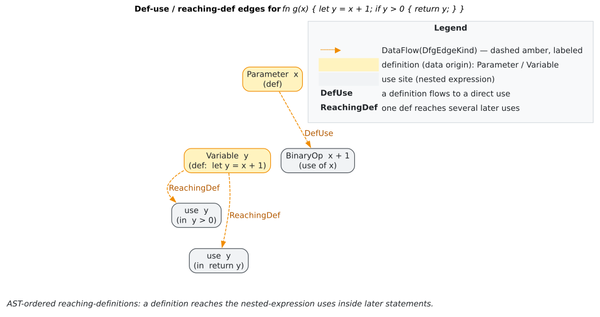
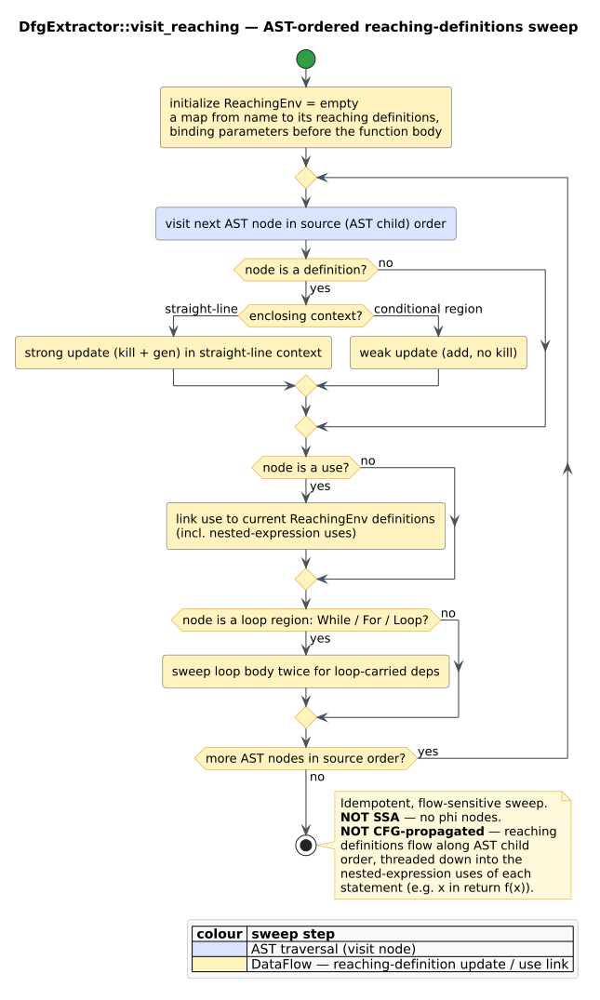

# Theory 03 — Data Flow and Reaching Definitions

> **Where this sits.** [Theory 01](01-code-property-graphs.md) defined the
> [DFG](../GLOSSARY.md#data-flow-graph-dfg) overlay abstractly; this chapter supplies
> the data-flow theory behind it. It develops the classical
> [lattice](../GLOSSARY.md#lattice-data-flow) / fixed-point framework
> (Kildall [[1]](#references); Aho, Lam, Sethi & Ullman [[2]](#references)),
> specialises it to [reaching definitions](../GLOSSARY.md#reaching-definition) with
> [gen/kill](../GLOSSARY.md#kill--gen-data-flow) sets and
> [strong/weak update](../GLOSSARY.md#strong-update--weak-update), and then explains
> **why `libcpg` computes reaching definitions with an
> [AST-ordered flow-sensitive sweep](../GLOSSARY.md#ast-ordered-reaching-definitions)**
> rather than [SSA](../GLOSSARY.md#static-single-assignment-ssa) or a CFG fixed point.
> Notation follows the [Glossary conventions](../GLOSSARY.md#notation-conventions).

## 1. Data-flow analysis as a lattice fixed point

Classical data-flow analysis (Kildall [[1]](#references)) frames a whole-procedure
property as the least solution of a monotone equation system over a
[lattice](../GLOSSARY.md#lattice-data-flow). Fix a finite set `` $`D`$ `` of *facts*;
the analysis domain is the powerset lattice `` $`(2^{D}, \subseteq)`$ `` with join
`` $`\sqcup = \cup`$ ``, bottom `` $`\bot = \varnothing`$ ``, and top
`` $`\top = D`$ ``. Each CFG node `` $`b`$ `` carries a monotone **transfer
function** `` $`f_b : 2^{D} \to 2^{D}`$ `` describing how it changes the facts that
flow through it. For a *forward* analysis, the entry facts of a node are the join of
its predecessors' exit facts, and the exit facts are the transfer of the entry:

```math
\mathrm{IN}[b] \;=\; \bigsqcup_{p \in \mathrm{pred}(b)} \mathrm{OUT}[p]
\qquad\qquad
\mathrm{OUT}[b] \;=\; f_b\!\big(\mathrm{IN}[b]\big) .
```

Because every `` $`f_b`$ `` is monotone and the lattice has finite height, iterating
these equations from `` $`\bot`$ `` reaches a least fixed point — the
**maximum-fixed-point (MFP)** solution — in finitely many rounds. When the transfer
functions are *distributive* (as they are for reaching definitions), the MFP
coincides with the ideal **meet-over-all-paths (MOP)** solution, so the fixed point
loses no precision relative to enumerating paths [[2]](#references).

## 2. Reaching definitions

A [definition](../GLOSSARY.md#def-use-chain--definition--use) is a program point that
assigns a variable; a **[reaching definition](../GLOSSARY.md#reaching-definition)** at
a point `` $`p`$ `` is a definition `` $`d`$ `` of some variable `` $`x`$ `` such that
there is a path from `` $`d`$ `` to `` $`p`$ `` with **no intervening redefinition**
of `` $`x`$ ``. Reaching definitions is the archetypal forward, *may* analysis: the
facts `` $`D`$ `` are the definition sites, the join is union (a definition reaches
`` $`p`$ `` if it reaches along *some* predecessor), and each node's transfer is
expressed with two sets — the definitions it creates and the ones it invalidates:

```math
\mathrm{gen}[b] = \{\,\text{definitions made at } b\,\}
\qquad
\mathrm{kill}[b] = \{\,\text{prior definitions of the same variables}\,\}
```

```math
\mathrm{OUT}[b] \;=\; \mathrm{gen}[b] \;\cup\; \big(\mathrm{IN}[b] \setminus \mathrm{kill}[b]\big) .
```

Whether a definition **kills** the previous ones distinguishes two update styles,
central to `libcpg`'s implementation:

- A **[strong update](../GLOSSARY.md#strong-update--weak-update)** applies when the
  write *definitely* happens (straight-line code): it both gens the new definition
  and kills the old ones — the latest write wins.
- A **weak update** applies when the write only *may* happen (a conditionally
  executed region): it gens the new definition **without** killing, because a
  definition on the other path may still reach later uses. Weak update is the sound,
  conservative choice — it can add an extra edge, never drop a real one.

The result is materialised as [def-use chains](../GLOSSARY.md#def-use-chain--definition--use):
`libcpg` records a [`DfgEdgeKind::DefUse`](../GLOSSARY.md#data-flow-graph-dfg) edge
from each reaching definition to the use it reaches (and, symmetrically,
`ReachingDef`), so a query answers *"which definitions reach this use?"* by reading
incident edges rather than re-running the analysis (`reaching_definitions`,
`uses_of_definition`).



*Figure — reaching-definition / def-use edges connecting each definition to the uses it reaches. Source: [`diagrams/def-use-example.dot`](../diagrams/def-use-example.dot).*

## 3. Why an AST-ordered sweep instead of SSA or a CFG fixed point

The classical algorithm iterates the equations of §1 over the CFG until a fixed
point; [SSA](../GLOSSARY.md#static-single-assignment-ssa) instead rewrites the program
so each variable is assigned once, inserting `` $`\phi`$ ``-functions at joins
(Cytron et al., see [Theory 04](04-program-dependence-and-slicing.md)). `libcpg`
deliberately uses **neither**. Its `DfgExtractor` performs a single
**[AST-ordered, flow-sensitive sweep](../GLOSSARY.md#ast-ordered-reaching-definitions)**:
it abstract-interprets the function body in *source order* over the AST, threading an
environment

```math
\rho : \mathit{Name} \to \mathcal{P}(\mathit{DefSites})
```

(`ReachingEnv`, a map from each variable name to its currently reaching definition
nodes). The choice is a considered trade-off, honest about its limits:

- **Motivation — nested-expression uses.** The earlier CFG-fixed-point attempts
  propagated facts only between CFG nodes, and so *missed* uses buried inside
  expressions that are not themselves CFG nodes — the `buf` in `decode(buf)`, the
  `x` in `return f(x)`. The AST sweep visits those identifier uses directly and links
  each to its reaching definition, which is the precise gap it was written to close.
- **Simplicity and language-agnosticism.** The sweep dispatches only on
  [`CpgNodeKind`](../GLOSSARY.md#node-kind--edge-kind), never on grammar specifics, so
  one implementation serves all 16 grammars plus the
  [Mode-B](../GLOSSARY.md#mode-b--build_from_tree) Rholang/MeTTa frontends.
- **Honesty.** It is **not** SSA (no `` $`\phi`$ ``-functions, no single-assignment
  renaming) and **not** a classic CFG fixed point. Two earlier CFG-based
  reaching-definition implementations are retained in the source but *never compiled*
  (guarded by `#[cfg(any())]`) as an executable record of the approaches the sweep
  superseded — see [`design/0003-ast-ordered-reaching-defs.md`](../design/0003-ast-ordered-reaching-defs.md).

### The sweep in detail

The environment `` $`\rho`$ `` is updated as the walk descends, with these rules
(the `bind` operation is a [strong or weak update](../GLOSSARY.md#strong-update--weak-update)
per context):

1. **Definitions** — a `Variable` (`let`), `Parameter`, or simple `Assignment`
   *binds* its name. The initialiser/right-hand side is visited **before** the bind,
   so a self-referential use sees the *pre-existing* definition (`let x = x + 1`
   reads the old `x`, then defines the new one).
2. **Strong vs weak** — in straight-line context the bind is a strong update (kill +
   gen); inside a **conditional region** (`If`, `Else`, `While`, `For`, `Loop`,
   `Match`, `MatchArm`, `Try`, `Catch`, `Finally`) it is a weak update (gen only),
   so a write on one branch cannot erase a write on a sibling branch.
3. **Uses** — an `Identifier` in use position links *every* currently-reaching
   definition of its name to itself with a `DefUse` edge. **Binder** identifiers (the
   `x` in `let x = …`, a parameter's own name, the target of a plain `x = …`) are
   definition sites, not uses, and are skipped so no spurious self-edge appears.
4. **Loops** — a loop body is swept **twice** (a bounded fixed point) so that a use
   near the top of the body can observe a definition made lower in the same body — a
   loop-carried dependence the single forward pass would miss.
5. **Idempotence** — an edge is added only if an identical one is absent, so re-running
   `extract` is a no-op and uses that *are* CFG nodes are not double-linked.

The double sweep of loop bodies is the sweep's nod to the fixed-point theory of §1:
two passes suffice here because the environment is monotone and a single back-edge
re-exposes the body's own late definitions to its early uses.



*Figure — the AST-ordered reaching-definitions sweep, showing strong updates in straight-line context, weak updates inside conditional regions, and the two-pass loop-body handling. Source: [`diagrams/reaching-defs-sweep.puml`](../diagrams/reaching-defs-sweep.puml).*

## 4. Literate procedure

The core walk (`visit_reaching`) descends the AST, mutating `` $`\rho`$ `` in place
and collecting `(definition, use)` pairs:

```text
visit(node, ρ, conditional, pairs):
  match kind(node):

    Variable{name} | Parameter{name}:
        binder ← the Identifier child equal to `name`     # a def site, not a use
        for child in ast_children(node) except binder:
            visit(child, ρ, conditional, pairs)           # RHS uses see old ρ
        bind(ρ, name, node, conditional)                  # strong if !conditional

    Assignment{op}:
        target ← first child
        for child in children:
            skip if child = target and target is Identifier and op = "="
            visit(child, ρ, conditional, pairs)
        if target is Identifier: bind(ρ, name(target), node, conditional)

    Identifier{name}:                                     # a use
        for d in ρ.get(name):  pairs.push((d, node))

    _ (blocks, calls, control flow, …):
        c ← conditional or is_conditional_region(kind)
        passes ← 2 if is_loop_region(kind) else 1         # loop double sweep
        repeat passes times:
            for child in ast_children(node): visit(child, ρ, c, pairs)

bind(ρ, name, def, conditional):
    if conditional: ρ[name] ← ρ[name] ∪ {def}             # weak update
    else:           ρ[name] ← {def}                       # strong update (kill+gen)
```

## 5. Real snippet

```rust
use libcpg::{
    build_def_use_chains, DfgExtractor, CodePropertyGraph, NodeId,
};

/// Build the DFG overlay, then read reaching definitions off it.
fn analyse_data_flow(cpg: &mut CodePropertyGraph, function: NodeId, a_use: NodeId) {
    // Populate DefUse / ReachingDef (and parameter/return/field) edges.
    // Idempotent: safe to call even if the builder already ran it.
    DfgExtractor::new().extract(cpg);

    // "Which definitions reach this use?" — read incident DFG edges, no re-analysis.
    let defs: Vec<NodeId> = cpg.reaching_definitions(a_use);
    println!("{} definition(s) reach the use", defs.len());

    // Symmetrically, "which uses does this definition reach?"
    for &d in &defs {
        let uses = cpg.uses_of_definition(d);
        println!("definition {:?} reaches {} use(s)", d.as_u32(), uses.len());
    }

    // Materialised per-variable chains for the whole function.
    let chains = build_def_use_chains(cpg, function);
    println!("{} variable(s) have def-use chains", chains.len());
}
```

`DfgExtractor::extract` runs the sweep of §3 for every function; `reaching_definitions`
and `uses_of_definition` then answer queries by reading `DefUse`/`ReachingDef` edges,
and `build_def_use_chains` returns the per-variable
[`DefUseChain`](../GLOSSARY.md#def-use-chain--definition--use) map. Configuration
(field-access, parameter, and return-value edges; an iteration cap; alias tracking,
off by default) is set through `DfgExtractorConfig` — see
[`components/builder/dfg.md`](../components/builder/dfg.md).

## Cross-references

- The DFG edge alphabet (13 `DfgEdgeKind` variants): [Theory 01](01-code-property-graphs.md)
  and [`components/graph/edges.md`](../components/graph/edges.md).
- Data dependence *reprojects* these DFG edges into the PDG:
  [Theory 04](04-program-dependence-and-slicing.md).
- The design rationale and the retired approaches:
  [`design/0003-ast-ordered-reaching-defs.md`](../design/0003-ast-ordered-reaching-defs.md).
- Validation of the sweep against a real test corpus (nested use, latest-def,
  non-flow, shadowing, idempotency): [`scientific/02-reaching-defs-validation.md`](../scientific/02-reaching-defs-validation.md).

## References

1. Kildall, G. A. (1973). *A Unified Approach to Global Program Optimization.* POPL '73. DOI: [10.1145/512927.512945](https://doi.org/10.1145/512927.512945)
2. Aho, Lam, Sethi, Ullman (2006). *Compilers: Principles, Techniques, and Tools* (2nd ed.). ISBN 978-0321486813 (no DOI). *(Data-flow analysis.)*
