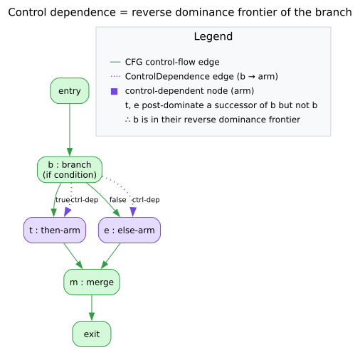
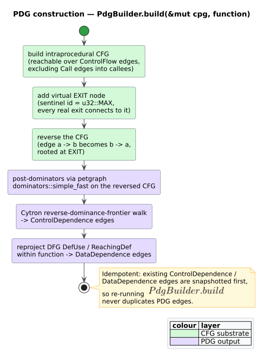
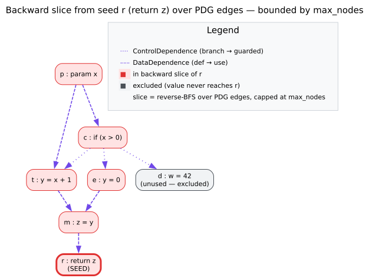
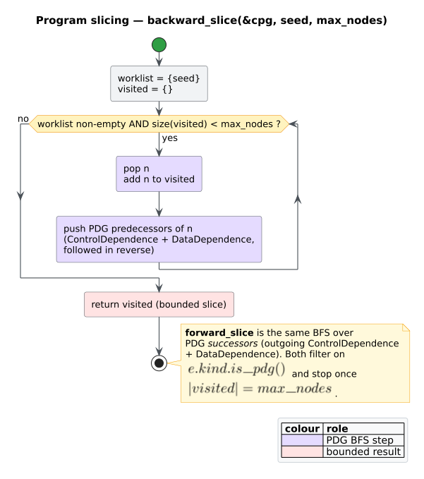

# Theory 04 — Program Dependence and Slicing

> **Where this sits.** [Theory 02](02-control-flow-and-complexity.md) built the CFG and
> [Theory 03](03-data-flow-and-reaching-definitions.md) the DFG. This chapter overlays
> the fourth layer — the [Program Dependence Graph (PDG)](../GLOSSARY.md#program-dependence-graph-pdg)
> of [control](../GLOSSARY.md#control-dependence)- and
> [data](../GLOSSARY.md#data-dependence)-dependence edges — and shows how it turns
> [program slicing](../GLOSSARY.md#program-slicing) into a bounded reachability query.
> It develops [dominators and post-dominators](../GLOSSARY.md#dominator--post-dominator),
> the [dominance frontier](../GLOSSARY.md#dominance-frontier--reverse-dominance-frontier),
> the equivalence *control dependence = reverse dominance frontier*
> (Ferrante–Ottenstein–Warren [[1]](#references); Cytron et al. [[2]](#references)),
> and Weiser slicing [[3]](#references). Notation follows the
> [Glossary conventions](../GLOSSARY.md#notation-conventions).

## 1. Dominators and post-dominators

Fix a CFG with a single `` $`\mathit{entry}`$ `` and a single `` $`\mathit{exit}`$ ``.

- Node `` $`d`$ `` **dominates** node `` $`n`$ `` (written `` $`d \gg n`$ ``) if
  *every* path from `` $`\mathit{entry}`$ `` to `` $`n`$ `` passes through
  `` $`d`$ ``. Every node dominates itself; the immediate dominator
  `` $`\mathrm{idom}(n)`$ `` is the unique closest strict dominator, and the idom
  relation forms the **dominator tree**.
- Node `` $`p`$ `` **post-dominates** node `` $`n`$ `` if every path from `` $`n`$ ``
  to `` $`\mathit{exit}`$ `` passes through `` $`p`$ ``. Post-domination is
  domination computed on the **reversed** CFG rooted at `` $`\mathit{exit}`$ ``.

`libcpg` obtains both from `petgraph`'s `dominators::simple_fast`, the
Cooper–Harvey–Kennedy iterative dominator algorithm: run it on the CFG for
dominators, or on a reversed view rooted at a virtual exit for **post-dominators**.
Post-dominators are the prerequisite for control dependence.

## 2. Dominance frontier and control dependence

The **[dominance frontier](../GLOSSARY.md#dominance-frontier--reverse-dominance-frontier)**
of `` $`d`$ `` is the set of nodes where `` $`d`$ ``'s dominance just stops:

```math
\mathrm{DF}(d) = \{\, w : d \gg p \text{ for some } p \in \mathrm{pred}(w),\ \text{and } d \not\gg_{\!s} w \,\}
```

where `` $`\gg_{\!s}`$ `` is *strict* domination. Intuitively, `` $`w`$ `` is a join
point just beyond the region `` $`d`$ `` dominates — the classic use is
`` $`\phi`$ ``-placement in [SSA](../GLOSSARY.md#static-single-assignment-ssa)
(Cytron et al. [[2]](#references)).

**Control dependence** asks the dual question: node `` $`n`$ `` is
[control-dependent](../GLOSSARY.md#control-dependence) on branch `` $`b`$ `` when
`` $`b`$ `` *decides whether `` $`n`$ `` executes*. Formally (Ferrante–Ottenstein–Warren
[[1]](#references)), `` $`n`$ `` is control-dependent on `` $`b`$ `` iff

1. there is a CFG path from `` $`b`$ `` to `` $`n`$ `` on which every node (except
   `` $`b`$ `` and `` $`n`$ ``) is post-dominated by `` $`n`$ ``, **and**
2. `` $`b`$ `` is **not** post-dominated by `` $`n`$ `` (so `` $`b`$ `` has an
   alternative successor from which `` $`n`$ `` is not guaranteed).

Cytron et al. [[2]](#references) supply the operational identity `libcpg` uses:

> **Control dependence is exactly the dominance frontier of the _reverse_ CFG.**

That is, `` $`n`$ `` is control-dependent on `` $`b`$ `` iff
`` $`b \in \mathrm{RDF}(n)`$ ``, the **[reverse dominance frontier](../GLOSSARY.md#dominance-frontier--reverse-dominance-frontier)**
(the dominance frontier computed on the reversed CFG, i.e. using post-dominators).



*Figure — control dependence recovered as the reverse (post-)dominance frontier: a node lies on a branch's frontier exactly when the branch decides its execution. Source: [`diagrams/dominance-frontier.dot`](../diagrams/dominance-frontier.dot).*

## 3. How `libcpg` builds the PDG

`PdgBuilder::build(&mut cpg, function)` overlays both dependence families onto the
CPG's shared node set. It is run **on demand** (never during initial construction)
and is [idempotent](../GLOSSARY.md#idempotent) — it snapshots existing PDG edges and
skips duplicates, so a re-build adds nothing.

### Control dependence — the five steps

Following §2, the builder computes `` $`\mathrm{RDF}`$ `` directly:

```text
compute_control_dependence(cpg, function):
 1. NODES ← intraprocedural CFG nodes reachable from `function` over ControlFlow
            edges, EXCLUDING `Call` edges (they cross into callees).
 2. Build the REVERSE CFG as a graph keyed by node id, plus a virtual EXIT
    (id = u32::MAX, which never collides with a real id). For every forward
    edge a→b add the reverse edge b→a.
 3. Connect EXIT to every real exit: recorded function exits (e.g. a loop
    guard's false branch), structural sinks, and Return/Throw nodes. Ensure
    every node can reach EXIT so post-dominance is total.
 4. POSTDOM ← simple_fast(reverse CFG, EXIT)          # immediate post-dominators
 5. RDF walk (Cytron et al.): for each join b with ≥ 2 reverse-CFG predecessors,
    walk each predecessor up the post-dominator tree until ipdom(b); every node
    visited is control-dependent on b. Emit ControlDependence  b → dependent.
```

Two deliberate choices are worth noting. The builder walks the **real**
`ControlFlow` edges rather than `function_cfg`, because that subgraph drops `Block`
nodes (the CFG's connective tissue) and would fragment the graph. And exits are taken
from `cfg_exits()`, not sink-detection alone, because a `while` guard is a genuine
exit (its false branch leaves the loop) yet still has a successor, so it is not a
sink. The virtual `EXIT` at `u32::MAX` makes post-dominance total even for functions
with multiple returns.

### Data dependence — reprojection

[Data dependence](../GLOSSARY.md#data-dependence) is already latent in the DFG:
`libcpg` **reprojects** it. For every `DefUse` / `ReachingDef` edge (Theory 03) whose
*both* endpoints lie within the function's AST subtree, it emits a first-class
`DataDependence` edge `` $`d \to u`$ `` (definition → use). Collapsing the two DFG
edge kinds into one uniform dependence kind lets the slicer traverse a single edge set.

```math
E_{\mathrm{PDG}} \;=\; \underbrace{\{\, b \to n : n \text{ is control-dependent on branch } b \,\}}_{\texttt{ControlDependence}} \;\cup\; \underbrace{\{\, d \to u : d \text{ reaches use } u \,\}}_{\texttt{DataDependence}}
```



*Figure — PDG construction: intraprocedural CFG → virtual EXIT → post-dominators → reverse dominance frontier → control-dependence edges, joined with reprojected data-dependence edges. Source: [`diagrams/pdg-construction.puml`](../diagrams/pdg-construction.puml).*

## 4. Program slicing

A **[program slice](../GLOSSARY.md#program-slicing)** with respect to a *slicing
criterion* — a node of interest — is the sub-program that affects (or is affected by)
that node. Weiser [[3]](#references) introduced slicing as a debugging aid; Ferrante–
Ottenstein–Warren [[1]](#references) showed that on a PDG a slice is simply the set of
nodes reachable from the criterion over dependence edges. `libcpg` adopts exactly this
PDG-reachability formulation, in both directions and **bounded**:

- The **[backward slice](../GLOSSARY.md#backward-slice--forward-slice)** of criterion
  `` $`c`$ `` is everything `` $`c`$ `` transitively *depends on* — its PDG
  predecessors — found by reverse-BFS over **incoming** `ControlDependence` /
  `DataDependence` edges. It answers *"what could have produced this value / caused
  this to run?"*
- The **forward slice** is everything `` $`c`$ `` transitively *affects* — its PDG
  successors — found by forward-BFS over **outgoing** dependence edges. It answers
  *"what would break if I change this?"*

Both include `` $`c`$ `` itself and take a `max_nodes` bound: the BFS stops once the
slice reaches that many nodes (and returns empty if `max_nodes` is `0` or the
criterion is absent), so slicing hostile or huge inputs is safe. The result is a set
of `NodeId`s (a `FxHashSet<NodeId>`).

```text
slice(cpg, criterion, max_nodes, direction):
 1. if max_nodes = 0 or criterion ∉ cpg: return ∅
 2. S ← {criterion};  Q ← [criterion]
 3. while Q not empty and |S| < max_nodes:
 4.     n ← pop(Q)
 5.     for each PDG edge incident to n in `direction`:      # incoming | outgoing
 6.         m ← the other endpoint
 7.         if |S| ≥ max_nodes: return S
 8.         if m ∉ S: add m to S; push m onto Q
 9. return S
```



*Figure — a backward slice (highlighted) over the PDG: the transitive control- and data-dependence predecessors of the criterion. Source: [`diagrams/slice-example.dot`](../diagrams/slice-example.dot).*



*Figure — the bounded BFS shared by backward and forward slicing, differing only in whether it follows incoming or outgoing PDG edges. Source: [`diagrams/slicing-bfs.puml`](../diagrams/slicing-bfs.puml).*

## 5. Real snippet

```rust
use libcpg::{backward_slice, forward_slice, PdgBuilder, CodePropertyGraph, NodeId};

/// Add the PDG overlay for one function, then slice around a criterion node.
fn slice_around(cpg: &mut CodePropertyGraph, function: NodeId, criterion: NodeId) {
    // Overlay ControlDependence + DataDependence. Requires the function's CFG and
    // DFG to already exist. Idempotent — safe to call more than once.
    PdgBuilder::new().build(cpg, function);

    // Everything the criterion depends on (its causes), capped at 256 nodes.
    let back = backward_slice(cpg, criterion, 256);
    // Everything the criterion affects (its consequences).
    let fwd = forward_slice(cpg, criterion, 256);

    println!("backward slice: {} nodes", back.len());
    println!("forward slice:  {} nodes", fwd.len());
}
```

`PdgBuilder::new().build` performs §3; `backward_slice` / `forward_slice` perform §4
over the resulting PDG edges. All three are on the crate's **feature-free** surface —
no cargo feature is needed. A step-by-step worked slice and its interpretation are in
[`usage/04-program-slicing.md`](../usage/04-program-slicing.md), and the construction
internals (virtual EXIT, `simple_fast`, the Cytron walk) in
[`components/builder/pdg-and-slicing.md`](../components/builder/pdg-and-slicing.md).

## Cross-references

- The dependence edge kinds in the CPG model: [Theory 01](01-code-property-graphs.md)
  and [`components/graph/edges.md`](../components/graph/edges.md).
- The control edges that seed control dependence: [Theory 02](02-control-flow-and-complexity.md).
- The data-flow edges that reproject into data dependence: [Theory 03](03-data-flow-and-reaching-definitions.md).
- SSA and the dominance frontier, defined for contrast: [Theory 03 §3](03-data-flow-and-reaching-definitions.md#3-why-an-ast-ordered-sweep-instead-of-ssa-or-a-cfg-fixed-point).

## References

1. Ferrante, J., Ottenstein, K. J., Warren, J. D. (1987). *The Program Dependence Graph and Its Use in Optimization.* ACM TOPLAS 9(3). DOI: [10.1145/24039.24041](https://doi.org/10.1145/24039.24041)
2. Cytron, R., Ferrante, J., Rosen, B. K., Wegman, M. N., Zadeck, F. K. (1991). *Efficiently Computing Static Single Assignment Form and the Control Dependence Graph.* ACM TOPLAS 13(4). DOI: [10.1145/115372.115320](https://doi.org/10.1145/115372.115320)
3. Weiser, M. (1984). *Program Slicing.* IEEE TSE SE-10(4). DOI: [10.1109/TSE.1984.5010248](https://doi.org/10.1109/TSE.1984.5010248) (orig. ICSE '81).
