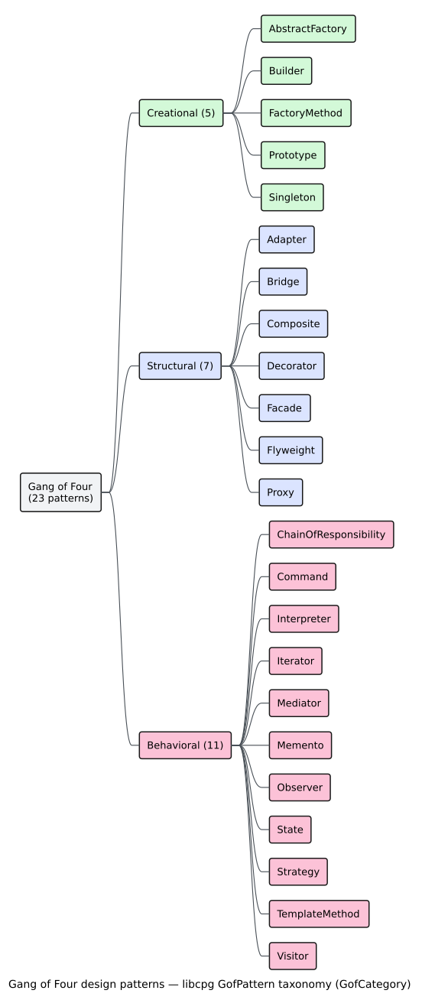

# Design‑Pattern Detection

> Theory pillar · file 07. Built on [subgraph isomorphism / VF2](05-subgraph-isomorphism-vf2.md); complements [graph similarity](06-graph-similarity.md).

A **[design pattern](../GLOSSARY.md#design-pattern)** is a named, reusable solution to a recurring design problem — Singleton, Observer, Strategy, and the other twenty catalogued by Gamma, Helm, Johnson, and Vlissides, the "[Gang of Four](../GLOSSARY.md#gang-of-four-gof)" (GoF) [[2]](#references). Because each pattern prescribes a *shape* — which classes play which roles, and how they reference one another — it can be recognised in a [Code Property Graph](../GLOSSARY.md#code-property-graph-cpg) as a small **template subgraph**. This page explains how `libcpg` turns the GoF catalogue into graph templates, matches them with a *relaxed* [VF2](../GLOSSARY.md#vf2) search, scores each candidate by template completeness, and offers a lightweight feature‑vector **classifier** as an alternative. It also covers the object‑oriented quality metrics ([LCOM](../GLOSSARY.md#gang-of-four-gof), CBO) that describe candidates.

Everything here is in the `patterns` module, gated behind the `design-patterns` feature — distinct from the always‑on `pattern` module (VF2/similarity) of files [05](05-subgraph-isomorphism-vf2.md)–[06](06-graph-similarity.md). The two names are never interchangeable.


*Figure — the GoF detection pipeline: template library → relaxed VF2 → confidence scoring → threshold → ranked `PatternMatch` list. Source: [`diagrams/pattern-detection-pipeline.puml`](../diagrams/pattern-detection-pipeline.puml).*

---

## 1. GoF patterns as graph templates

For each of the 23 patterns, `libcpg` stores two artefacts (in `src/patterns/design/templates.rs`):

- a **template CPG** (`build_pattern_cpg`) — the pattern's roles as CPG nodes wired by CPG edges, the graph VF2 actually searches for;
- a **`PatternTemplate`** (`build_pattern_template`) — the same roles as declarative node/edge constraints, plus a per‑pattern `min_confidence` threshold, used to *score* a match.

Templates are drawn from a deliberately small structural vocabulary. Roles are typed with the node kinds `Trait` (an interface/abstract role), `Class`, `Field`, and `Function`; relationships use the edges `AstChild` (containment: a class *has* a method or field), `Inherits`, `Implements`, and `TypeOf` (a field *is of* an interface type). The **Singleton** template is representative:

```text
Singleton template (5 roles, 4 edges):
  n0: Class    ──AstChild──▶ n1: Field      (the static instance)
   │                        n2: Function     (private constructor)
   ├──AstChild──────────────▶
   ├──AstChild──────────────▶ n3: Function   (static getInstance)
   └ (n3) ──AstChild──▶ n4: Return
  n1: Field  ──DataFlow(FieldRead)──▶ n4: Return   (getInstance returns the field)
```

The **Strategy** template pairs a `Trait` (the strategy interface) that owns an operation `Function` with a context `Class` that owns a `Field` typed (`TypeOf`) as that trait; **Observer** wires a subject `Class` (an `observers` collection `Field`, `attach`/`notify` methods) to an `Observer` `Trait` with an `update` method. Every template is a handful of nodes and edges — enough to fix the pattern's skeleton, loose enough to survive real‑world variation.



*Figure — the 23 GoF patterns by `GofCategory` (Creational · Structural · Behavioral). Source: [`diagrams/gof-taxonomy.puml`](../diagrams/gof-taxonomy.puml).*

The full catalogue, exposed as the `GofPattern` enum, is:

| `GofCategory` | Patterns (`GofPattern` variants) |
|---|---|
| **Creational** (5) | `AbstractFactory`, `Builder`, `FactoryMethod`, `Prototype`, `Singleton` |
| **Structural** (7) | `Adapter`, `Bridge`, `Composite`, `Decorator`, `Facade`, `Flyweight`, `Proxy` |
| **Behavioral** (11) | `ChainOfResponsibility`, `Command`, `Interpreter`, `Iterator`, `Mediator`, `Memento`, `Observer`, `State`, `Strategy`, `TemplateMethod`, `Visitor` |

The creational variant is `FactoryMethod` — never `Factory` (that spelling belongs to the classifier of Section 4, a separate path).

---

## 2. Relaxed VF2 matching

`GofPatternDetector::detect` searches for each template with a [VF2 matcher](05-subgraph-isomorphism-vf2.md) (Cordella et al. [[1]](#references)) configured for **recall over precision**:

```rust
let matcher = Vf2Matcher::new()
    .with_strict_kinds(false)   // category‑level node matching
    .with_strict_edges(false);  // category‑level edge matching
```

Under this *relaxed* configuration (see [file 05 §4](05-subgraph-isomorphism-vf2.md#4-feasibility-the-pruning-rules)), a template `Class` role matches a target `Class` *or* `Struct` (both declarations), and an `AstChild` template edge matches any AST edge. Relaxation is deliberate: real code expresses the same pattern in many concrete forms (a `Struct` with an `impl` block where the template drew a `Class`; a containment edge that differs in exact kind), and strict isomorphism would miss most of them. The price — spurious embeddings that merely *look* like the skeleton — is paid back by the confidence score of Section 3, which measures *how completely* each embedding fills the template.

---

## 3. Confidence scoring

A relaxed match tells you a skeleton *embeds*; it does not tell you *how well*. `libcpg` attaches a **[confidence](../GLOSSARY.md#confidence-pattern-match)** in $`[0,1]`$ to each match, derived from **template completeness** — the fraction of the template's declared roles that the match actually bound:

```math
\text{completeness} = \frac{\text{matched\_nodes}}{\text{expected\_nodes}}, \qquad
\text{expected\_nodes} = |\,\text{template node constraints}\,|.
```

The final confidence blends this completeness with the template's own baseline $`b = \texttt{min\_confidence}`$, so that a fully‑bound template scores $`b`$ and a barely‑bound one decays toward $`b/2`$:

```math
\text{confidence} = \text{completeness}\cdot b \;+\; (1 - \text{completeness})\cdot 0.5\, b.
```

Matches scoring **below** the detector's `min_confidence` are discarded; survivors are sorted by confidence, highest first. Two thresholds govern this:

- the **detector** threshold `GofPatternDetector::min_confidence`, default $`0.7`$ (tunable via `with_min_confidence`);
- each **template**'s own baseline $`b`$, which varies by pattern — e.g. `Observer`, `Singleton`, `Prototype`, `Iterator`, and `Memento` set $`b = 0.8`$ (their skeletons are distinctive, so a partial match should still score high), while the looser `Facade` sets $`b = 0.6`$ and most others $`0.7`$.

Detected matches carry metadata: `category` (the `GofCategory` name) and `pattern_type = "GoF"`, alongside `pattern_name` and the `node_mapping`.

```rust
// requires: features = ["design-patterns"]
use libcpg::CodePropertyGraph;
use libcpg::patterns::{GofPatternDetector, GofPattern, PatternDetector}; // trait provides detect

let detector = GofPatternDetector::new()
    .with_min_confidence(0.7)
    .with_patterns(vec![GofPattern::Singleton, GofPattern::Observer, GofPattern::Strategy]);
//  ^ empty `with_patterns` (the default) searches for all 23.

let matches = detector.detect(&cpg); // cpg: &CodePropertyGraph, sorted by confidence desc
for m in &matches {
    let category = m.metadata.get("category").map(String::as_str).unwrap_or("?");
    println!("{} [{}] confidence {:.2}", m.pattern_name, category, m.confidence);
}
```

> **Honesty.** The confidence score is a **template‑completeness proxy, not a probability** that the code truly implements the pattern. Combined with relaxed matching and a small template library, detection is best read as *advisory*: a ranked shortlist of candidates for a human (or a stricter downstream check) to confirm, not a verdict.

---

## 4. The classifier alternative

Template matching asks "does this graph *contain* the pattern's skeleton?" A complementary approach asks "given the *features* of this class, which pattern does it most resemble?" `libcpg` provides that as `PatternClassifier`, which scores each class/struct with hand‑crafted heuristics over a fixed **12‑element [feature vector](../GLOSSARY.md#feature-vector-classification)**.

`FeatureVector` records eleven named features — method and field counts, method/field ratio, inheritance depth, implemented‑interface count, static‑method count, whether there is a private constructor, counts of factory‑like (`create*`/`make*`/`build*`) and observer‑like (`register*`/`subscribe*`/`notify*`/`update*`) methods, interface‑typed field count, and a decorator‑candidate flag — and `to_array` emits `[f64; 12]` by appending one computed feature (the static‑to‑total method ratio).

```rust
// requires: features = ["design-patterns"]
use libcpg::patterns::PatternClassifier;
use libcpg::patterns::classification::ClassificationMode;

let classifier = PatternClassifier::new()          // min_confidence 0.7, RuleBased mode
    .with_mode(ClassificationMode::RuleBased)
    .with_min_confidence(0.7);

let labels = classifier.classify(&cpg);            // one pass over class/struct nodes
```

`classify` extracts a feature vector per class and applies the configured `ClassificationMode`:

- **`RuleBased`** (default) — five heuristic detectors: `Singleton` (static instance‑returning method + private constructor), `Factory` (two or more factory‑named methods), `Observer` (two or more observer‑named methods), `Strategy` (a field typed as an interface the class does *not* itself implement — the "context" role), and `Decorator` (implements an interface *and* holds a field of that same interface). Each emits an additive score; matches below `min_confidence` are dropped and the rest sorted by confidence.
- **`Hybrid`** — merges rule‑based and ML results, boosting confidence where they agree.
- **`MachineLearning`** — gated behind the `ml-linfa` feature.

> **Honesty.** The classifier detects only the five patterns above (not all 23), and its label for the creational pattern is the string `"Factory"`, distinct from the GoF enum's `FactoryMethod`. The `MachineLearning` mode currently **falls back to the rule‑based path** even when `ml-linfa` is enabled — no trained model ships with the crate — so in practice classification is heuristic. See [`components/patterns/classification.md`](../components/patterns/classification.md), which illustrates the classification flow in detail.

---

## 5. Structural quality metrics (LCOM / CBO)

Whether a candidate class *is* a given pattern often turns on its **cohesion** and **coupling**. `libcpg`'s `PatternMetrics::compute` derives the two classic object‑oriented metrics of Chidamber and Kemerer [[3]](#references), so a detector or a reviewer can weigh a candidate:

- **LCOM — Lack of Cohesion of Methods** (`PatternMetrics::cohesion`). For each class with at least two methods and one field, `libcpg` forms each method's set of accessed fields (found by walking the method's AST descendants for `MemberAccess`/`Identifier` uses of the class's field names), then counts method pairs that **share** a field versus those that do **not**:

  ```math
  \text{LCOM} = \frac{\max\big(0,\ \#\text{non‑sharing pairs} - \#\text{sharing pairs}\big)}{\#\text{method pairs}},
  ```

  averaged over classes. High LCOM ⇒ methods touch disjoint fields ⇒ the class may be doing several unrelated jobs (a signal against a focused single‑role pattern).

- **CBO — Coupling Between Objects** (`PatternMetrics::coupling`). For each class, the count of *distinct other* class/struct/trait names it references — through field, variable, parameter, and annotation types, and through `Inherits`/`Implements` edges (self‑references excluded) — averaged over classes. High CBO ⇒ many collaborators, which distinguishes, say, a `Facade` (couples to many subsystems) from a `Singleton` (couples to almost nothing).

`PatternMetrics` also reports class/interface counts, inheritance and composition counts, and average methods per class — a compact structural profile for the whole CPG.

---

## 6. Which approach, when

| Approach | Question it answers | Coverage | Precision character |
|---|---|---|---|
| **Relaxed VF2 templates** (`GofPatternDetector`) | "does the pattern's *skeleton* embed here?" | all 23 GoF | high recall, confidence‑ranked; advisory |
| **Feature classifier** (`PatternClassifier`) | "which pattern does this *class* most resemble?" | 5 patterns (rule‑based) | heuristic, per‑class |
| **Structural metrics** (`PatternMetrics`) | "how cohesive / coupled is this class?" | LCOM, CBO, counts | descriptive, not a label |
| **Exact VF2** ([file 05](05-subgraph-isomorphism-vf2.md)) | "does *this precise* shape occur?" | any hand‑built template | high precision, low recall |
| **Graph similarity** ([file 06](06-graph-similarity.md)) | "how *alike* are two graphs overall?" | whole‑graph score | graded, unlabelled |

In practice they compose: run the GoF detector for a ranked shortlist, read `PatternMetrics` to sanity‑check each candidate's cohesion/coupling, and fall back to strict VF2 when you need certainty about an exact shape. The runnable APIs live in [`components/patterns/gang-of-four.md`](../components/patterns/gang-of-four.md) and [`components/patterns/classification.md`](../components/patterns/classification.md).

---

## References

1. Cordella, L. P., Foggia, P., Sansone, C., Vento, M. (2004). *A (Sub)graph Isomorphism Algorithm for Matching Large Graphs.* IEEE TPAMI 26(10). DOI: [10.1109/TPAMI.2004.75](https://doi.org/10.1109/TPAMI.2004.75)
2. Gamma, E., Helm, R., Johnson, R., Vlissides, J. (1994). *Design Patterns.* Addison-Wesley. ISBN 978-0201633610 (no DOI).
3. Chidamber, S. R., Kemerer, C. F. (1994). *A Metrics Suite for Object Oriented Design.* IEEE TSE 20(6). DOI: [10.1109/32.295895](https://doi.org/10.1109/32.295895) *(LCOM/CBO.)*
