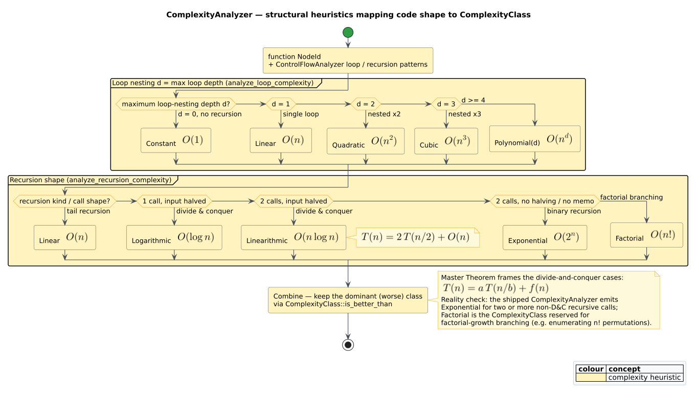
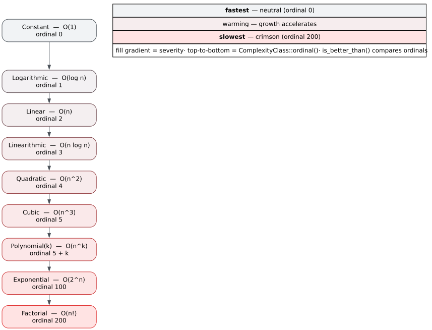

# Algorithm and Complexity Analysis

> Theory pillar · file 08. Uses the control‑flow structure of [file 02](02-control-flow-and-complexity.md) and the CPG traversal of [file 01](01-code-property-graphs.md); a heuristic sibling to the pattern work of files [05](05-subgraph-isomorphism-vf2.md)–[07](07-design-pattern-detection.md).

Given a function, two questions recur in code understanding: *what kind of algorithm is this?* (sorting, searching, a graph traversal, dynamic programming…) and *how expensive is it?* ($`O(n)`$? $`O(n^2)`$? $`O(2^n)`$?). `libcpg` answers both **statically and heuristically** from the shape of the [Code Property Graph](../GLOSSARY.md#code-property-graph-cpg): loop‑nesting depth and recursion structure drive a [complexity class](../GLOSSARY.md#complexity-class--big-o) estimate, and a handful of structural signatures name an [algorithm family](../GLOSSARY.md#algorithm-family). This is recognition by *shape*, not proof of *behaviour* — the results are advisory, and this page is candid about where the heuristics stop.

The analysis lives in the `algorithms` module, gated behind the `algorithm-detection` feature. Its entry point is per‑function:

```rust
// requires: features = ["algorithm-detection"]
use libcpg::CodePropertyGraph;
use libcpg::algorithms::AlgorithmDetector;                  // trait: detect(&cpg, fn)
use libcpg::algorithms::detection::DefaultAlgorithmDetector;

let detector = DefaultAlgorithmDetector::new()              // default min_confidence = 0.5
    .with_min_confidence(0.5);

// detect() takes ONE function NodeId; iterate the functions you care about.
let functions: Vec<_> = cpg.functions().map(|n| n.id).collect();
for func in functions {
    for algo in detector.detect(&cpg, func) {              // Vec<DetectedAlgorithm>, sorted desc
        let cx = algo.signature.time_complexity.as_ref()
            .map(|c| c.class.as_str())                      // e.g. "O(n²)"
            .unwrap_or("Unknown");
        println!("{} ~ {} (confidence {:.2})", algo.family, cx, algo.confidence);
    }
}
```



*Figure — the heuristic mapping from control‑flow structure (loop depth, recursion shape) to a `ComplexityClass`. Source: [`diagrams/complexity-heuristics.puml`](../diagrams/complexity-heuristics.puml).*

---

## 1. The detection pipeline

`DefaultAlgorithmDetector::detect(&cpg, function)` runs three phases and returns a `Vec<DetectedAlgorithm>` sorted by confidence, descending, filtered at the detector's `min_confidence` (default $`0.5`$ — **not** the $`0.7`$ of the GoF detector in [file 07](07-design-pattern-detection.md)):

1. **Control‑flow analysis** (`ControlFlowAnalyzer`) extracts the function's loops and any recursion.
2. **Complexity estimation** (`ComplexityAnalyzer::estimate_time_complexity`) turns that structure into a `ComplexityEstimate`.
3. **Family detection** runs five `detect_*` routines (sorting, searching, graph, dynamic programming, divide‑and‑conquer); each emits a `DetectedAlgorithm` when its structural signature is present and its confidence clears the threshold.

A `DetectedAlgorithm` bundles the `AlgorithmFamily`, an optional specific `name` (e.g. `"Binary Search"`), the containing `function`, key nodes, an `AlgorithmSignature` (loop structure, recursion pattern, time/space `ComplexityEstimate`), and a `confidence`.

---

## 2. Loop‑nesting structure

`ControlFlowAnalyzer::detect_loops` walks the function's AST descendants and records a `LoopPattern` for each loop node, capturing its **kind**, its **nesting depth**, and whether it is **counted** (bounded):

- **Kind** (`LoopKind`): `For`, `While`, `Infinite` (a Rust `loop`), plus `DoWhile` and `Iterator` for the shapes some front‑ends emit.
- **Depth**: computed by counting loop ancestors — a loop with two enclosing loops has depth $`3`$.
- **Counted**: a `For` over a range‑like expression, or a `While` carrying both a comparison *and* an increment, is treated as bounded; an `Infinite` or iterator loop is not. Counted‑ness raises the confidence of the resulting estimate but not its class.

Maximum nesting depth is the dominant loop signal. The estimator maps it straight onto the polynomial ladder:

| Max loop depth | `ComplexityClass` | Big‑O |
|---|---|---|
| 0 (no loops) | `Constant` | $`O(1)`$ |
| 1 | `Linear` | $`O(n)`$ |
| 2 | `Quadratic` | $`O(n^2)`$ |
| 3 | `Cubic` | $`O(n^3)`$ |
| $`d \ge 4`$ | `Polynomial(d)` | $`O(n^d)`$ |

This is a *structural upper‑bound heuristic*: it assumes each nested counted loop multiplies the iteration count by $`n`$. It cannot see that an inner loop runs a constant number of times, so it may over‑estimate — a limitation stated plainly here and reflected in the estimate's `confidence`.

---

## 3. Recursion structure

`ControlFlowAnalyzer::detect_recursion` finds call sites inside a function that target the function itself (direct recursion), classifies **tail** position, and gathers **base cases** (guarded `Return`s that contain no recursive call). It yields a `RecursionPattern { kind, base_cases, recursive_calls }` whose `kind` is one of `Direct`, `Indirect`, or `Tail`.

The number of recursive calls, together with a **divide‑and‑conquer** test, drives the recursion → complexity mapping (`analyze_recursion_complexity`):

| Recursion shape | `ComplexityClass` | Big‑O |
|---|---|---|
| Tail recursion | `Linear` | $`O(n)`$ |
| Divide‑and‑conquer, 1 recursive call | `Logarithmic` | $`O(\log n)`$ |
| Divide‑and‑conquer, 2 recursive calls | `Linearithmic` | $`O(n \log n)`$ |
| Divide‑and‑conquer, $`k \ge 3`$ calls | `Polynomial(k)` | $`O(n^k)`$ |
| Non‑D&C, 1 recursive call | `Linear` | $`O(n)`$ |
| Non‑D&C, $`\ge 2`$ recursive calls | `Exponential` | $`O(2^n)`$ |

The **divide‑and‑conquer** test (`is_divide_and_conquer`) is itself a heuristic: it looks for the input being halved — a division or right‑shift by $`2`$, or an identifier named `mid`, `middle`, `pivot`, or `…half…` — before the recursive calls. Its presence is what separates $`O(n \log n)`$ merge‑sort‑like recursion from $`O(2^n)`$ naïve‑Fibonacci‑like recursion at the same call count.

When a function has *both* loops and recursion, the estimator keeps the **worse** of the two classes, compared via `ComplexityClass::is_better_than` (Section 5).

> **Honesty — recursion coverage.** `RecursionKind::Indirect` exists in the type but the shipped analyzer emits only `Direct` or `Tail`: mutual (indirect) recursion between two functions is modelled but not detected. The divide‑and‑conquer test is name‑ and operator‑based, so it can be fooled by unconventional variable names or by halving expressed indirectly.

---

## 4. The Master Theorem

The two‑call divide‑and‑conquer heuristic is grounded in the **Master Theorem** for divide‑and‑conquer recurrences (CLRS [[1]](#references)). A function that splits its input of size $`n`$ into $`a`$ subproblems of size $`n/b`$, with $`f(n)`$ non‑recursive work per level, satisfies

```math
T(n) = a\,T(n/b) + f(n), \qquad a \ge 1,\ b > 1,
```

whose solution compares $`f(n)`$ against $`n^{\log_b a}`$:

```math
T(n) =
\begin{cases}
\Theta\!\left(n^{\log_b a}\right) & \text{if } f(n) = O\!\left(n^{\log_b a - \varepsilon}\right), \\[4pt]
\Theta\!\left(n^{\log_b a}\log n\right) & \text{if } f(n) = \Theta\!\left(n^{\log_b a}\right), \\[4pt]
\Theta\!\left(f(n)\right) & \text{if } f(n) = \Omega\!\left(n^{\log_b a + \varepsilon}\right)\ \text{(with regularity)}.
\end{cases}
```

Merge sort is the canonical case: $`a = 2`$ subproblems, each of size $`n/2`$ ($`b = 2`$), with linear merge work $`f(n) = \Theta(n)`$. Since $`\log_b a = 1`$ and $`f(n) = \Theta(n^1)`$, the middle case gives $`T(n) = \Theta(n \log n)`$ — exactly the `Linearithmic` class the analyzer assigns to *two* recursive calls with halving. A single halving call ($`a = 1, b = 2`$, $`f(n) = O(1)`$) gives $`\Theta(\log n)`$, the binary‑search case. The heuristic is a structural shorthand for these Master‑Theorem outcomes; it does not solve the recurrence, so it reads $`a`$ and the halving directly from the CPG rather than deriving $`b`$ and $`f`$.

---

## 5. The complexity ladder

`ComplexityClass` is a totally ordered ladder from cheapest to most expensive, backed by an integer `ordinal()`:

| `ComplexityClass` | `as_str()` | `ordinal()` |
|---|---|---|
| `Constant` | `O(1)` | 0 |
| `Logarithmic` | `O(log n)` | 1 |
| `Linear` | `O(n)` | 2 |
| `Linearithmic` | `O(n log n)` | 3 |
| `Quadratic` | `O(n²)` | 4 |
| `Cubic` | `O(n³)` | 5 |
| `Polynomial(k)` | `O(n^k)` | $`5 + k`$ |
| `Exponential` | `O(2^n)` | 100 |
| `Factorial` | `O(n!)` | 200 |
| `Unknown` | `Unknown` | 1000 |

`is_better_than` compares ordinals, so "take the worse complexity" (Section 3) is just an ordinal `max`. The ladder is what makes loop and recursion estimates comparable.



*Figure — the `ComplexityClass` ladder ordered by `ordinal()`, cheapest at the bottom. Source: [`diagrams/complexity-ladder.dot`](../diagrams/complexity-ladder.dot).*

> **Honesty — the analyzer never emits `Factorial`.** `O(n!)` is a rung on the ladder (`ordinal() = 200`, `as_str() = "O(n!)"`) but the shipped `ComplexityAnalyzer` has **no path that produces it**: non‑divide‑and‑conquer recursion is capped at `Exponential` regardless of how many recursive calls it makes (see Section 3's table). So `Factorial` can appear in a hand‑constructed `ComplexityEstimate`, but *estimation from code tops out at `Exponential`*. Treat the ladder's top rung as reserved, not reachable, when reading analyzer output. Likewise, a `Polynomial(k)` for $`k \ge 4`$ arises only from loop nesting of depth $`\ge 4`$.

### Worked examples

- **`factorial(n)`** — one recursive call, no halving ⇒ **`Linear`, $`O(n)`$**. Note the analyzer classifies the *recursion structure* (linear depth), not the mathematical function's value; it is *not* `Factorial`. This is the sharpest illustration of "shape, not behaviour".
- **`merge_sort(a)`** — two recursive calls with a midpoint split ⇒ **`Linearithmic`, $`O(n \log n)`$**, matching the Master‑Theorem derivation of Section 4.
- **naïve `fib(n)`** — two recursive calls, *no* halving ⇒ **`Exponential`, $`O(2^n)`$**, the non‑D&C branch.

---

## 6. Algorithm families as structural signatures

Beyond cost, `libcpg` names an [algorithm family](../GLOSSARY.md#algorithm-family) from a *structural signature* — a combination of control‑flow shape and telltale operations. `AlgorithmFamily` enumerates **14** categories, each with a `typical_complexity()` string:

| `AlgorithmFamily` | Typical complexity | Detector? |
|---|---|---|
| `Sorting` | `O(n log n)` | ✅ `detect_sorting` |
| `Searching` | `O(log n)`–`O(n)` | ✅ `detect_searching` |
| `GraphTraversal` | `O(V + E)` | ✅ `detect_graph` |
| `DynamicProgramming` | Varies | ✅ `detect_dp` |
| `DivideAndConquer` | `O(n log n)` | ✅ `detect_divide_conquer` |
| `Greedy` | `O(n log n)` | ⚠️ advertised, **no detector** |
| `ShortestPath` | `O(E log V)`–`O(V³)` | ❌ none |
| `MinimumSpanningTree` | `O(E log V)` | ❌ none |
| `Backtracking` | `O(k^n)` worst case | ❌ none |
| `StringMatching` | `O(n + m)` | ❌ none |
| `TreeAlgorithm` | `O(n)` | ❌ none |
| `Hashing` | `O(1)` average | ❌ none |
| `Mathematical` | Varies | ❌ none |
| `Other` | Unknown | ❌ none |

The **five implemented** detectors recognise their families by these signatures:

- **`Sorting`** — loops present, comparison operations, and swaps (three‑plus assignments or a `swap`‑named call); adjacent‑index swaps hint at bubble sort, otherwise selection/insertion at $`O(n^2)`$.
- **`Searching`** — comparisons plus either a midpoint calculation / recursion (→ `"Binary Search"` at $`O(\log n)`$) or a single loop with an early return (→ `"Linear Search"` at $`O(n)`$).
- **`GraphTraversal`** — a *visited/seen* set together with queue operations (→ `"BFS"`) or stack / `while` structure (→ `"DFS"`).
- **`DynamicProgramming`** — a memoization table (a variable named `memo`, `dp`, `cache`, `table`, …), stronger when combined with nested loops.
- **`DivideAndConquer`** — recursion with a $`O(\log n)`$/$`O(n \log n)`$ estimate and one or two recursive calls.


*Figure — the `AlgorithmFamily` taxonomy and the structural signatures behind the implemented detectors. Source: [`diagrams/algorithm-family-taxonomy.puml`](../diagrams/algorithm-family-taxonomy.puml).*

> **Honesty — partial coverage.** `supported_families()` advertises six families (the five above **plus `Greedy`**), yet there is **no `Greedy` detector** — it is never produced. The remaining eight families (`ShortestPath`, `MinimumSpanningTree`, `Backtracking`, `StringMatching`, `TreeAlgorithm`, `Hashing`, `Mathematical`, `Other`) exist in the enum for completeness but have neither a detector nor advertisement. All detection is signature‑based and name‑sensitive (it keys on identifiers like `visited`, `mid`, `queue`, `dp`), so renaming can defeat it and coincidental names can trip it. Read family labels as hints, and confirm with the source.

---

## 7. Where this sits

Complexity and family analysis reuse the control‑flow theory of [file 02](02-control-flow-and-complexity.md) (loops, [cyclomatic complexity](../GLOSSARY.md#cyclomatic-complexity)) and the traversal API of [file 01](01-code-property-graphs.md), and they run per function like the [PDG‑based slicing](04-program-dependence-and-slicing.md) of file 04. Where [pattern detection](07-design-pattern-detection.md) recognises *design* structure, this pillar recognises *algorithmic* structure — both by shape, both heuristic, both advisory. The runnable API and further worked examples live in [`components/algorithms/complexity.md`](../components/algorithms/complexity.md) and [`components/algorithms/families.md`](../components/algorithms/families.md).

---

## References

1. Cormen, Leiserson, Rivest, Stein (2009). *Introduction to Algorithms* (3rd ed.). MIT Press. ISBN 978-0262033848 (no DOI). *(Master Theorem.)*
