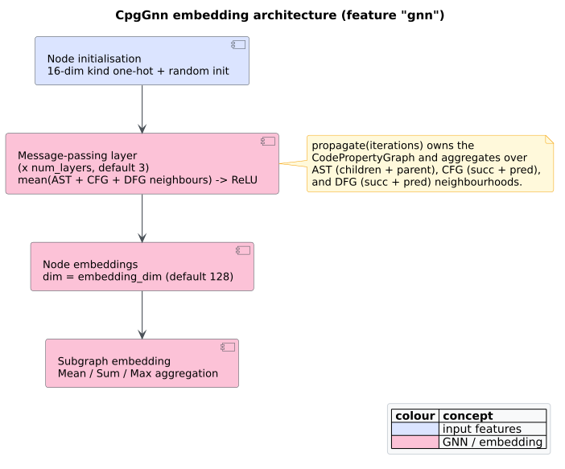
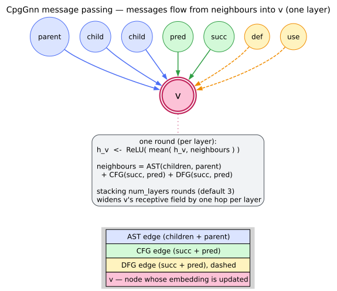
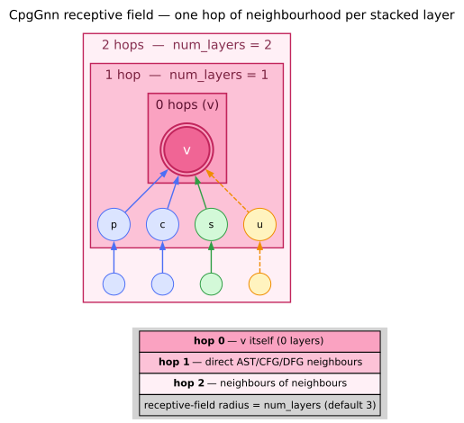

# Graph Neural Networks

> Theory pillar · file 09. The *learned* counterpart to the symbolic [graph similarity](06-graph-similarity.md) of file 06; consumes the multi‑overlay CPG of [file 01](01-code-property-graphs.md).

The earlier theory files reason about code **symbolically**: exact [subgraph isomorphism](05-subgraph-isomorphism-vf2.md), hand‑written similarity metrics, structural pattern templates. A **[graph neural network](../GLOSSARY.md#graph-neural-network-gnn)** (GNN) offers a complementary, **vectorial** view: it maps every node to a dense real vector — an [embedding](../GLOSSARY.md#embedding) — such that structurally and semantically related code lands nearby in vector space. Embeddings turn "is this code like that code?" into a distance computation, and they are the natural front‑end for downstream machine learning (vulnerability detection, clustering, retrieval). This page develops the message‑passing theory, its lineage, and `libcpg`'s concrete realisation.

GNNs for graphs were pioneered by Scarselli et al. [[1]](#references); the application to program analysis over CPG‑like multi‑edge graphs was crystallised by **Devign** (Zhou et al. [[2]](#references)), whose architecture directly inspires `libcpg`'s. The functionality lives in the `gnn` module, gated behind the `gnn` feature, as the `CpgGnn` type.



*Figure — the `CpgGnn` architecture: initialisation → mean message passing over three overlays → node & subgraph embeddings. Source: [`diagrams/gnn-architecture.puml`](../diagrams/gnn-architecture.puml).*

---

## 1. Message passing, intuitively

The core operation is **[message passing](../GLOSSARY.md#message-passing)**: every node repeatedly gathers its neighbours' current vectors, combines them with its own, and updates. It is a structured game of *telephone* — each round, a node hears from everyone one step away, so after `` $`k`$ `` rounds a node's vector reflects everything within `` $`k`$ `` hops.

```text
Round 0            Round 1                     Round 2
 [A₀]               [A₁]=agg(A₀, B₀)            [A₂]=agg(A₁, B₁)
  │                  │                            │
 [B₀]──▶[C₀]        [B₁]=agg(B₀, A₀, C₀)        [B₂]=agg(B₁, A₁, C₁)
                    [C₁]=agg(C₀, B₀)            [C₂]=agg(C₁, B₁)   ⟵ C now "knows" A
```

By round 2, node `` $`C`$ `` has indirectly absorbed information from `` $`A`$ `` (two hops away, via `` $`B`$ ``). What makes a *code* GNN distinctive — the Devign insight — is that the neighbourhood spans **several edge overlays at once**: syntax ([AST](../GLOSSARY.md#abstract-syntax-tree-ast)), control ([CFG](../GLOSSARY.md#control-flow-graph-cfg)), and data flow ([DFG](../GLOSSARY.md#data-flow-graph-dfg)) all contribute messages, so an embedding fuses *how the code is written*, *how it executes*, and *how values move*.

---

## 2. The aggregation equation

One round of `libcpg`'s message passing updates each node `` $`v`$ `` by taking the **mean** of its neighbours' and its own previous vectors and applying a [ReLU](../GLOSSARY.md#relu) nonlinearity:

```math
h_v^{(k)} = \mathrm{ReLU}\!\left( \mathrm{mean}\left( \{ h_u^{(k-1)} : u \in \mathcal{N}(v) \} \cup \{ h_v^{(k-1)} \} \right) \right),
```

where `` $`h_v^{(k)}`$ `` is node `` $`v`$ ``'s vector after round `` $`k`$ ``, `` $`\mathcal{N}(v)`$ `` is its neighbourhood across the three overlays, and the self term `` $`\{ h_v^{(k-1)} \}`$ `` is included in the mean (a "self‑loop", so a node never forgets itself). The three design choices each earn their place:

- **Mean** aggregation is *permutation‑invariant* (neighbour order is irrelevant) and *degree‑stable* (a high‑degree node does not blow up the magnitude), unlike `Sum`.
- **[ReLU](../GLOSSARY.md#relu)**, `` $`\mathrm{ReLU}(x) = \max(0, x)`$ ``, injects the nonlinearity that lets stacked rounds represent more than a single linear smoothing.
- **Self‑inclusion** keeps each node's own signal in play across rounds.



*Figure — one message‑passing round: mean over the AST, CFG, and DFG neighbours together with the node itself, then ReLU. Source: [`diagrams/gnn-message-passing.dot`](../diagrams/gnn-message-passing.dot).*

---

## 3. `libcpg`'s concrete propagation

`CpgGnn::propagate(iterations)` realises the equation above literally. The neighbourhood `` $`\mathcal{N}(v)`$ `` is the union of six directed relations across the three overlays, taken **undirected** (both directions contribute):

```text
Algorithm CpgGnn‑Propagate(G, iterations):
  if embeddings not initialised: Initialise(G)             # Section 4
  repeat `iterations` times:
    h' ← { }
    for each node v in G:
      acc   ← h[v]           # start from self → self‑loop in the mean
      count ← 0
      for u in ast_children(v) ∪ {ast_parent(v)}:  acc ← acc + h[u]; count += 1   # AST
      for u in cfg_successors(v) ∪ cfg_predecessors(v): acc ← acc + h[u]; count += 1   # CFG
      for u in dfg_successors(v) ∪ dfg_predecessors(v): acc ← acc + h[u]; count += 1   # DFG
      if count > 0:  acc ← acc / (count + 1)                # mean, +1 counts the self term
      acc ← ReLU(acc)                                       # elementwise max(0, ·)
      h'[v] ← acc
    h ← h'
  mark initialised
```

Dividing by `` $`\text{count} + 1`$ `` is precisely the "mean including self" of Section 2. Each round is **embarrassingly parallel across nodes** (every `` $`h'[v]`$ `` reads only the *previous* round's vectors), but the rounds themselves are inherently sequential — round `` $`k`$ `` depends on round `` $`k-1`$ ``. Without the `gnn` feature the method is a no‑op that merely marks the graph initialised.

> **Honesty — an untrained propagator.** `CpgGnn` is a **deterministic structural embedder, not a trained model**: there are no learned weight matrices and no back‑propagation. It computes a fixed mean‑aggregation message pass over the CPG. The `with_num_layers` and `with_dropout` builders store hyper‑parameters, but `propagate(iterations)` runs exactly the `iterations` you pass (it does not read `num_layers`), and dropout — a *training*-time regulariser — is not applied during this inference‑only pass. So the embeddings capture *structure*, not patterns *learned from labelled data*; feeding them to a downstream trained classifier (the Devign use case) is where learning would enter.

---

## 4. Initialisation

Before any message passing, each node is seeded with a vector that combines a **type signal** and a little **noise**:

- a 16‑dimensional, one‑hot‑like **node‑kind encoding** (`node_type_features`) placed into the leading dimensions, and
- small random values in `` $`[-0.1, 0.1]`$ `` across all `embedding_dim` dimensions, to break symmetry between nodes of the same kind.

The 16 buckets coarsen the 45 [node kinds](../GLOSSARY.md#node-kind--edge-kind) into families the network can distinguish from round zero:

| Bucket | Node kinds |
|---|---|
| 0–4 | `Root`; `Module`; `Class`/`Struct`; `Function`; `Variable`/`Field` |
| 5–7 | `If`/`While`/`For`/`Loop`; `Return`/`Break`/`Continue`; `Call` |
| 8–11 | `BinaryOp`/`UnaryOp`; `Assignment`; `Identifier`; `Literal` |
| 12–15 | `Block`; `Parameter`; `Try`/`Catch`/`Throw`; everything else |

Because the type signal seeds the vectors and message passing then mixes in neighbourhood context, an embedding is best read as *"a node of this kind, in this structural context"*.

---

## 5. Receptive field

The **receptive field** of a node after `` $`k`$ `` rounds is the set of nodes that can influence its embedding — exactly its `` $`k`$ ``‑hop neighbourhood. More rounds means broader context:

| Iterations | Context captured (roughly) |
|---|---|
| 1 | immediate neighbours (adjacent statements/operands) |
| 2 | the containing block or function |
| 3 | cross‑function context reached via call/data edges |
| 4+ | module‑level structure |



*Figure — the receptive field growing with iterations `` $`k = 1, 2, 3`$ ``. Source: [`diagrams/gnn-receptive-field.dot`](../diagrams/gnn-receptive-field.dot).*

There is a genuine trade‑off. More rounds widen the context but risk **over‑smoothing**: as `` $`k`$ `` grows, mean aggregation drives distant nodes' embeddings toward a shared average, erasing the very distinctions you want. Cost is `` $`O(\text{iterations} \times |E|)`$ ``. For code, 2–4 rounds are usually the sweet spot. Two structural cases behave as one would hope:

- **Disconnected components** (e.g. unrelated functions) never exchange messages, so function‑level analysis stays local — usually the desired behaviour.
- **Cycles** are handled naturally by the fixed‑point iteration: information circulates `` $`A \to B \to C \to A \to \dots`$ `` across rounds without special casing.

---

## 6. Embeddings and cosine similarity

The output types wrap the vectors and provide comparison:

- **`NodeEmbedding`** `{ node_id, vector, dim }` — a single node's embedding, with `norm()` (the L2 norm) and `cosine_similarity(&other)`.
- **`SubgraphEmbedding`** `{ node_ids, vector, dim, aggregation }` — a function/class/region embedding, produced by **mean‑pooling** its nodes' vectors (`CpgGnn::subgraph_embedding`), with the same `norm`/`cosine_similarity`.

Similarity between embeddings uses the same [cosine](../GLOSSARY.md#cosine-similarity) formula as the symbolic `Cosine` metric of [file 06](06-graph-similarity.md):

```math
\cos(u, v) = \frac{u \cdot v}{\lVert u \rVert \, \lVert v \rVert} \in [-1, 1],
```

returning `` $`0`$ `` when either vector is zero or the dimensions differ. This is the bridge between the two similarity worlds: [file 06](06-graph-similarity.md) compares *hand‑built* feature vectors; here the same cosine compares *message‑passed* embeddings.

```rust
// requires: features = ["gnn"]
use libcpg::CodePropertyGraph;
use libcpg::gnn::{CpgGnn, NodeEmbedding};
use libcpg::GraphNeuralNetwork;   // trait: propagate / node_embedding / subgraph_embedding

let mut gnn = CpgGnn::new(cpg)     // takes the CPG BY VALUE — CpgGnn owns it
    .with_embedding_dim(128)       // default 128
    .with_num_layers(3);           // stored hyper‑parameter
gnn.propagate(3);                  // run 3 message‑passing rounds

if let (Some(a), Some(b)) = (gnn.node_embedding(n1), gnn.node_embedding(n2)) {
    let sim = NodeEmbedding::new(n1, a).cosine_similarity(&NodeEmbedding::new(n2, b));
    println!("cosine(n1, n2) = {sim:.3}");
}
```

`AggregationMethod` records how a subgraph was pooled: **`Mean`** is the default and the method actually used; `Sum` and `Max` are defined; **`Attention` and `Hierarchical` are reserved placeholders** — not yet wired. (The `gpu` feature is likewise reserved, with no code attached.)

> **Serialisation note.** Under the `serde` feature, `NodeEmbedding`/`SubgraphEmbedding` derive `Serialize`/`Deserialize` but **skip the `vector` field** — the embedding is recomputed after load rather than stored. Only the node identity and metadata round‑trip; re‑run `propagate` to rebuild the vectors.

---

## 7. Where this sits

The GNN is `libcpg`'s learned‑representation layer, complementing rather than replacing the symbolic analyses: use exact [VF2](05-subgraph-isomorphism-vf2.md) when you need certainty about a shape, [graph‑similarity metrics](06-graph-similarity.md) for a fast unlearned score, and GNN embeddings when you want a *vectorial* notion of code likeness suitable for clustering or as features for a downstream model in the Devign lineage [[2]](#references). The runnable API, message‑passing details, and embedding recipes live in [`components/gnn/overview.md`](../components/gnn/overview.md), [`components/gnn/message-passing.md`](../components/gnn/message-passing.md), and [`components/gnn/embeddings.md`](../components/gnn/embeddings.md).

---

## References

1. Scarselli, F., et al. (2009). *The Graph Neural Network Model.* IEEE TNN 20(1). DOI: [10.1109/TNN.2008.2005605](https://doi.org/10.1109/TNN.2008.2005605)
2. Zhou, Y., et al. (2019). *Devign: … Graph Neural Networks.* NeurIPS. arXiv:[1909.03496](https://arxiv.org/abs/1909.03496) (no DOI).
