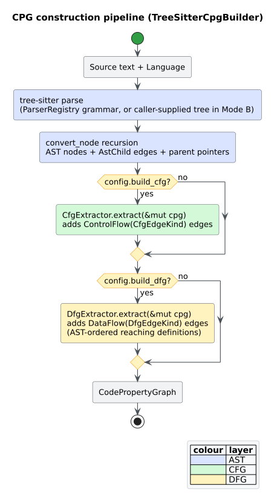
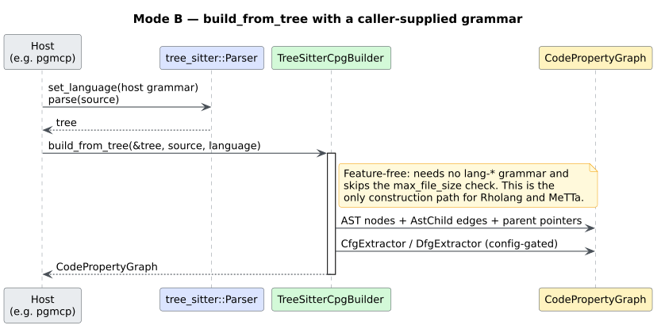

# Building CPGs

This guide covers every way to construct a [`CodePropertyGraph`](../GLOSSARY.md#code-property-graph-cpg) from source, and how to control what goes into it. It builds on [Getting Started](00-getting-started.md); if you have not yet seen the `default = []` consequence, read that first.

There are two construction **modes**, both provided by `TreeSitterCpgBuilder`:

- **Mode A — `build(source, language)`.** libcpg parses the source itself using a grammar registered under a `lang-*` [feature](../GLOSSARY.md#feature-flag-cargo). Simple, but the grammar must be compiled in.
- **[Mode B](../GLOSSARY.md#mode-b--build_from_tree) — `build_from_tree(&tree, source, language)`.** *You* parse the source with a `tree-sitter` grammar you own, and hand libcpg the resulting [`tree_sitter::Tree`](../GLOSSARY.md#tree-sitter). libcpg does the rest. This needs no `lang-*` feature and is the only path for [Rholang](../GLOSSARY.md#rholang) and [MeTTa](../GLOSSARY.md#metta).

Both modes run the **same post-parse pipeline**, so a CPG built either way is identical in shape (a property libcpg asserts in its own test suite — see [below](#build--build_from_tree-are-equivalent)).



*Figure — the four-stage construction pipeline shared by both build modes. Source: [`diagrams/construction-pipeline.puml`](../diagrams/construction-pipeline.puml).*

The four stages are:

1. **Parse** — tree-sitter turns source text into a concrete syntax tree.
2. **AST construction** — `NodeMapper` maps each tree-sitter node kind to a [`CpgNodeKind`](../components/graph/nodes.md), wiring `AstChild` edges and parent pointers, and seeding a CFG entry for every `Function`.
3. **CFG extraction** — `CfgExtractor` adds [control-flow](../GLOSSARY.md#control-flow-graph-cfg) edges (config-gated).
4. **DFG extraction** — `DfgExtractor` runs [AST-ordered reaching definitions](../GLOSSARY.md#ast-ordered-reaching-definitions) and adds [data-flow](../GLOSSARY.md#data-flow-graph-dfg) edges (config-gated).

---

## Mode A: `build`

The trait method `CpgBuilder::build` is the everyday entry point. Bring the `CpgBuilder` trait into scope, construct a `TreeSitterCpgBuilder`, and call it:

```rust
// requires: features = ["lang-rust"]
use libcpg::{CpgBuilder, Language, TreeSitterCpgBuilder};

fn main() -> Result<(), libcpg::Error> {
    let builder = TreeSitterCpgBuilder::new();
    let cpg = builder.build("fn add(a: i32, b: i32) -> i32 { a + b }", Language::Rust)?;

    assert!(cpg.node_count() > 1);
    assert_eq!(cpg.language(), Language::Rust);
    Ok(())
}
```

`build` returns `libcpg::Result<CodePropertyGraph>`. It can fail in two documented ways:

- `Error::UnsupportedLanguage(name)` — the `language` has no grammar registered (the `lang-*` feature is off, or the language is `Unknown`).
- `Error::Construction(msg)` — the source exceeded `max_file_size`, or the parser could not produce a tree.

---

## Mode A from a file: `build_file`

`build_file` is a provided trait method that reads a file, infers the language from its **extension** via `Language::from_extension`, builds, and records the path on the CPG (`source_path`).

```rust
// requires: features = ["lang-rust"]
use libcpg::{CpgBuilder, TreeSitterCpgBuilder};
use std::path::Path;

fn main() -> Result<(), libcpg::Error> {
    let builder = TreeSitterCpgBuilder::new();
    let cpg = builder.build_file(Path::new("src/lib.rs"))?;
    println!("built {} nodes from {:?}", cpg.node_count(), cpg.source_path());
    Ok(())
}
```

An unrecognised extension maps to `Language::Unknown`, which then fails the internal `build` with `UnsupportedLanguage`. `from_extension` returns a `Language` directly (defaulting to `Unknown`), never an `Option`.

---

## Configuring construction: `CpgBuilderConfig`

`TreeSitterCpgBuilder::new()` uses the default configuration. To change it, build a `CpgBuilderConfig` and pass it to `TreeSitterCpgBuilder::with_config`. The config is a builder itself:

```rust
// requires: features = ["lang-rust"]
use libcpg::{CpgBuilder, CpgBuilderConfig, Language, TreeSitterCpgBuilder};

fn main() -> Result<(), libcpg::Error> {
    let config = CpgBuilderConfig::new()
        .with_source(true)      // retain the source text on the CPG
        .with_cfg(true)         // run the CFG extractor (default: true)
        .with_dfg(false)        // skip the DFG extractor
        .with_comments(true);   // keep comment nodes in the AST

    let builder = TreeSitterCpgBuilder::with_config(config);
    let cpg = builder.build("fn main() { /* hi */ }", Language::Rust)?;
    assert!(cpg.source_code().is_some());
    Ok(())
}
```

The full set of knobs, with their defaults:

| Field | Builder method | Default | Effect |
|-------|----------------|---------|--------|
| `retain_source` | `with_source(bool)` | `false` | Keep source text (readable via `source_code()`) |
| `build_cfg` | `with_cfg(bool)` | `true` | Run `CfgExtractor` after AST construction |
| `build_dfg` | `with_dfg(bool)` | `true` | Run `DfgExtractor` after CFG |
| `include_comments` | `with_comments(bool)` | `false` | Emit `Comment` nodes instead of dropping them |
| `max_file_size` | `with_max_file_size(usize)` | `10 * 1024 * 1024` | Reject larger sources in **`build`** (see note) |
| `resolve_imports` | `with_import_resolution(bool)` | `false` | Reserved for cross-file reference resolution |

**Why skip an overlay?** If you only need syntactic structure (say, to count node kinds), setting `with_cfg(false).with_dfg(false)` builds just the AST and skips the two most expensive stages. If you later change your mind, the extractors are [idempotent](../GLOSSARY.md#idempotent) and can be run by hand — see [Running extractors manually](#running-extractors-manually).

**`max_file_size` and Mode B.** The size check is applied only in `build`. `build_from_tree` **skips it**, because the caller already produced the tree and therefore already owns the memory. If you accept untrusted input through Mode B, enforce your own bound before parsing — see [Input and Resource Hardening](../security/01-input-and-resource-hardening.md).

---

## Mode B: `build_from_tree`

Mode B decouples parsing from CPG construction. You parse with a grammar crate you depend on directly, then pass the tree in. Crucially, **the per-language node mappers for the 16 built-in languages are always compiled** — only the Rholang/MeTTa arms are gated behind their `cfg` toggles. So a Rust (or Python, Go, …) CPG can be built through Mode B with **no libcpg `lang-*` feature at all**; you need only a tree-sitter grammar to make the tree.

```rust
// requires: your own grammar crate, e.g. tree-sitter-rust = "0.24"
// (no libcpg lang-* feature is needed: map_rust is always compiled)
use libcpg::{Language, TreeSitterCpgBuilder};

fn main() -> Result<(), libcpg::Error> {
    let source = "fn main() { let x = 1; let y = x; }";

    // 1. Parse with the grammar you own.
    let mut parser = tree_sitter::Parser::new();
    parser
        .set_language(&tree_sitter_rust::LANGUAGE.into())
        .expect("load the Rust grammar");
    let tree = parser.parse(source, None).expect("parse the source");

    // 2. Hand the tree to libcpg. Same pipeline as `build`, minus the parse.
    let builder = TreeSitterCpgBuilder::new();
    let cpg = builder.build_from_tree(&tree, source, Language::Rust)?;

    assert!(cpg.node_count() > 1);
    Ok(())
}
```

When would you reach for Mode B?

- **The host already links the grammar.** A tool such as pgmcp that already parses with `tree-sitter-python` avoids a second grammar copy (and the duplicate-C-symbol hazard) by handing libcpg the tree it already has. This motivation is recorded in [ADR-0002](../design/0002-mode-b-build-from-tree.md).
- **The language is Rholang or MeTTa.** These have no registered grammar in libcpg at all; Mode B is the *only* way to build them. See [F1R3FLY.io: Rholang & MeTTa](06-f1r3fly-rholang-metta.md).
- **You want to reuse one parse** across several tools.



*Figure — the Mode-B call sequence: the caller owns the grammar; libcpg owns the pipeline. Source: [`diagrams/mode-b-sequence.puml`](../diagrams/mode-b-sequence.puml).*

---

## `build` ≡ `build_from_tree` are equivalent

Because both modes share the post-parse pipeline, the graphs they produce are identical. libcpg guarantees this with an inline regression test (`test_build_from_tree_matches_build` in `src/builder/tree_sitter.rs`) that parses the *same* source both ways and asserts the results match:

```rust
// requires: features = ["lang-rust"]
use libcpg::{CpgBuilder, Language, TreeSitterCpgBuilder};
use libcpg::builder::ParserRegistry;

fn main() -> Result<(), libcpg::Error> {
    let source = "fn main() { let x = 1; let y = x; }";

    // Parse externally, exactly as a Mode-B caller would.
    let ts_language = ParserRegistry::global()
        .get(Language::Rust)
        .expect("rust grammar registered");
    let mut parser = tree_sitter::Parser::new();
    parser.set_language(&ts_language).expect("set language");
    let tree = parser.parse(source, None).expect("parse");

    let builder = TreeSitterCpgBuilder::new();
    let from_tree = builder.build_from_tree(&tree, source, Language::Rust)?;
    let from_source = builder.build(source, Language::Rust)?;

    // Same nodes, same edges, same language.
    assert_eq!(from_tree.node_count(), from_source.node_count());
    assert_eq!(from_tree.edge_count(), from_source.edge_count());
    Ok(())
}
```

The formal statement and its evidence are in [CPG Invariants and Equivalence](../scientific/01-cpg-invariants-and-equivalence.md).

---

## Which languages can I actually build?

Two methods report supported languages, and they mean different things:

- **`builder.supported_languages()`** returns a *static* list of the 16 languages libcpg *knows how to map*, **regardless of enabled features**. It is a capability advertisement, not a runtime guarantee.
- **`ParserRegistry::global().supports(language)`** returns whether a grammar is *actually registered right now* — i.e. whether the corresponding `lang-*` feature was compiled in. This is the check that predicts whether `build` will succeed.

```rust
// Feature-free: both calls compile with no lang-* features.
use libcpg::{CpgBuilder, Language, TreeSitterCpgBuilder};
use libcpg::builder::ParserRegistry;

let builder = TreeSitterCpgBuilder::new();

// Static advertisement — always lists 16 languages.
let advertised = builder.supported_languages().len();
assert_eq!(advertised, 16);

// Real availability — depends on which lang-* features are on.
let registry = ParserRegistry::global();
if registry.supports(Language::Rust) {
    // `build(_, Language::Rust)` will find a grammar.
} else {
    // The lang-rust feature is off; use Mode B instead.
}
```

Prefer `ParserRegistry::supports` (or `ParserRegistry::get(lang).is_some()`) whenever you branch on availability. The registry, its lazy `OnceLock` initialisation, and the mapping to grammar crates are detailed in [Language Frontends](../architecture/language-frontends.md).

---

## Running extractors manually

`build`/`build_from_tree` invoke `CfgExtractor` and `DfgExtractor` for you according to the config. If you built the AST with the overlays disabled — or you are working with a hand-built CPG — you can run them yourself. They are [idempotent](../GLOSSARY.md#idempotent), so re-running never duplicates edges.

```rust
// Feature-free.
use libcpg::{CfgExtractor, CodePropertyGraph, DfgExtractor};

fn add_overlays(cpg: &mut CodePropertyGraph) {
    CfgExtractor::new().extract(cpg); // adds ControlFlow edges
    DfgExtractor::new().extract(cpg); // adds DataFlow edges
}
```

Both extractors also have `with_config` constructors for finer control (fall-through edges, exception edges, field-access tracking, the reaching-defs iteration cap). Those are documented in [CFG construction](../components/builder/cfg.md) and [DFG construction](../components/builder/dfg.md).

---

## Next steps

- Walk the graph you just built: [Querying and Traversal](02-querying-and-traversal.md).
- Add the [PDG](../GLOSSARY.md#program-dependence-graph-pdg) and slice it: [Program Slicing](04-program-slicing.md).
- The precise builder API — every method, config field, and return type — is in the [builder reference](../api/builder-reference.md).

---

## References

This guide relies on no external literature of its own; the concepts it uses (the CPG, its overlays, and Mode B) are cited where they are defined — see the [glossary references](../GLOSSARY.md#references) and [ADR-0002](../design/0002-mode-b-build-from-tree.md).
</content>
